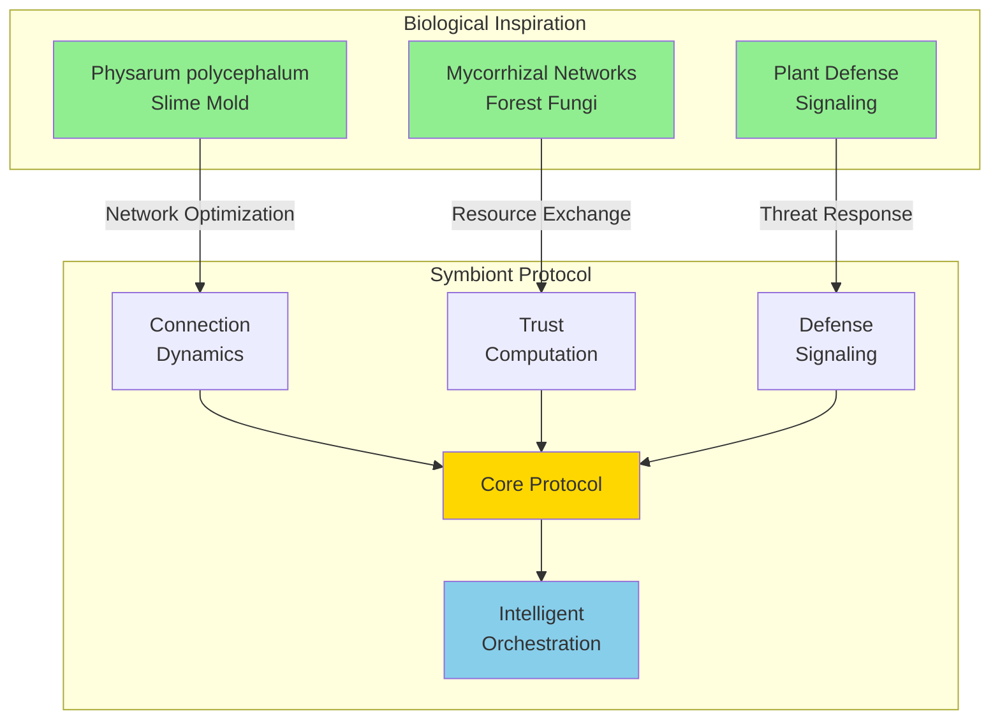
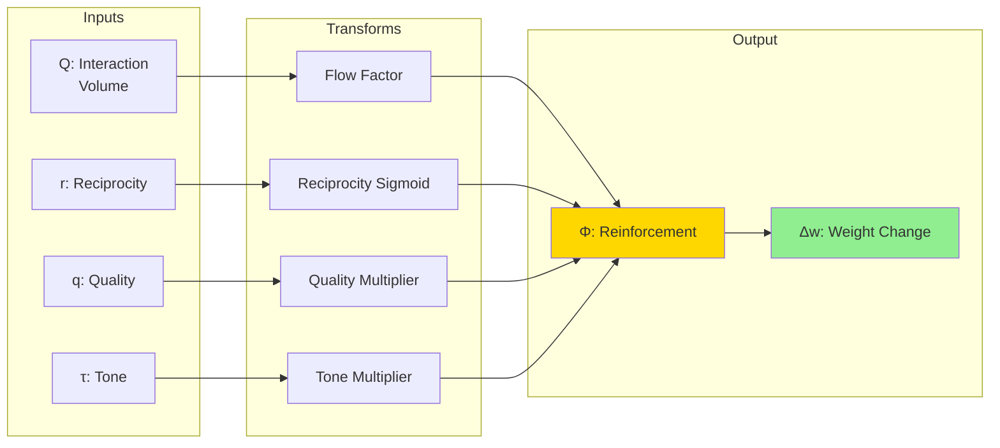
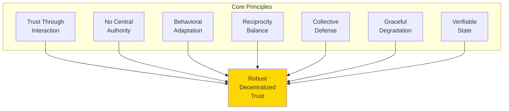

# Symbiont

## Bio-Inspired Trust and Orchestration Protocol

**Version 0.1 | December 2025**

[](https://github.com/YOUR_USERNAME/symbiont/actions/workflows/ci.yml)
[](https://opensource.org/licenses/MIT)
[](https://www.rust-lang.org/)

---

## Abstract

Symbiont is a decentralized trust and orchestration protocol inspired by biological network optimization systems. Drawing from the adaptive behavior of *Physarum polycephalum* (slime mold) and mycorrhizal fungal networks, Symbiont enables multi-agent systems to establish trust, detect adversarial behavior, and intelligently route tasks without central authority.



---

## Key Features

| Feature | Description |
|---------|-------------|
| **Emergent Trust** | Trust emerges from interaction patterns, not central authority |
| **Adaptive Connections** | Connections strengthen through positive reciprocity (like slime mold tubes) |
| **Collective Defense** | Defense signals propagate through trusted connections |
| **Adversary Detection** | Behavioral analysis identifies strategic adversaries |
| **Intelligent Routing** | Workflows route to the most trusted, capable nodes |

---

## The Core Equation

At the heart of Symbiont lies the **Physarum Equation**, which governs how connection strengths evolve:

$$\frac{dw}{dt} = \gamma \cdot |Q|^\mu \cdot \sigma(r) \cdot \psi(q) \cdot \phi(\tau) - \alpha \cdot w - D$$



| Symbol | Description | Range |
|--------|-------------|-------|
| w | Connection weight | [0, 1] |
| Q | Interaction volume (flow) | [0, ∞) |
| r | Reciprocity score | (-∞, +∞) |
| q | Quality score | [0, 1] |
| τ | Tone score | [-1, 1] |
| D | Defense dampening | [0, ∞) |

---

## Documentation

### Documentation Legend

Complete documentation is available in the [`/docs`](./docs/) directory:

#### Foundational Concepts

| Document | Description | Audience |
|----------|-------------|----------|
| [Introduction](./docs/concepts/introduction.md) | High-level overview and motivation | All readers |
| [Biological Foundations](./docs/concepts/biological-foundations.md) | The science behind the protocol | Students, researchers |
| [Core Principles](./docs/concepts/core-principles.md) | Seven design principles and philosophy | All readers |
| [Glossary](./docs/concepts/glossary.md) | Terminology, symbols, and constants | Quick reference |

#### System Architecture

| Document | Description | Audience |
|----------|-------------|----------|
| [Architecture Overview](./docs/architecture/overview.md) | System design, layers, and components | Developers, architects |
| [Node Architecture](./docs/architecture/node.md) | Individual node structure and lifecycle | Implementers |
| [Network Topology](./docs/architecture/network.md) | Network structure, evolution, properties | System designers |
| [Data Flow](./docs/architecture/data-flow.md) | How information moves through the system | All technical readers |

#### Protocol Specification

| Document | Description | Audience |
|----------|-------------|----------|
| [The Physarum Equation](./docs/protocol/physarum-equation.md) | Core mathematical dynamics | Researchers, advanced developers |
| [Trust Computation](./docs/protocol/trust-computation.md) | How trust emerges and is calculated | All technical readers |
| [Reciprocity System](./docs/protocol/reciprocity.md) | Exchange balance tracking | Implementers |
| [Defense Signaling](./docs/protocol/defense-signaling.md) | Threat detection and propagation | Security-focused readers |
| [Convergence Protocol](./docs/protocol/convergence.md) | How agents reach consensus | Distributed systems developers |
| [State Machines](./docs/protocol/state-machines.md) | Node, defense, connection state transitions | Implementers |

#### Tutorials

| Document | Description | Audience |
|----------|-------------|----------|
| [Getting Started](./docs/tutorials/getting-started.md) | Installation and first simulation | New users |
| [Running Simulations](./docs/tutorials/running-simulations.md) | Advanced simulation and metrics | Experimenters |
| [Understanding Trust](./docs/tutorials/understanding-trust.md) | Interactive trust calculation walkthrough | Students |
| [Building Workflows](./docs/tutorials/building-workflows.md) | Creating multi-agent workflows | Developers |

#### API Reference

| Document | Description | Audience |
|----------|-------------|----------|
| [Core Types](./docs/api/types.md) | Type definitions and structures | Implementers |
| [Constants](./docs/api/constants.md) | Protocol parameters and ranges | Configuration |
| [Mathematical Functions](./docs/api/math.md) | Helper functions and implementations | Implementers |
| [Node API](./docs/api/node.md) | Node interface and methods | Developers |

#### Master Specifications

| Document | Description | Audience |
|----------|-------------|----------|
| [Master Reference](./docs/master%20design%20docs/Symbiont_Master_Reference.md) | Complete protocol specification | All readers |
| [Language-Agnostic Spec](./docs/master%20design%20docs/Symbiont_v0.1_Language_Agnostic.md) | Implementation guide for any language | Implementers |
| [Complete Specification](./docs/master%20design%20docs/Symbiont_v0.1_Complete_Specification.md) | Full technical specification | Advanced readers |

---

## Project Structure

```
symbiont/
├── symbiont-core/          # Core protocol library
│   └── src/
│       ├── types.rs        # Core types (NodeId, Score, Weight)
│       ├── node.rs         # Node structure and behavior
│       ├── connection.rs   # Connection dynamics (Physarum)
│       ├── trust.rs        # Trust computation
│       ├── defense.rs      # Defense signaling
│       ├── routing.rs      # Task routing
│       ├── workflow.rs     # Workflow orchestration
│       ├── handoff.rs      # Task handoff protocol
│       ├── detection.rs    # Adversary detection
│       ├── convergence.rs  # Convergence protocol
│       ├── math.rs         # Mathematical functions
│       └── constants.rs    # Protocol constants
│
├── symbiont-sim/           # Simulation harness
│   └── src/
│       ├── network.rs      # Network simulation
│       ├── agents.rs       # Agent behavior models
│       ├── scenarios/      # Test scenarios
│       └── metrics.rs      # Metrics collection
│
├── symbiont-cli/           # Command-line interface
│   └── src/main.rs
│
└── docs/                   # Documentation
    ├── concepts/           # Foundational concepts
    ├── architecture/       # System architecture
    ├── protocol/           # Protocol specification
    ├── tutorials/          # Step-by-step guides
    ├── api/                # API reference
    └── master design docs/ # Master specifications
```

---

## Quick Start

### Prerequisites

- Rust 1.70 or later
- Cargo package manager

### Installation

```bash
# Clone the repository
git clone https://github.com/your-org/symbiont.git
cd symbiont

# Build all crates
cargo build --release

# Run tests
cargo test
```

### Run Simulations

```bash
# Trust emergence in honest network
cargo run -p symbiont-cli -- simulate trust-emergence

# Strategic adversary injection
cargo run -p symbiont-cli -- simulate strategic --inject-at 100

# Workflow chain routing
cargo run -p symbiont-cli -- simulate workflow-chain

# With verbose output
cargo run -p symbiont-cli -- simulate trust-emergence -v
```

### Available Scenarios

| Scenario | Description |
|----------|-------------|
| `trust-emergence` | Observe trust dynamics in honest network |
| `strategic` | Strategic adversary builds trust then defects |
| `free-rider` | Free riders take but don't contribute |
| `sybil` | Sybil cluster attack |
| `workflow-chain` | Sequential workflow routing |
| `workflow-fan-out` | Parallel workflow with merge |

---

## Protocol Constants

Key parameters governing protocol behavior:

| Constant | Symbol | Default | Description |
|----------|--------|---------|-------------|
| Reinforcement Rate | γ | 0.1 | Rate of connection strengthening |
| Decay Rate | α | 0.01 | Natural connection weakening |
| Reciprocity Sensitivity | β | 2.0 | Sigmoid steepness |
| Memory Factor | λ | 0.9 | EMA weighting |
| Flow Exponent | μ | 0.5 | Sublinear flow scaling |
| Initial Weight | W_INIT | 0.3 | Starting connection weight |
| Minimum Weight | W_MIN | 0.01 | Connection removal threshold |
| Maximum Weight | W_MAX | 1.0 | Maximum connection strength |

See [Constants Reference](./docs/api/constants.md) for the complete list.

---

## Design Philosophy



1. **Trust Through Interaction** — Trust emerges from consistent, high-quality, reciprocal interactions
2. **No Central Authority** — No master node, no oracle, no single point of failure
3. **Behavioral Adaptation** — Trust adapts to changing behavior over time
4. **Reciprocity Balance** — Sustainable relationships require balanced exchange
5. **Collective Defense** — The network defends itself through coordinated signaling
6. **Graceful Degradation** — The system continues functioning when components fail
7. **Verifiable State** — All state changes are traceable and cryptographically signed

---

## Contributing

See [CONTRIBUTING.md](./CONTRIBUTING.md) for guidelines on contributing to this project.

## Security

See [SECURITY.md](./SECURITY.md) for security policy and reporting vulnerabilities.

## License

This project is licensed under the MIT License - see the [LICENSE](./LICENSE) file for details.

---

## References

1. Tero, A., et al. (2010). "Rules for Biologically Inspired Adaptive Network Design." *Science*, 327(5964), 439-442.

2. Simard, S. W. (2018). "Mycorrhizal Networks Facilitate Tree Communication, Learning, and Memory." In *Memory and Learning in Plants*. Springer.

3. Meyerson, D., Weick, K. E., & Kramer, R. M. (1996). "Swift Trust and Temporary Groups." In *Trust in Organizations*. Sage.

4. Heil, M., & Ton, J. (2008). "Long-distance signalling in plant defence." *Trends in Plant Science*, 13(6), 264-272.

---

*Symbiont v0.1 — Trust emerges from interaction. Orchestration emerges from trust.*
