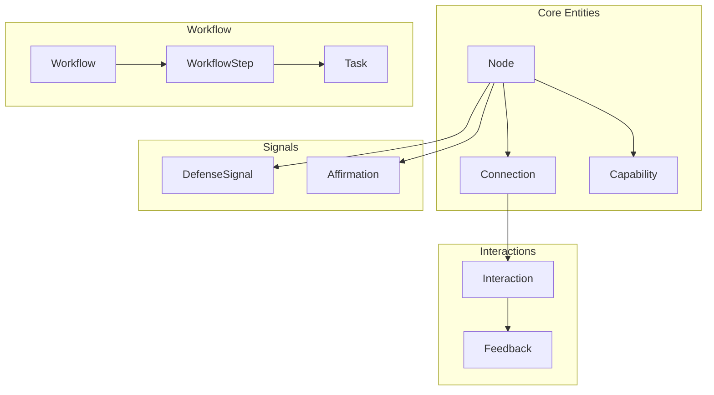

# Core Types

**Document Version:** 1.0
**Last Updated:** December 2025
**Status:** Normative

---

## 1. Introduction

This document provides the complete type reference for the Symbiont protocol. All types are implementation-agnostic and can be mapped to any programming language.

---

## 2. Primitive Types

### 2.1 Numeric Types

| Type | Description | Range |
|------|-------------|-------|
| `uint8` | Unsigned 8-bit integer | [0, 255] |
| `uint32` | Unsigned 32-bit integer | [0, 2^32-1] |
| `uint64` | Unsigned 64-bit integer | [0, 2^64-1] |
| `float64` | 64-bit floating point | IEEE 754 |

### 2.2 Protocol-Specific Types

```
TYPE NodeId       = bytes[32]           // Cryptographic identifier
TYPE CapabilityId = bytes[16]           // Capability identifier
TYPE TaskId       = bytes[16]           // Task identifier
TYPE WorkflowId   = bytes[16]           // Workflow identifier
TYPE StepId       = bytes[8]            // Step identifier
TYPE Timestamp    = uint64              // Unix timestamp (milliseconds)
TYPE Duration     = uint64              // Duration (milliseconds)
TYPE Hash         = bytes[32]           // Cryptographic hash (BLAKE3/SHA-256)
TYPE Signature    = bytes[64]           // Ed25519 signature
TYPE PublicKey    = bytes[32]           // Ed25519 public key
TYPE PrivateKey   = bytes[64]           // Ed25519 private key (expanded)
```

### 2.3 Constrained Types

```
TYPE Score        = float64 ∈ [0, 1]    // Normalized score
TYPE SignedScore  = float64 ∈ [-1, 1]   // Signed normalized score
TYPE Weight       = float64 ∈ [0, 1]    // Connection weight
TYPE Probability  = float64 ∈ [0, 1]    // Probability value
```

---

## 3. Enumerations

### 3.1 NodeStatus

```
ENUM NodeStatus {
    PROBATIONARY,    // New node, building trust
    MEMBER,          // Passed probation
    ESTABLISHED,     // Long history of reliability
    HUB,             // Highly connected, trusted
    EXPELLED         // Removed from network
}
```

### 3.2 DefenseState

```
ENUM DefenseState {
    NORMAL,          // No active threats
    PRIMED,          // Received signals, alert
    DEFENDING        // Actively responding
}
```

### 3.3 ThreatType

```
ENUM ThreatType {
    CHEATING,        // Intentionally wrong results
    SYBIL,           // Multiple fake identities
    COLLUSION,       // Coordinated gaming
    QUALITY_FRAUD,   // Fake quality ratings
    STRATEGIC        // Build trust then defect
}
```

### 3.4 CapabilityCategory

```
ENUM CapabilityCategory {
    ANALYSIS,        // Examine and interpret
    GENERATION,      // Create new content
    TRANSFORMATION,  // Convert between formats
    VALIDATION       // Verify correctness
}
```

### 3.5 WorkflowType

```
ENUM WorkflowType {
    SINGLE,          // One task, one agent
    SEQUENTIAL,      // Chain: A → B → C
    PARALLEL,        // Concurrent: A, B, C then merge
    DAG              // Directed acyclic graph
}
```

### 3.6 WorkflowStatus

```
ENUM WorkflowStatus {
    PENDING,         // Not yet started
    RUNNING,         // In progress
    COMPLETED,       // Successfully finished
    FAILED,          // One or more steps failed
    CANCELLED        // Manually cancelled
}
```

### 3.7 StepStatus

```
ENUM StepStatus {
    PENDING,         // Not yet started
    WAITING,         // Dependencies not met
    READY,           // Ready to execute
    RUNNING,         // Currently executing
    COMPLETED,       // Successfully finished
    FAILED,          // Execution failed
    SKIPPED          // Bypassed (optional step)
}
```

### 3.8 SignalType

```
ENUM SignalType {
    GENERAL_ALERT,   // General warning
    SPECIFIC_THREAT, // Specific node identified
    BROADCAST        // Network-wide alert
}
```

### 3.9 AffirmationType

```
ENUM AffirmationType {
    QUALITY,         // Acknowledge good quality
    RELIABILITY,     // Acknowledge consistency
    COLLABORATION,   // Acknowledge helpfulness
    GROWTH           // Acknowledge improvement
}
```

### 3.10 Priority

```
ENUM Priority {
    LOW,
    NORMAL,
    HIGH,
    CRITICAL
}
```

### 3.11 Flag

```
ENUM Flag {
    LOW_DIVERSITY,       // Insufficient partner diversity
    PROBATION_WARNING,   // At risk of failing probation
    UNDER_INVESTIGATION, // Multiple threat reports
    LOAD_LIMITED,        // Reduced capacity
    DEFENSE_ACTIVE       // Defending against threat
}
```

---

## 4. Core Structures

### 4.1 Node

```
STRUCTURE Node {
    id              : NodeId
    private_key     : PrivateKey
    status          : NodeStatus
    trust           : Score
    trust_cap       : Score
    confidence      : Score             // Self-confidence
    priming         : Score             // Defense readiness
    connections     : Map<NodeId, Connection>
    capabilities    : Map<CapabilityId, CapabilityState>
    threat_beliefs  : Map<NodeId, ThreatBelief>
    quality_score   : Score
    interaction_count : uint64
    flags           : Set<Flag>
}
```

### 4.2 Connection

```
STRUCTURE Connection {
    partner_id   : NodeId
    w            : Weight              // Connection strength
    r            : float64             // Reciprocity score (unbounded)
    q            : Score               // Quality score
    τ            : SignedScore         // Tone score
    π            : Score               // Priming level
    last_active  : Timestamp
    count        : uint32              // Interaction count
}
```

### 4.3 Capability

```
STRUCTURE Capability {
    id           : CapabilityId
    name         : string
    category     : CapabilityCategory
    input_types  : List<DataType>
    output_types : List<DataType>
}

STRUCTURE CapabilityState {
    capability   : Capability
    quality      : Score              // Quality for this capability
    volume       : uint32             // Times used
    last_used    : Timestamp
    available    : boolean
    load         : Score              // Current load [0, 1]
}
```

### 4.4 ThreatBelief

```
STRUCTURE ThreatBelief {
    level       : Score               // Threat level [0, 1]
    threat_type : ThreatType
    evidence    : List<Hash>
    updated     : Timestamp
}
```

---

## 5. Interaction Types

### 5.1 Interaction

```
STRUCTURE Interaction {
    initiator    : NodeId
    responder    : NodeId
    task_volume  : float64            // Q - amount of work/value
    capability   : CapabilityId
    quality      : Score              // Measured quality
    tone         : SignedScore        // Measured tone
    exchange_in  : float64            // Value received
    exchange_out : float64            // Value given
    timestamp    : Timestamp
}
```

### 5.2 Feedback

```
STRUCTURE Feedback {
    helpfulness  : int ∈ [1, 5]
    accuracy     : int ∈ [1, 5]
    relevance    : int ∈ [1, 5]
    timeliness   : int ∈ [1, 5]
    would_reuse  : boolean
}
```

---

## 6. Task Types

### 6.1 Task

```
STRUCTURE Task {
    id              : TaskId
    type            : WorkflowType
    required_caps   : List<CapabilityId>
    input           : TaskInput         // Serialized input data
    constraints     : TaskConstraints
    context         : TaskContext
    origin          : NodeId
}
```

### 6.2 TaskConstraints

```
STRUCTURE TaskConstraints {
    timeout         : Duration
    priority        : Priority
    min_trust       : Score
    min_quality     : Score
    preferred_nodes : List<NodeId>
    excluded_nodes  : List<NodeId>
}
```

### 6.3 TaskContext

```
STRUCTURE TaskContext {
    workflow_id  : Option<WorkflowId>
    step_index   : Option<uint32>
    metadata     : Map<string, bytes>
}
```

---

## 7. Workflow Types

### 7.1 Workflow

```
STRUCTURE Workflow {
    id          : WorkflowId
    name        : string
    type        : WorkflowType
    steps       : List<WorkflowStep>
    context     : WorkflowContext
    status      : WorkflowStatus
    created     : Timestamp
    completed   : Option<Timestamp>
}
```

### 7.2 WorkflowStep

```
STRUCTURE WorkflowStep {
    step_id     : StepId
    name        : string
    task        : Task
    assigned_to : Option<NodeId>
    depends_on  : List<StepId>
    status      : StepStatus
    result      : Option<StepResult>
    started     : Option<Timestamp>
    completed   : Option<Timestamp>
    retries     : uint8
}
```

### 7.3 WorkflowContext

```
STRUCTURE WorkflowContext {
    input       : bytes               // Serialized initial input
    accumulated : Map<string, bytes>  // Accumulated data
    lineage     : List<NodeId>        // Nodes that processed this
}
```

### 7.4 StepResult

```
STRUCTURE StepResult {
    status      : StepStatus
    output      : Option<bytes>       // Serialized output
    error       : Option<string>
    metrics     : ExecutionMetrics
}

STRUCTURE ExecutionMetrics {
    duration    : Duration
    node_trust  : Score
    node_quality: Score
}
```

---

## 8. Handoff Types

### 8.1 Handoff

```
STRUCTURE Handoff {
    from_node   : NodeId
    to_node     : NodeId
    task        : Task
    context     : HandoffContext
    timestamp   : Timestamp
    signature   : Signature
}
```

### 8.2 HandoffContext

```
STRUCTURE HandoffContext {
    workflow_id  : WorkflowId
    step_index   : uint32
    prior_results: List<StepResult>
    accumulated  : Map<string, bytes>
    lineage      : List<NodeId>
}
```

---

## 9. Signal Types

### 9.1 DefenseSignal

```
STRUCTURE DefenseSignal {
    type         : SignalType
    sender       : NodeId             // Node sending this signal
    origin       : NodeId             // Original detector
    threat       : NodeId             // The threatening node
    threat_type  : ThreatType
    confidence   : Score
    evidence     : Hash
    hops         : uint8
    timestamp    : Timestamp
    signature    : Signature
}
```

### 9.2 Affirmation

```
STRUCTURE Affirmation {
    from         : NodeId
    to           : NodeId
    type         : AffirmationType
    strength     : Score
    timestamp    : Timestamp
    signature    : Signature
}
```

---

## 10. Result Types

### 10.1 RoutingResult

```
STRUCTURE RoutingResult {
    success      : boolean
    selected     : Option<NodeId>
    score        : Option<Score>
    alternatives : List<(NodeId, Score)>
    reason       : Option<string>      // If failed
}
```

### 10.2 WorkflowResult

```
STRUCTURE WorkflowResult {
    workflow_id  : WorkflowId
    status       : WorkflowStatus
    output       : Option<bytes>
    error        : Option<string>
    duration     : Duration
    steps_completed : uint32
    steps_failed    : uint32
}
```

### 10.3 HandoffResult

```
ENUM HandoffResult {
    SUCCESS(bytes),          // Execution result
    INVALID_SIGNATURE,
    MISSING_CAPABILITY,
    OVERLOADED,
    TIMEOUT,
    ERROR(string)
}
```

---

## 11. Type Relationships



---

## 12. Summary

| Category | Types |
|----------|-------|
| Primitives | NodeId, Score, Weight, Timestamp, etc. |
| Enums | NodeStatus, ThreatType, WorkflowType, etc. |
| Core | Node, Connection, Capability |
| Interaction | Interaction, Feedback |
| Workflow | Workflow, WorkflowStep, Task |
| Signals | DefenseSignal, Affirmation |
| Results | RoutingResult, WorkflowResult |

---

*Previous: [Building Workflows](../tutorials/building-workflows.md) | Next: [Constants](./constants.md)*
