# Data Flow

**Document Version:** 1.0
**Last Updated:** December 2025
**Status:** Normative

---

## 1. Introduction

### 1.1 Purpose

This document describes how data flows through the Symbiont system—from task initiation through execution, trust updates, and signal propagation. Understanding data flow is essential for implementing and debugging Symbiont systems.

### 1.2 Overview

Data flows through Symbiont in several patterns:

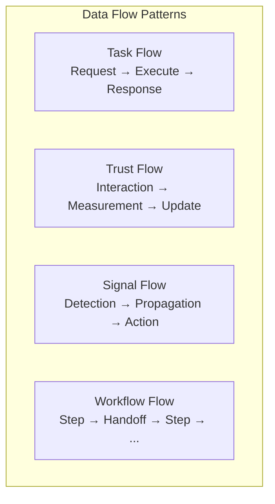

---

## 2. Task Flow

### 2.1 Single Task Flow

The simplest flow: one task, one executor.

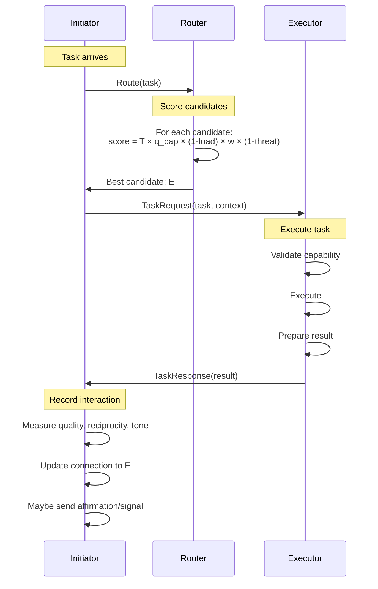

### 2.2 Task Data Structure

```
TaskRequest {
    task_id      : TaskId
    capability   : CapabilityId
    input        : TaskInput
    constraints  : TaskConstraints
    context      : TaskContext
    timestamp    : Timestamp
    signature    : Signature
}

TaskResponse {
    task_id      : TaskId
    status       : { SUCCESS, FAILURE, PARTIAL }
    output       : TaskOutput
    metrics      : ExecutionMetrics
    timestamp    : Timestamp
    signature    : Signature
}
```

### 2.3 Routing Decision Flow

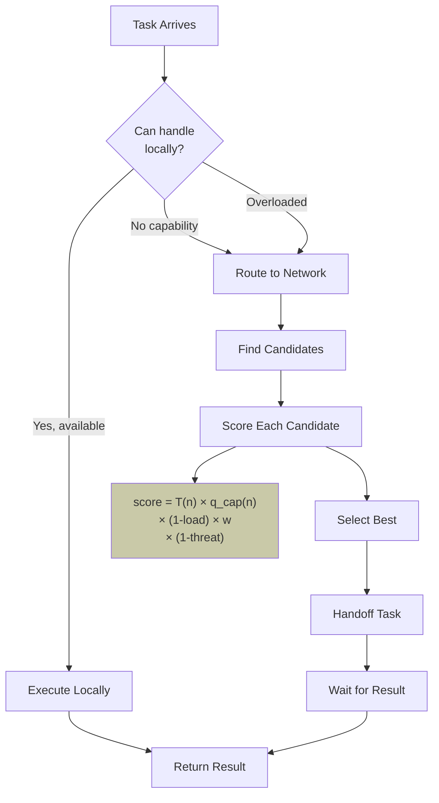

---

## 3. Interaction Flow

### 3.1 Complete Interaction Cycle

After every interaction, the following updates occur:

```mermaid
flowchart TD
    INT[Interaction Complete] --> MEAS[Measure Outcomes]

    MEAS --> Q[Quality Score<br/>q ∈ [0,1]]
    MEAS --> RHO[Exchange Ratio<br/>ρ = in/out]
    MEAS --> TAU[Tone Score<br/>τ ∈ [-1,1]]

    Q --> UPD[Update Connection]
    RHO --> UPD
    TAU --> UPD

    UPD --> RECIP[Update Reciprocity<br/>r = λr + (1-λ)(log(ρ) + θ(q-0.5))]

    UPD --> QUAL[Update Quality<br/>conn.q = λ(conn.q) + (1-λ)q]

    UPD --> TONE[Update Tone<br/>conn.τ = λ(conn.τ) + (1-λ)τ]

    RECIP --> PHY[Apply Physarum Equation]
    QUAL --> PHY
    TONE --> PHY

    PHY --> NEWW["w_new = w + Δt(Φ - αw - D)"]

    NEWW --> POST[Post-Interaction]
    POST --> AFF{Quality > 0.8<br/>Tone > 0.5?}
    POST --> WARN{Problems<br/>detected?}

    AFF -->|Yes| SEND_AFF[Send Affirmation]
    WARN -->|Yes| SEND_DEF[Emit Defense Signal]

    style NEWW fill:#b8956b
```

### 3.2 Measurement Details

#### Quality Measurement

```
FUNCTION compute_quality(feedback):

    Q_raw = (ω_HELP × feedback.helpfulness +    // 0.4
             ω_ACC  × feedback.accuracy +        // 0.3
             ω_REL  × feedback.relevance +       // 0.2
             ω_TIME × feedback.timeliness) / 4   // 0.1

    // Apply reuse modifier
    IF feedback.would_reuse:
        Q_raw = Q_raw × REUSE_BOOST     // 1.2
    ELSE:
        Q_raw = Q_raw × REUSE_PENALTY   // 0.8

    // Normalize to [0, 1]
    Q_normalized = (Q_raw - 1) / 4

    RETURN Q_normalized
```

#### Reciprocity Update

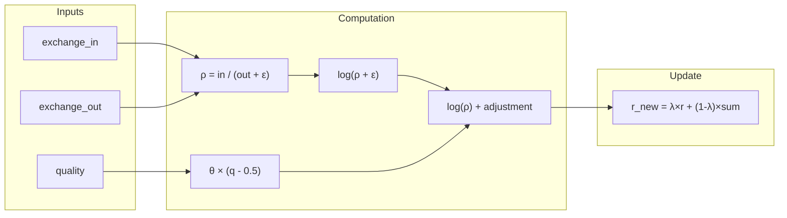

### 3.3 Connection Update Pipeline

```
FUNCTION update_connection(self, partner, interaction):

    conn = self.connections[partner.id]

    // Step 1: Compute measurements
    q   = compute_quality(interaction.feedback)
    ρ   = interaction.exchange_in / (interaction.exchange_out + ε)
    τ   = compute_tone(interaction)

    // Step 2: Update reciprocity (EMA)
    log_rho = log(ρ + ε)
    quality_adj = θ × (q - 0.5)
    conn.r = λ × conn.r + (1 - λ) × (log_rho + quality_adj)

    // Step 3: Update quality (EMA)
    conn.q = λ × conn.q + (1 - λ) × q

    // Step 4: Update tone (EMA)
    conn.τ = λ × conn.τ + (1 - λ) × τ

    // Step 5: Compute reinforcement (Physarum)
    Q   = interaction.task_volume
    σ_r = sigmoid(conn.r)       // (2 / (1 + e^(-βr))) - 1
    ψ_q = 0.5 + conn.q          // [0.5, 1.5]
    φ_τ = 0.7 + 0.3 × conn.τ    // [0.4, 1.0]

    Φ = γ × pow(|Q|, μ) × σ_r × ψ_q × φ_τ

    // Step 6: Compute defense dampening
    D = 0
    IF partner.id IN self.threat_beliefs:
        D = δ × self.threat_beliefs[partner.id].level

    // Step 7: Update weight
    Δw = Φ - α × conn.w - D
    conn.w = clamp(conn.w + Δw, W_MIN, W_MAX)

    // Step 8: Bookkeeping
    conn.last_active = now()
    conn.count += 1
```

---

## 4. Defense Signal Flow

### 4.1 Signal Generation

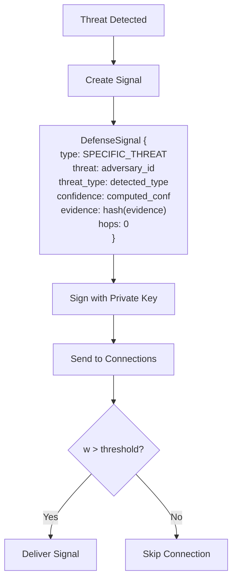

### 4.2 Signal Propagation

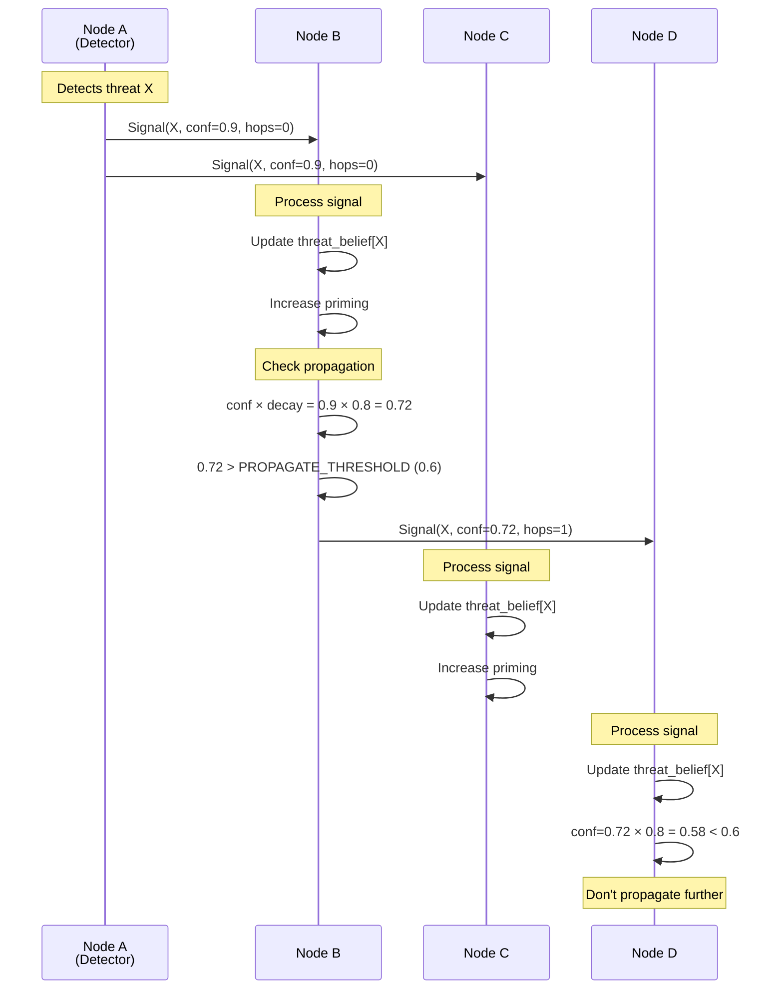

### 4.3 Belief Update Flow

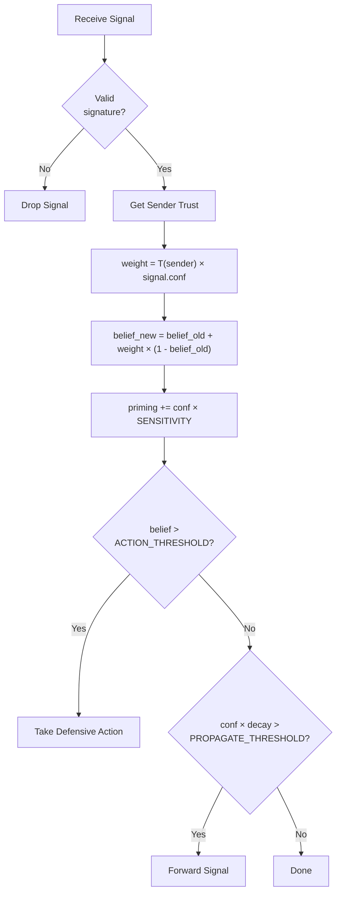

---

## 5. Workflow Flow

### 5.1 Sequential Workflow

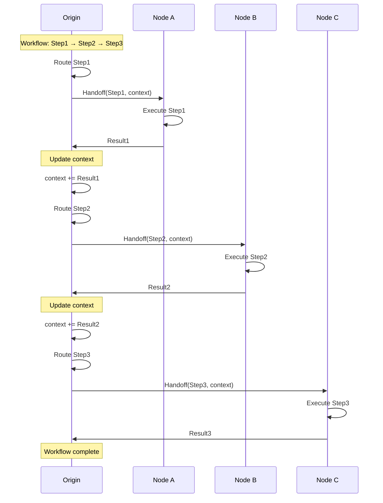

### 5.2 Handoff Data Structure

```
Handoff {
    from_node    : NodeId
    to_node      : NodeId
    task         : Task
    context      : HandoffContext
    timestamp    : Timestamp
    signature    : Signature
}

HandoffContext {
    workflow_id   : WorkflowId
    step_index    : uint32
    prior_results : List<StepResult>
    accumulated   : Map<string, any>
    lineage       : List<NodeId>
}
```

### 5.3 Parallel Workflow

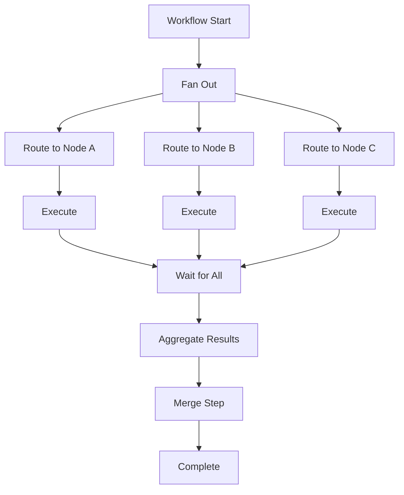

### 5.4 DAG Workflow

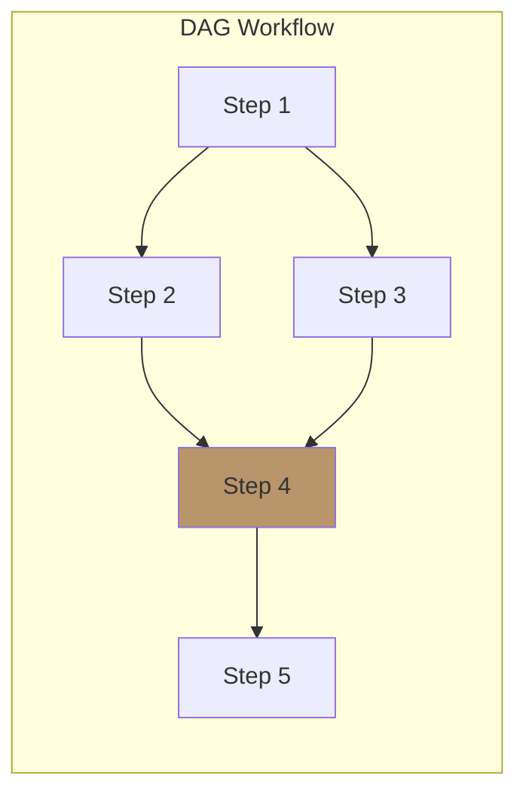

Execution order:
1. S1 executes
2. S2 and S3 execute in parallel (both depend only on S1)
3. S4 executes (waits for S2 AND S3)
4. S5 executes

---

## 6. Trust Computation Flow

### 6.1 Trust Aggregation

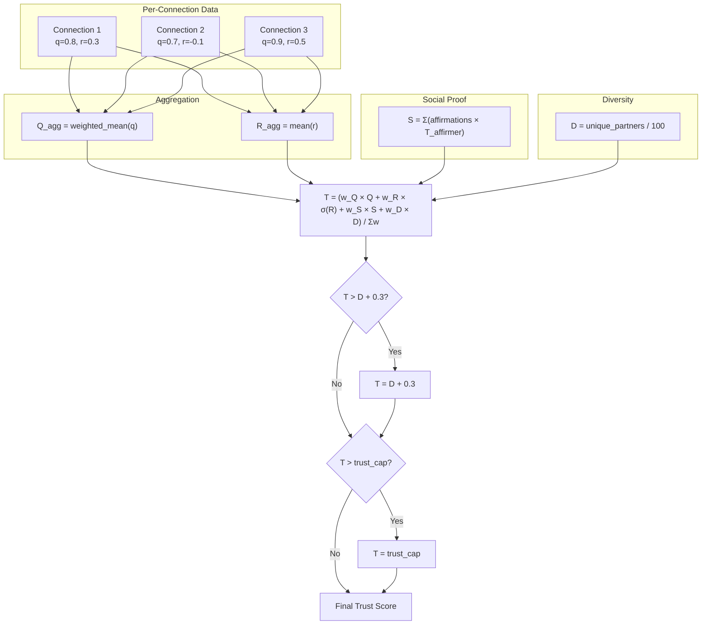

### 6.2 Per-Capability Quality

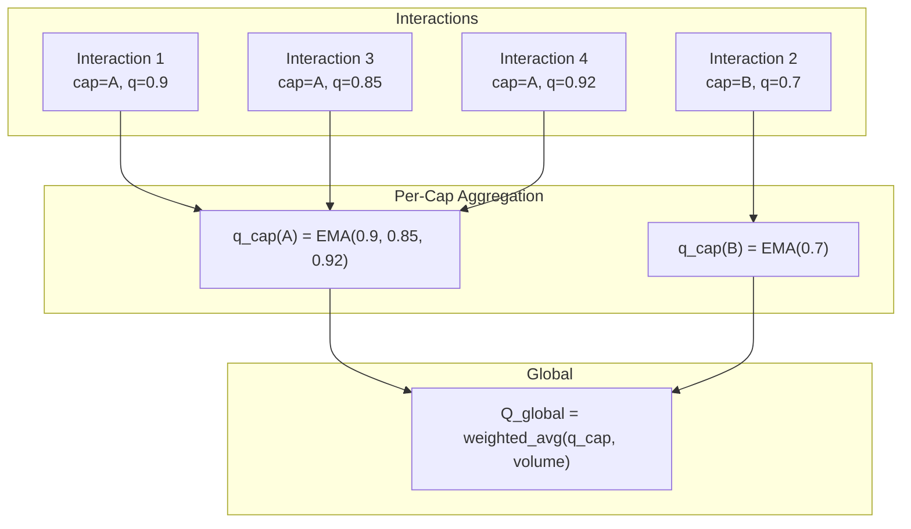

---

## 7. Background Flow

### 7.1 Periodic Tasks

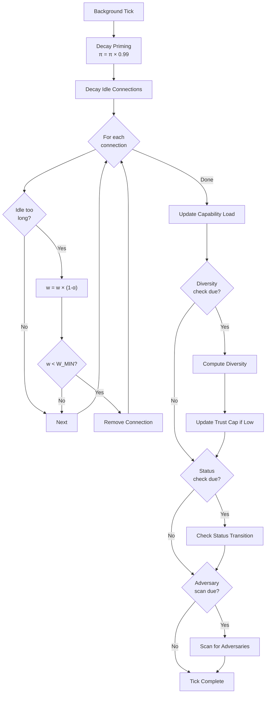

### 7.2 Decay Dynamics

| What Decays | Rate | Formula |
|-------------|------|---------|
| Priming | Per tick | π × 0.99 |
| Idle connections | Per tick | w × (1 - α) |
| Capability load | Per tick | load × 0.95 |
| Threat beliefs | Per tick | belief × decay_rate |

---

## 8. Data Flow Summary

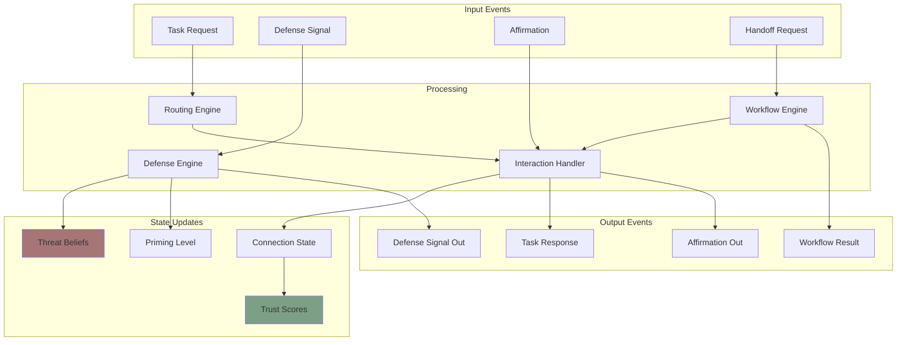

---

## 9. Key Takeaways

| Flow Type | Trigger | Updates | Outputs |
|-----------|---------|---------|---------|
| **Task** | Task request | Connection w, q, r, τ | Response, maybe signal/affirmation |
| **Defense** | Threat detection | Threat beliefs, priming | Forwarded signals |
| **Workflow** | Multi-step task | Same as task per step | Final result |
| **Background** | Timer | Decay connections, priming | Status transitions |

All flows ultimately contribute to the trust computation, which in turn affects future routing decisions—creating a feedback loop that naturally optimizes network behavior.

---

*Previous: [Network Topology](./network.md) | Next: [The Physarum Equation](../protocol/physarum-equation.md)*
