# Network Topology

**Document Version:** 1.0
**Last Updated:** December 2025
**Status:** Normative

---

## 1. Introduction

### 1.1 Purpose

This document describes the network topology of Symbiont systems—how nodes connect, how the network evolves, and what emergent properties arise from local connection dynamics.

### 1.2 Key Concepts

- Networks are **self-organizing** — topology emerges from interactions
- Connections are **weighted** — not all links are equal
- The network is **dynamic** — connections strengthen, weaken, appear, and disappear
- There are **no privileged nodes** — the network is fully decentralized

---

## 2. Network Model

### 2.1 Graph Representation

A Symbiont network is a **weighted, directed graph** G = (V, E, W) where:

- **V** = Set of nodes (agents)
- **E** = Set of edges (connections)
- **W** = Edge weights ∈ [0, 1]

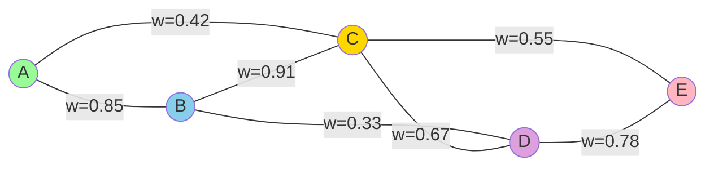

### 2.2 Connection Directionality

While the graph is logically undirected (if A connects to B, B connects to A), each node maintains its **own view** of the connection:

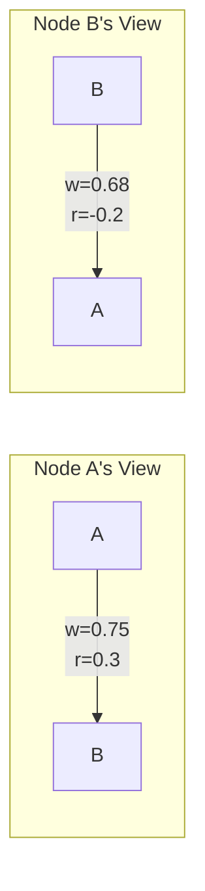

**Key Point:** Node A's weight to B may differ from B's weight to A. This asymmetry captures:
- Different perceived quality of interactions
- Different reciprocity experiences
- Information asymmetry

### 2.3 Network Metrics

| Metric | Definition | Significance |
|--------|------------|--------------|
| **Degree** | Number of connections | Connectivity |
| **Weighted Degree** | Sum of connection weights | Connection strength |
| **Clustering Coefficient** | Triangle density | Local cohesion |
| **Path Length** | Hops between nodes | Information propagation |
| **Betweenness Centrality** | Bridge importance | Routing significance |

---

## 3. Network Evolution

### 3.1 Connection Formation

Connections form when nodes interact:

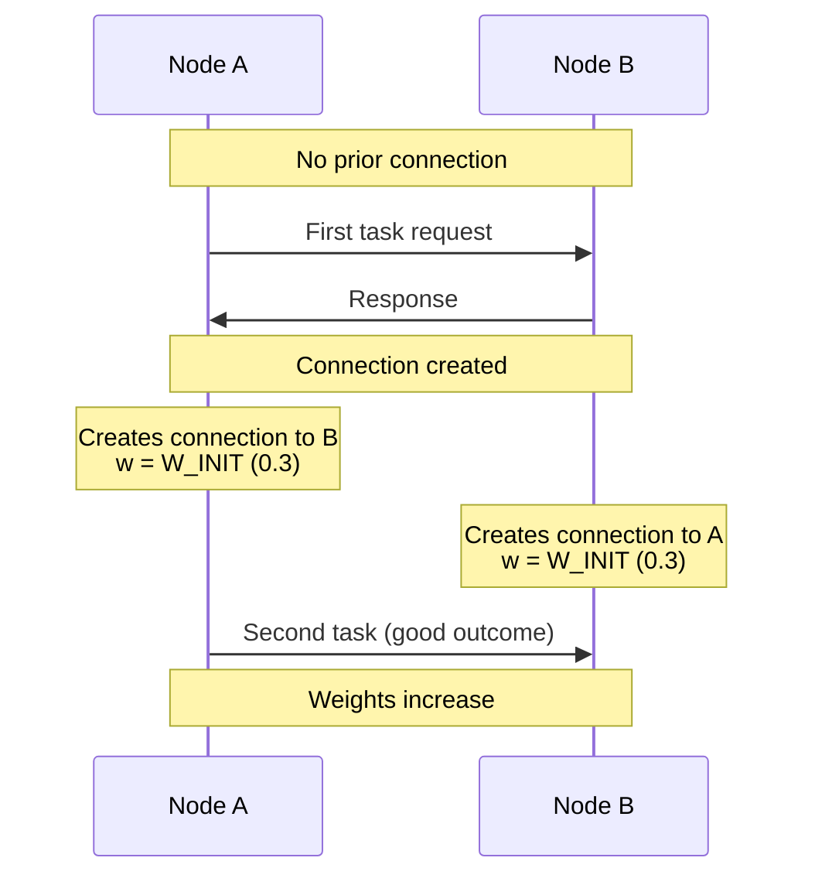

### 3.2 Connection Dynamics

Connections evolve according to the Physarum equation:

$$\frac{dw}{dt} = \gamma \cdot |Q|^\mu \cdot \sigma(r) \cdot \psi(q) \cdot \phi(\tau) - \alpha \cdot w - D$$

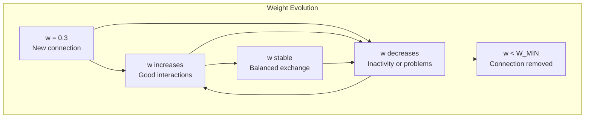

### 3.3 Emergent Topology

Over time, the network develops structure:

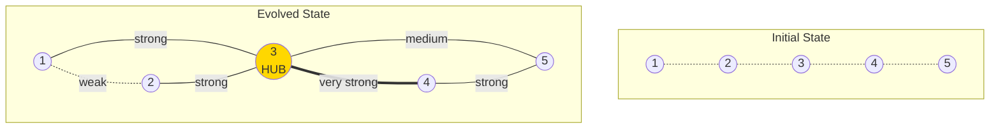

**Emergent Properties:**
- **Hubs** emerge naturally from high-quality, well-connected nodes
- **Clusters** form around nodes with similar capabilities
- **Weak links** decay and disappear
- **Strong links** persist and strengthen

---

## 4. Network Properties

### 4.1 Small-World Property

Symbiont networks tend to exhibit small-world characteristics:

| Property | Description | Benefit |
|----------|-------------|---------|
| High clustering | Local neighborhoods well-connected | Redundancy |
| Short path lengths | Few hops between any two nodes | Fast signal propagation |
| Hub emergence | Some nodes become highly connected | Efficient routing |

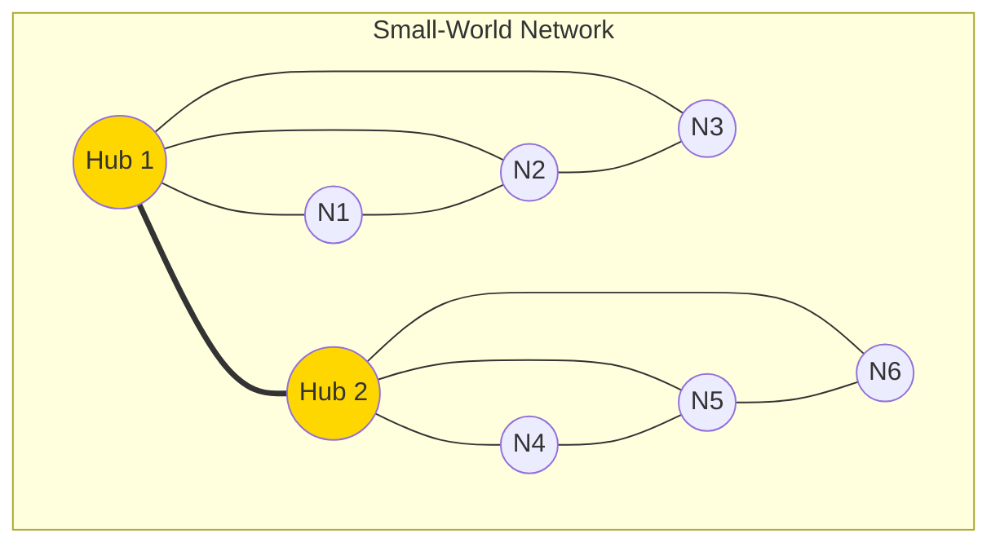

### 4.2 Scale-Free Tendency

Connection degree distribution tends toward power-law:
- Most nodes have few connections
- Few nodes (hubs) have many connections

This emerges from **preferential attachment**: high-trust nodes receive more task requests, forming more connections.

### 4.3 Resilience

The network is resilient to:

| Failure Type | Network Response |
|--------------|------------------|
| Random node failure | Routes around; minimal impact |
| Hub failure | Degraded but functional; other hubs compensate |
| Adversary injection | Defense signals propagate; adversary isolated |
| Network partition | Each partition continues functioning |

---

## 5. Network Operations

### 5.1 Node Discovery

New nodes discover the network through:

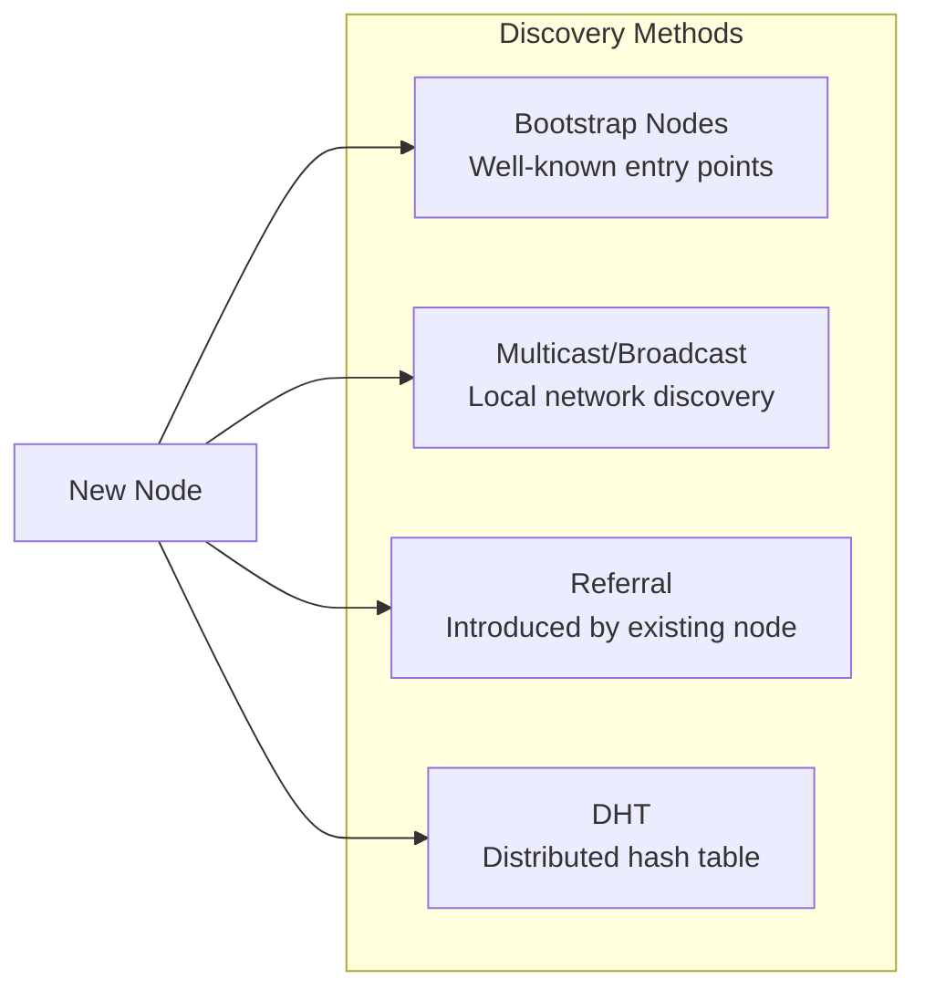

### 5.2 Connection Management

Each node manages connections locally:

```
FUNCTION manage_connections(self):

    // Prune dead connections
    FOR EACH conn IN self.connections:
        IF conn.w < W_MIN:
            self.connections.remove(conn.partner_id)
        ELSE IF (now() - conn.last_active) > MAX_IDLE:
            // Probe to check if still alive
            IF NOT probe(conn.partner_id):
                self.connections.remove(conn.partner_id)

    // Consider new connections (e.g., from recommendations)
    FOR EACH candidate IN get_recommended_connections():
        IF should_connect(candidate):
            self.connections[candidate.id] = new_connection(candidate.id)
```

### 5.3 Network Partitioning

If the network partitions:

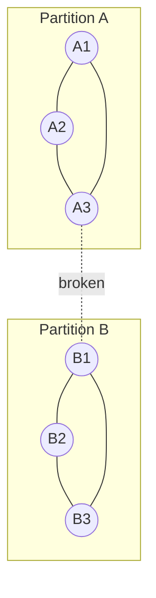

**Behavior:**
- Each partition operates independently
- Trust scores remain valid within partition
- Cross-partition connections decay
- Upon reconnection, connections re-establish gradually

---

## 6. Defense Signal Propagation

### 6.1 Signal Flow Through Network

Defense signals propagate through trusted connections:

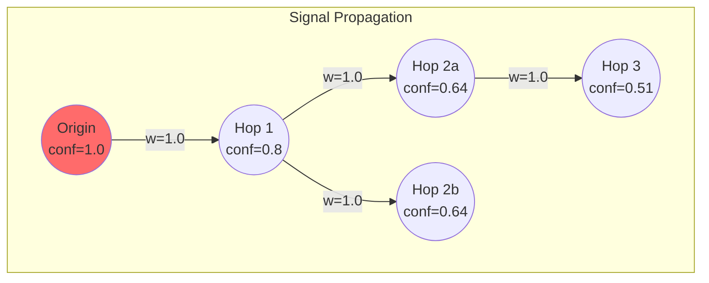

### 6.2 Propagation Rules

```
confidence_at_hop = confidence_previous × DECAY_PER_HOP × w_connection

WHERE:
    DECAY_PER_HOP = 0.8
    MAX_HOPS = 5
    MIN_SIGNAL = 0.1
```

### 6.3 Multi-Path Aggregation

When signals arrive from multiple paths:

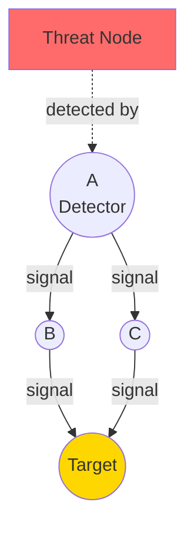

**Target's Belief Update:**
- Receives signal from B (confidence c₁)
- Receives signal from C (confidence c₂)
- Final belief: Bayesian aggregation of both

---

## 7. Routing in the Network

### 7.1 Local Routing Decisions

Each node makes routing decisions based on local information:

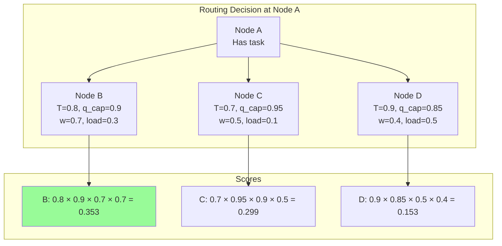

**Result:** Task routes to Node B (highest score).

### 7.2 Multi-Hop Routing

For workflows, routing decisions cascade:

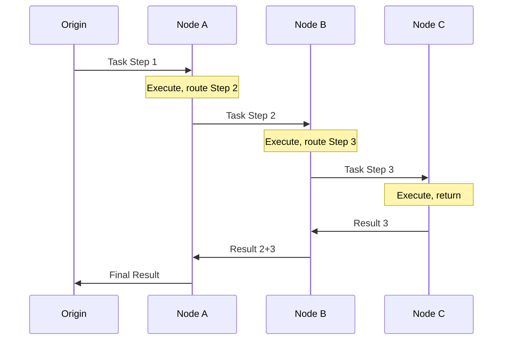

**Key Point:** Each node routes from its own perspective, using its own connection weights and trust assessments.

---

## 8. Network Health Metrics

### 8.1 Health Indicators

| Metric | Healthy Range | Warning Signs |
|--------|---------------|---------------|
| Mean connection weight | 0.5 - 0.8 | < 0.3 or > 0.95 |
| Network diameter | 3 - 6 hops | > 10 hops |
| Hub count | 5-15% of nodes | < 2% or > 30% |
| Mean diversity | > 0.4 | < 0.2 |
| Active defense signals | < 10% of nodes | > 30% |

### 8.2 Network Visualization

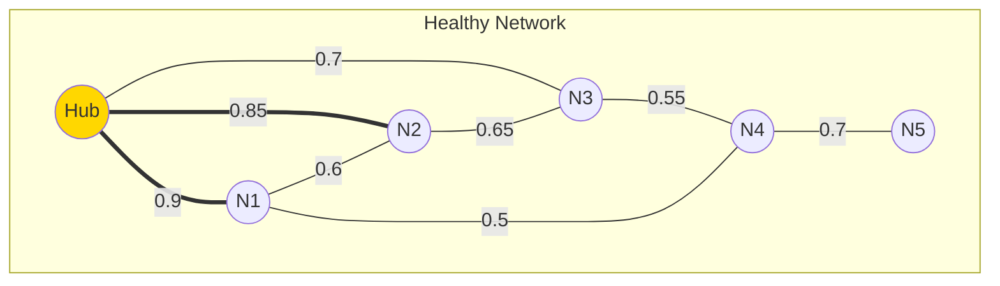

Characteristics:
- Clear hub structure
- Mix of strong and medium connections
- Good path redundancy

---

## 9. Network Scenarios

### 9.1 New Node Joining

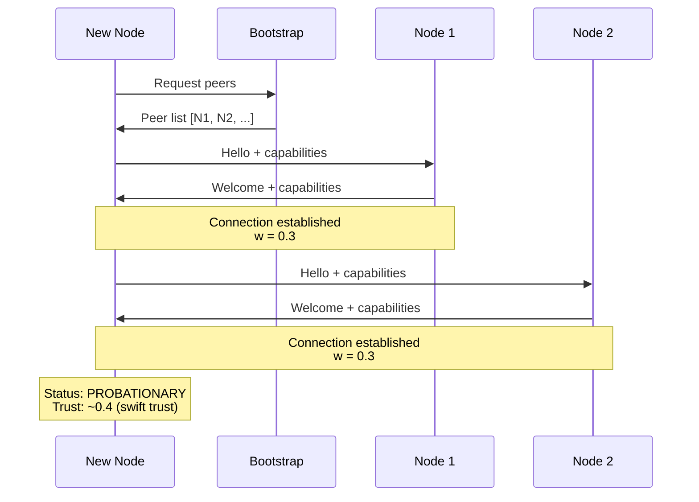

### 9.2 Hub Emergence

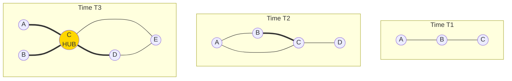

Node C becomes a hub through:
1. High-quality interactions
2. Good reciprocity
3. Diverse connections
4. Reliable availability

### 9.3 Adversary Isolation

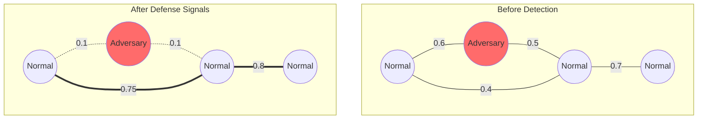

---

## 10. Summary

Symbiont networks are:

| Property | Description |
|----------|-------------|
| **Self-organizing** | Topology emerges from interaction patterns |
| **Weighted** | Connection strength varies based on history |
| **Dynamic** | Constantly evolving through Physarum dynamics |
| **Resilient** | Tolerates failures and attacks |
| **Efficient** | Small-world properties enable fast routing |

The network structure is not designed—it **emerges** from the collective behavior of nodes following simple local rules.

---

*Previous: [Node Architecture](./node.md) | Next: [Data Flow](./data-flow.md)*
