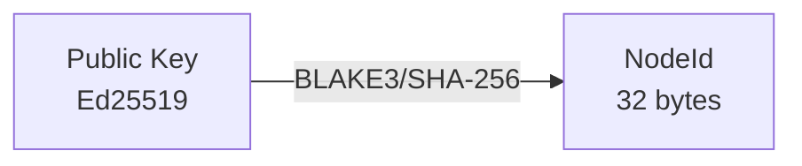
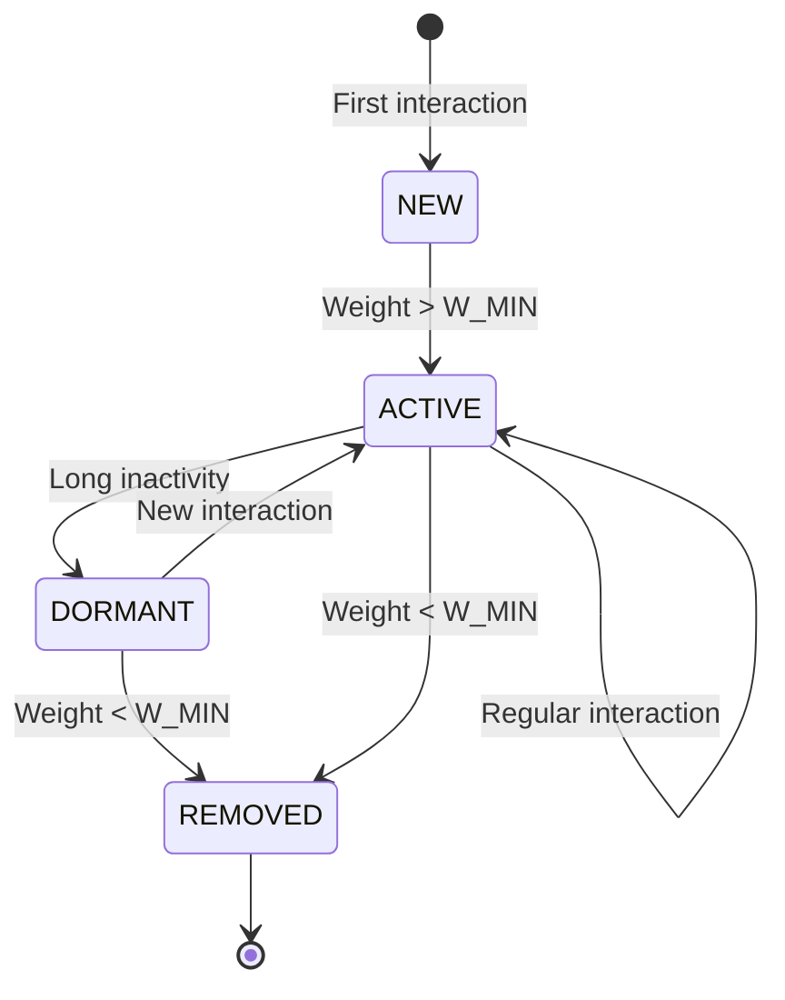
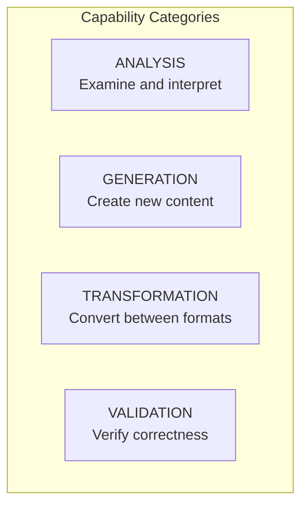
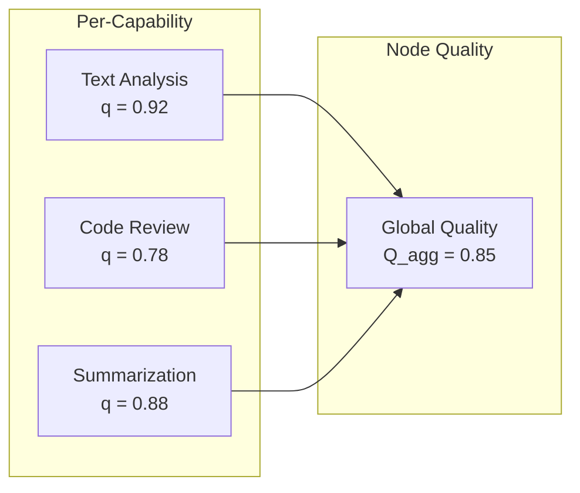
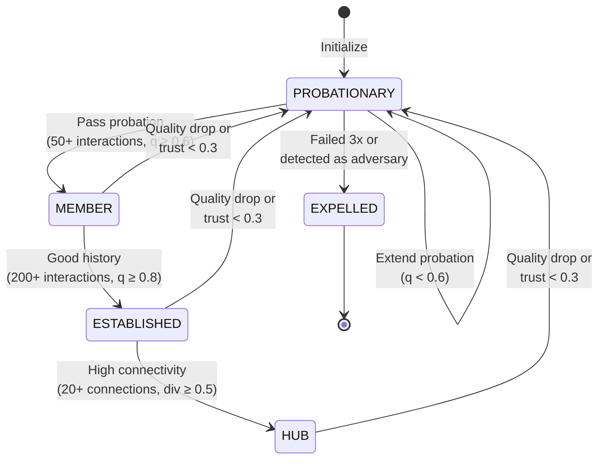
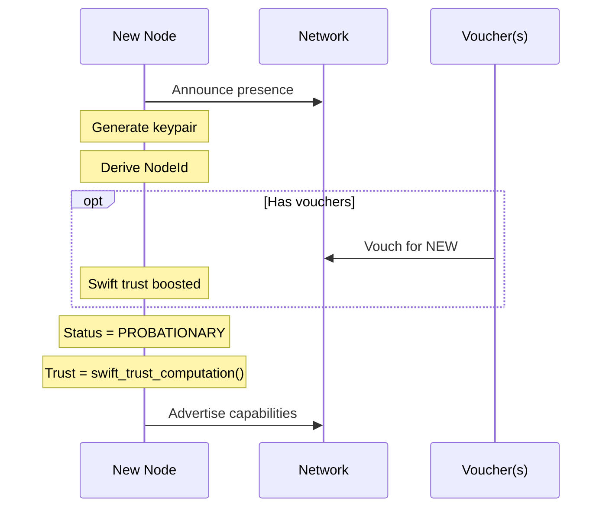
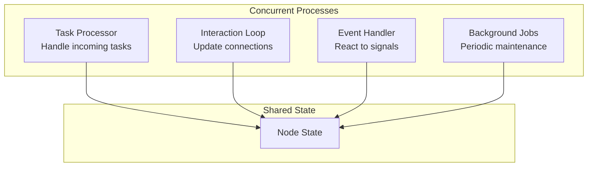
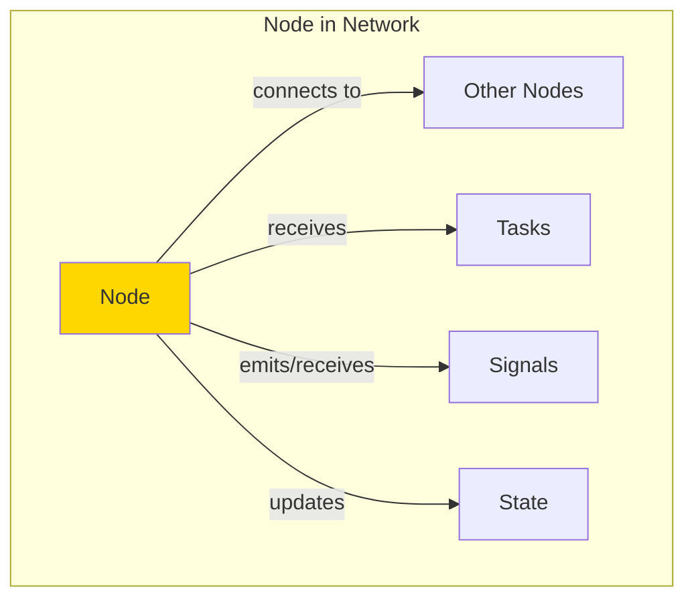

# Node Architecture

**Document Version:** 1.0
**Last Updated:** December 2025
**Status:** Normative

---

## 1. Introduction

### 1.1 Purpose

This document describes the internal architecture of a Symbiont node. It details the structure, state, and behavior of individual nodes that participate in the Symbiont network.

### 1.2 Scope

This document covers:
- Node structure and state
- Lifecycle management
- Internal processes
- Capability management

---

## 2. Node Overview

### 2.1 Definition

A **Node** is an autonomous agent participating in the Symbiont network. Each node:
- Has a unique cryptographic identity
- Maintains connections to other nodes
- Offers capabilities (functions it can perform)
- Computes trust locally
- Participates in defense signaling

### 2.2 Node Structure Diagram

```mermaid
graph TB
    subgraph "Node Structure"
        subgraph "Identity"
            ID[NodeId<br/>32 bytes]
            KEY[Private Key]
        end

        subgraph "Status"
            STAT[Status<br/>PROBATIONARY → HUB]
            TRUST[Trust Score<br/>T ∈ [0, 1]]
            CONF[Self-Confidence<br/>S_conf ∈ [0, 1]]
            PRIME[Priming<br/>π ∈ [0, 1]]
        end

        subgraph "Relationships"
            CONN[Connections<br/>Map NodeId → Connection]
            THREATS[Threat Beliefs<br/>Map NodeId → ThreatBelief]
        end

        subgraph "Capabilities"
            CAPS[Capability States<br/>Map CapId → CapState]
        end

        subgraph "Flags"
            FLAGS[Flags<br/>Set of Warning Flags]
        end
    end

    style ID fill:#87CEEB
    style TRUST fill:#98FB98
    style CONN fill:#FFD700
    style CAPS fill:#DDA0DD
```

---

## 3. Node State

### 3.1 Core State Structure

```
STRUCTURE Node {
    // Identity
    id              : NodeId            // 32-byte cryptographic identifier
    private_key     : PrivateKey        // Ed25519 private key

    // Status
    status          : NodeStatus        // Current lifecycle status
    trust           : Score             // Computed trust level [0, 1]
    trust_cap       : Score             // Maximum allowed trust [0, 1]
    confidence      : Score             // Self-confidence [0, 1]
    priming         : Score             // Defense readiness [0, 1]

    // Relationships
    connections     : Map<NodeId, Connection>
    threat_beliefs  : Map<NodeId, ThreatBelief>

    // Capabilities
    capabilities    : Map<CapabilityId, CapabilityState>

    // Flags
    flags           : Set<Flag>

    // Metrics
    interaction_count : uint64
    quality_score     : Score           // Aggregated quality
}
```

### 3.2 State Field Details

#### 3.2.1 NodeId
**Type:** bytes[32]
**Description:** Unique cryptographic identifier, derived from the public key.



#### 3.2.2 NodeStatus
**Type:** Enumeration
**Values:**

| Status | Description | Trust Range |
|--------|-------------|-------------|
| PROBATIONARY | New node, building trust | [0, 0.6] |
| MEMBER | Passed probation | [0.4, 0.8] |
| ESTABLISHED | Long history of good behavior | [0.6, 1.0] |
| HUB | Highly connected, trusted node | [0.8, 1.0] |
| EXPELLED | Removed from network | N/A |

#### 3.2.3 Trust Score
**Type:** float64 ∈ [0, 1]
**Computation:** Aggregated from quality, reciprocity, social proof, and diversity (see [Trust Computation](../protocol/trust-computation.md)).

#### 3.2.4 Trust Cap
**Type:** float64 ∈ [0, 1]
**Purpose:** Maximum trust level allowed, reduced by flags or low diversity.
**Default:** 1.0

#### 3.2.5 Self-Confidence
**Type:** float64 ∈ [0, 1]
**Purpose:** Node's belief in its own trustworthiness, updated by affirmations.

**Update Formula:**
$$S_{conf,new} = \alpha \cdot S_{conf,old} + (1-\alpha) \cdot A_{mean}$$

Where α = 0.95 and A_mean is the weighted mean of recent affirmations.

#### 3.2.6 Priming Level
**Type:** float64 ∈ [0, 1]
**Purpose:** Defense readiness, increased by signals, decayed over time.

**Dynamics:**
- Increase: π += signal.confidence × PRIMING_SENSITIVITY
- Decay: π *= PRIMING_DECAY (0.99 per tick)

---

## 4. Connection State

### 4.1 Connection Structure

Each connection to another node maintains:

```
STRUCTURE Connection {
    partner_id   : NodeId           // Who this connection is to
    w            : Weight           // Connection strength [0, 1]
    r            : float64          // Reciprocity score (unbounded)
    q            : Score            // Quality score [0, 1]
    τ            : SignedScore      // Tone score [-1, 1]
    π            : Score            // Priming level for this connection
    last_active  : Timestamp        // Last interaction time
    count        : uint32           // Total interaction count
}
```

### 4.2 Connection Lifecycle



### 4.3 Connection Initialization

```
FUNCTION new_connection(partner_id):
    RETURN Connection {
        partner_id  = partner_id
        w           = W_INIT        // 0.3
        r           = 0.0           // Neutral reciprocity
        q           = 0.5           // Neutral quality
        τ           = 0.0           // Neutral tone
        π           = 0.0           // Not primed
        last_active = now()
        count       = 0
    }
```

---

## 5. Capability State

### 5.1 Capability Structure

```
STRUCTURE CapabilityState {
    capability   : Capability        // The capability definition
    quality      : Score             // Quality for THIS capability [0, 1]
    volume       : uint32            // Times this capability was used
    last_used    : Timestamp         // When last used
    available    : boolean           // Currently available?
    load         : Score             // Current load [0, 1]
}

STRUCTURE Capability {
    id           : CapabilityId
    name         : string
    category     : CapabilityCategory
    input_types  : List<DataType>
    output_types : List<DataType>
}
```

### 5.2 Capability Categories



### 5.3 Per-Capability Quality Tracking

Quality is tracked separately for each capability:



This allows nuanced routing: "Node A is excellent at analysis but mediocre at generation."

---

## 6. Threat Beliefs

### 6.1 Threat Belief Structure

```
STRUCTURE ThreatBelief {
    level       : Score              // Threat level [0, 1]
    threat_type : ThreatType         // Category of threat
    evidence    : List<Hash>         // Hashes of evidence
    updated     : Timestamp          // Last update time
}

ENUM ThreatType {
    CHEATING,           // Providing intentionally wrong results
    SYBIL,              // Multiple fake identities
    COLLUSION,          // Coordinating with others to game system
    QUALITY_FRAUD,      // Artificially inflating quality scores
    STRATEGIC           // Building trust then defecting
}
```

### 6.2 Threat Belief Update

Beliefs are updated using Bayesian update:

```
FUNCTION update_threat_belief(self, threat_id, signal):

    current = self.threat_beliefs[threat_id] OR default_belief()

    // Weight based on sender trust and signal confidence
    weight = T(signal.sender) × signal.confidence

    // Bayesian update
    new_level = current.level + weight × (1 - current.level)

    self.threat_beliefs[threat_id] = ThreatBelief {
        level       = new_level
        threat_type = signal.threat_type
        evidence    = current.evidence + [signal.evidence]
        updated     = now()
    }
```

---

## 7. Node Lifecycle

### 7.1 State Machine



### 7.2 Transition Conditions

| Transition | Condition |
|------------|-----------|
| PROBATIONARY → MEMBER | interaction_count ≥ 50 AND mean_quality ≥ 0.6 |
| PROBATIONARY → EXPELLED | failed_probation_3_times OR detected_as_adversary |
| MEMBER → ESTABLISHED | interaction_count ≥ 200 AND mean_quality ≥ 0.8 |
| ESTABLISHED → HUB | connection_count ≥ 20 AND diversity ≥ 0.5 AND quality ≥ 0.85 |
| ANY → PROBATIONARY | quality_drop > 0.4 OR trust < 0.3 |
| ANY → EXPELLED | threat_belief ≥ 0.9 from multiple sources |

### 7.3 Transition Actions

```
FUNCTION check_status_transition(self):

    SWITCH self.status:

        CASE PROBATIONARY:
            IF self.interaction_count >= 50:
                IF mean_quality(self) >= 0.6:
                    self.status = MEMBER
                    self.trust = min(self.trust × 1.5, 0.8)
                ELSE:
                    self.probation_failures += 1
                    IF self.probation_failures >= 3:
                        self.status = EXPELLED
                        notify_network()

        CASE MEMBER:
            IF self.interaction_count >= 200 AND mean_quality(self) >= 0.8:
                self.status = ESTABLISHED

        CASE ESTABLISHED:
            IF len(self.connections) >= 20 AND diversity(self) >= 0.5:
                IF mean_quality(self) >= 0.85:
                    self.status = HUB
```

---

## 8. Node Initialization

### 8.1 Cold Start

When a new node joins the network:



### 8.2 Swift Trust Computation

```
FUNCTION initialize_node(node_id, role, capabilities, vouchers):

    // Base swift trust
    T_swift = SWIFT_TRUST_BASE                    // 0.4

    // Category-based adjustment
    T_category = lookup_role_trust(role) × similarity_score()

    // Voucher contribution (if any)
    T_vouch = 0
    FOR EACH voucher IN vouchers:
        vouch_weight = voucher.trust × voucher.stake × time_decay(voucher.age)
        T_vouch += vouch_weight

    // Social proof (if available)
    T_social = sigmoid(interaction_quality_sum / network_average)

    // Combine
    T_init = 0.3 × T_swift + 0.2 × T_category + 0.3 × T_vouch + 0.2 × T_social

    RETURN Node {
        id           = node_id
        status       = PROBATIONARY
        trust        = T_init
        trust_cap    = 1.0
        confidence   = 0.5           // Neutral self-confidence
        priming      = 0.0           // Not primed
        connections  = {}
        capabilities = init_capabilities(capabilities)
        // ...
    }
```

---

## 9. Node Processes

### 9.1 Process Overview

Each node runs concurrent processes:



### 9.2 Task Processor

Handles incoming tasks and routing decisions:

```
FUNCTION process_task(self, task, network):

    required_cap = task.required_caps[0]

    // Can we handle it ourselves?
    IF self.has_capability(required_cap) AND self.load < 0.9:
        result = self.execute(task)
        RETURN TaskResult.LOCAL(result)

    // Route to best candidate
    candidates = find_candidates(task, network)
    IF candidates is empty:
        RETURN TaskResult.NO_CANDIDATES

    scored = []
    FOR EACH node IN candidates:
        score = compute_routing_score(self, node, task)
        scored.append((node, score))

    scored.sort(BY score DESC)
    target = scored[0].node

    handoff = perform_handoff(self, target, task)
    result = await_result(handoff)

    RETURN TaskResult.ROUTED(target, result)
```

### 9.3 Background Jobs

Periodic maintenance:

```
FUNCTION background_tick(self):

    // Decay priming
    self.priming = self.priming × PRIMING_DECAY

    // Decay unused connections
    FOR EACH conn IN self.connections:
        IF (now() - conn.last_active) > IDLE_THRESHOLD:
            conn.w = conn.w × (1 - α)
            IF conn.w < W_MIN:
                remove_connection(conn)

    // Update capability availability
    FOR EACH cap_state IN self.capabilities:
        cap_state.load = cap_state.load × 0.95
        cap_state.available = (cap_state.load < 0.9)

    // Check diversity (periodic)
    IF tick_count MOD DIVERSITY_INTERVAL == 0:
        update_diversity_score(self)

    // Check status transitions (periodic)
    IF tick_count MOD STATUS_INTERVAL == 0:
        check_status_transition(self)
```

---

## 10. Flags System

### 10.1 Available Flags

```
ENUM Flag {
    LOW_DIVERSITY,        // Insufficient partner diversity
    PROBATION_WARNING,    // At risk of failing probation
    UNDER_INVESTIGATION,  // Multiple threat reports received
    LOAD_LIMITED,         // Reduced capacity
    DEFENSE_ACTIVE        // Currently defending against threat
}
```

### 10.2 Flag Effects

| Flag | Effect |
|------|--------|
| LOW_DIVERSITY | trust_cap reduced to 0.7 |
| PROBATION_WARNING | Extra monitoring |
| UNDER_INVESTIGATION | May be excluded from routing |
| LOAD_LIMITED | Load factor applied to routing |
| DEFENSE_ACTIVE | Priming maintained high |

---

## 11. Summary

A Symbiont node is a self-contained agent that:

| Aspect | Description |
|--------|-------------|
| **Identity** | Cryptographic keypair defines unique NodeId |
| **Status** | Progresses through lifecycle based on behavior |
| **Connections** | Maintains weighted relationships to other nodes |
| **Capabilities** | Advertises what it can do, tracked per-capability |
| **Trust** | Computes trust locally based on interaction history |
| **Defense** | Maintains threat beliefs and priming level |
| **Processes** | Runs concurrent task, event, and maintenance loops |



---

*Previous: [Architecture Overview](./overview.md) | Next: [Network Topology](./network.md)*
