# Architecture Overview

**Document Version:** 1.0
**Last Updated:** December 2025
**Status:** Normative

---

## 1. Introduction

### 1.1 Purpose

This document provides a comprehensive overview of the Symbiont system architecture. It describes the major components, their relationships, and how they work together to achieve decentralized trust and orchestration.

### 1.2 Scope

This document covers:
- High-level system structure
- Component responsibilities
- Inter-component communication
- Deployment considerations

---

## 2. System Context

### 2.1 External View

Symbiont operates as a layer that enables trust-based coordination between autonomous agents:

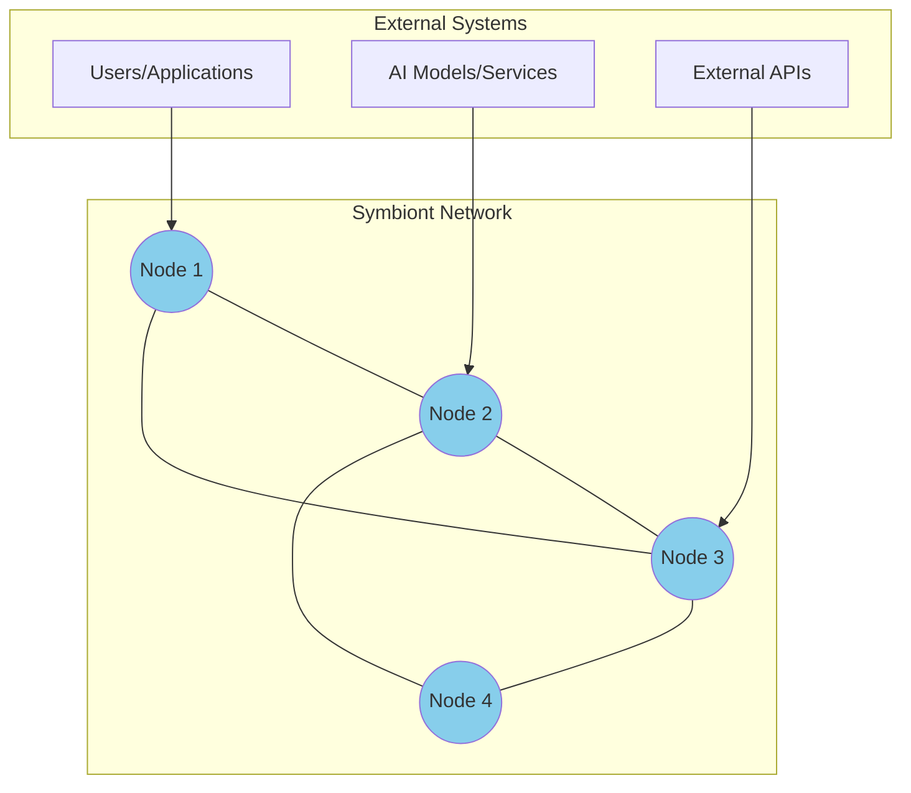

### 2.2 What Symbiont Provides

| Capability | Description |
|------------|-------------|
| **Trust Computation** | Determines how trustworthy each node is |
| **Task Routing** | Directs tasks to capable, trusted nodes |
| **Defense Signaling** | Propagates threat warnings through the network |
| **Workflow Orchestration** | Coordinates multi-step task sequences |
| **Adversary Detection** | Identifies malicious behavior patterns |

### 2.3 What Symbiont Does NOT Provide

| Not Included | Reason |
|--------------|--------|
| Transport Layer | Use existing P2P (libp2p, Veilid) or custom |
| Identity Management | Use existing PKI or identity systems |
| Task Execution | Nodes implement their own capabilities |
| Consensus | Trust emerges; no global consensus needed |

---

## 3. Architectural Layers

### 3.1 Layer Diagram

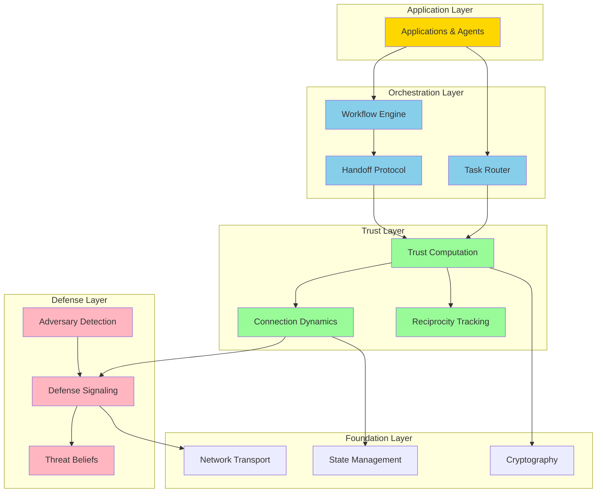

### 3.2 Layer Responsibilities

| Layer | Responsibility | Key Components |
|-------|----------------|----------------|
| **Application** | User-facing functionality | Agents, UIs, APIs |
| **Orchestration** | Task routing and workflow | Router, Workflow Engine, Handoff |
| **Trust** | Trust computation | Dynamics, Reciprocity, Aggregation |
| **Defense** | Threat response | Signals, Detection, Beliefs |
| **Foundation** | Core infrastructure | Crypto, State, Network |

---

## 4. Component Architecture

### 4.1 Node Components

Each Symbiont node contains the following internal components:

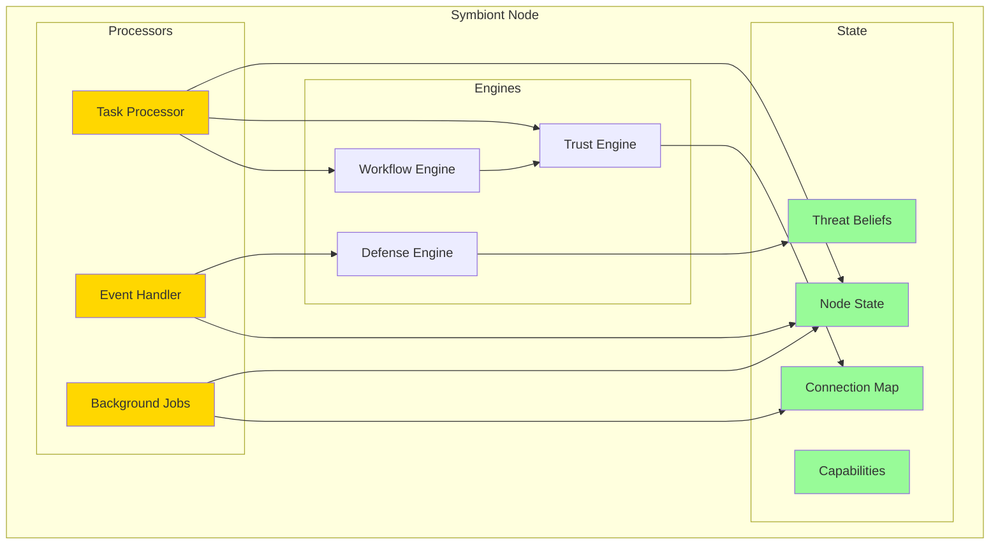

### 4.2 Component Descriptions

#### 4.2.1 Task Processor
**Purpose:** Routes incoming tasks and orchestrates workflows.

**Responsibilities:**
- Evaluate whether to handle locally or delegate
- Score candidates for routing
- Execute local tasks
- Manage workflow state

#### 4.2.2 Event Handler
**Purpose:** Reacts to asynchronous events from the network.

**Handled Events:**
- Defense signals from other nodes
- Affirmations received
- Handoff requests
- Workflow updates

#### 4.2.3 Background Jobs
**Purpose:** Performs periodic maintenance tasks.

**Jobs:**
- Decay idle connections
- Decay priming level
- Update capability availability
- Check diversity scores
- Scan for adversaries

#### 4.2.4 Trust Engine
**Purpose:** Computes trust scores and manages connection dynamics.

**Operations:**
- Apply Physarum equation to connections
- Aggregate trust scores
- Apply diversity caps
- Track quality per capability

#### 4.2.5 Defense Engine
**Purpose:** Manages threat detection and response.

**Operations:**
- Process incoming defense signals
- Update threat beliefs
- Emit signals when threats detected
- Manage priming state

#### 4.2.6 Workflow Engine
**Purpose:** Coordinates multi-step task execution.

**Operations:**
- Parse workflow definitions
- Track step completion
- Manage handoffs between nodes
- Handle failures and retries

---

## 5. State Management

### 5.1 State Categories

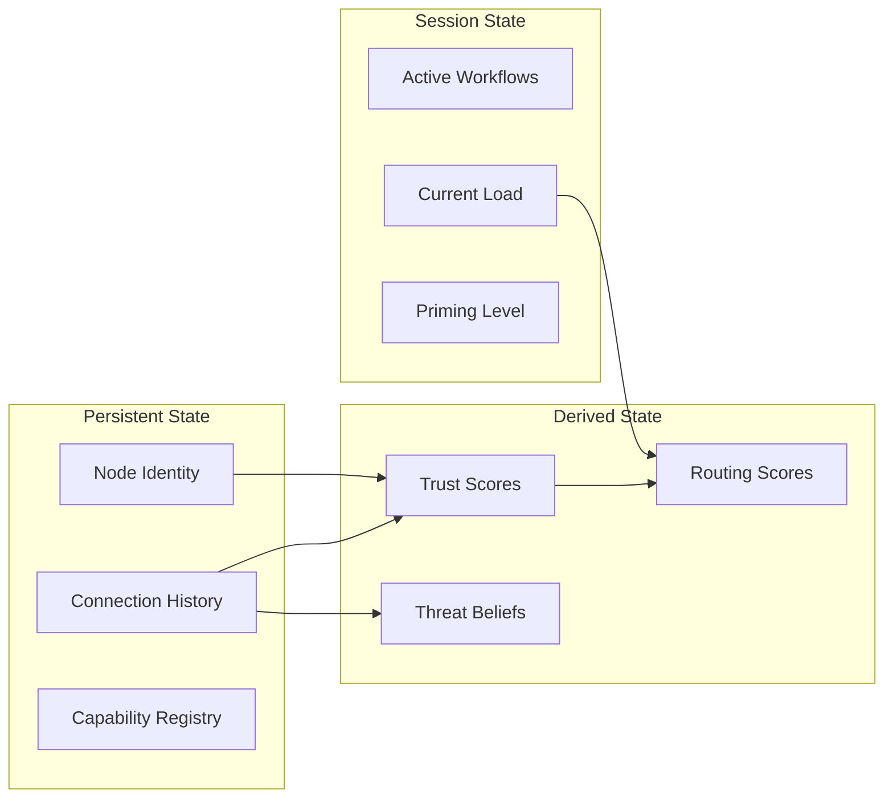

### 5.2 State Persistence

| State | Persistence | Recovery |
|-------|-------------|----------|
| Node Identity | Permanent | From key storage |
| Connections | Durable | From database |
| Active Workflows | Session | Lost on restart |
| Trust Scores | Derived | Recomputed |
| Priming | Session | Resets to 0 |

---

## 6. Communication Patterns

### 6.1 Message Types

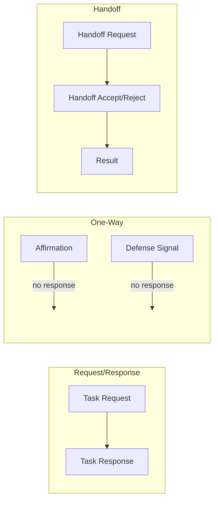

### 6.2 Message Flow Example

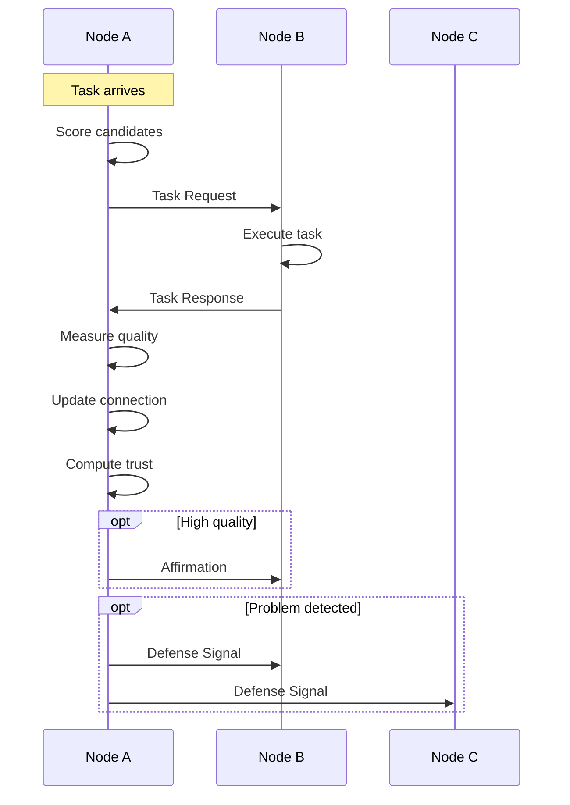

---

## 7. Concurrency Model

### 7.1 Concurrent Processes

A Symbiont node runs four concurrent processes:

```mermaid
graph TB
    subgraph "Process 1: Task Processing"
        TP1[Receive Task]
        TP2[Route/Execute]
        TP3[Return Result]
        TP1 --> TP2 --> TP3
    end

    subgraph "Process 2: Interaction Loop"
        IL1[Complete Interaction]
        IL2[Measure Outcomes]
        IL3[Update Connection]
        IL1 --> IL2 --> IL3
    end

    subgraph "Process 3: Event Handling"
        EH1[Receive Event]
        EH2[Update State]
        EH3[Maybe Propagate]
        EH1 --> EH2 --> EH3
    end

    subgraph "Process 4: Background"
        BG1[Decay Connections]
        BG2[Update Availability]
        BG3[Scan for Adversaries]
        BG1 --> BG2 --> BG3 --> BG1
    end
```

### 7.2 Synchronization Points

| Shared Resource | Access Pattern | Synchronization |
|-----------------|----------------|-----------------|
| Connection Map | Read-heavy, occasional write | RwLock |
| Trust Scores | Write after each interaction | Mutex |
| Threat Beliefs | Write on signal, read on route | RwLock |
| Workflow State | Exclusive per workflow | Per-workflow lock |

---

## 8. Deployment Architecture

### 8.1 Single Node Deployment

The simplest deployment is a single node:

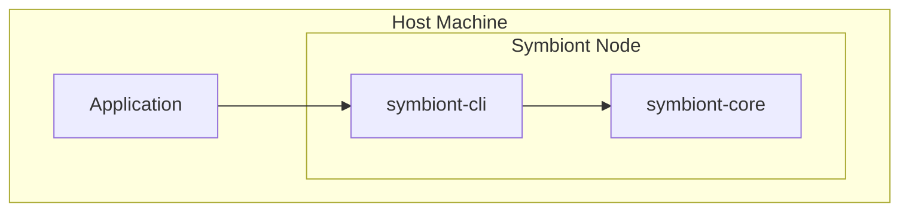

### 8.2 Multi-Node Network

Production deployments involve multiple nodes:

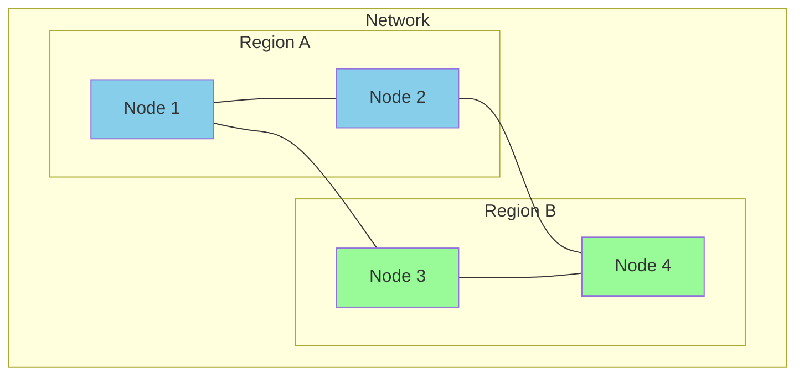

### 8.3 Crate Structure

The Symbiont implementation is organized into crates:

```
symbiont/
├── symbiont-core/     # Core protocol library
│   ├── types.rs       # Core types
│   ├── node.rs        # Node implementation
│   ├── connection.rs  # Connection dynamics
│   ├── trust.rs       # Trust computation
│   ├── defense.rs     # Defense signaling
│   ├── routing.rs     # Task routing
│   ├── workflow.rs    # Workflow execution
│   ├── handoff.rs     # Handoff protocol
│   ├── detection.rs   # Adversary detection
│   ├── convergence.rs # Convergence protocol
│   ├── math.rs        # Mathematical functions
│   └── constants.rs   # Protocol constants
│
├── symbiont-sim/      # Simulation harness
│   ├── network.rs     # Network simulation
│   ├── agents.rs      # Agent behaviors
│   ├── scenarios/     # Test scenarios
│   └── metrics.rs     # Metrics collection
│
└── symbiont-cli/      # Command-line interface
    └── main.rs        # CLI entry point
```

---

## 9. Integration Points

### 9.1 Transport Integration

Symbiont is transport-agnostic. Integrate with:

| Transport | Use Case |
|-----------|----------|
| libp2p | General-purpose P2P |
| Veilid | Privacy-focused P2P |
| gRPC | Service mesh integration |
| WebSocket | Browser-based clients |
| Custom | Specialized requirements |

### 9.2 Identity Integration

Node identity can integrate with:

| System | Integration |
|--------|-------------|
| Ed25519 keys | Native support |
| X.509 certificates | Extract public key |
| DID documents | Use verification method |
| Hardware security | HSM key storage |

### 9.3 Application Integration

Applications integrate via:

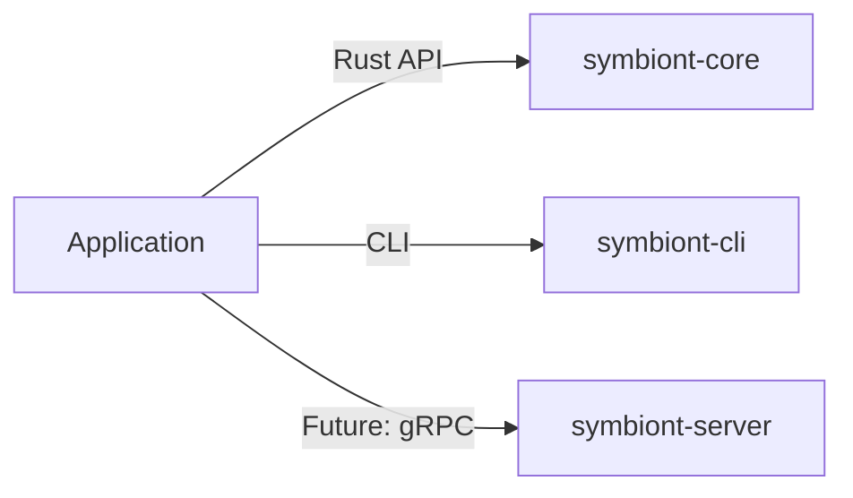

---

## 10. Scalability Considerations

### 10.1 Connection Limits

Each node maintains connections to a subset of the network:

| Metric | Guideline |
|--------|-----------|
| Active connections | 10-100 typical |
| Maximum connections | Implementation-dependent |
| Connection storage | O(connections) per node |

### 10.2 Network Size

Symbiont scales horizontally:

| Network Size | Considerations |
|--------------|----------------|
| Small (< 100) | Full connectivity possible |
| Medium (100-1000) | Partial connectivity |
| Large (> 1000) | Hub nodes emerge naturally |

### 10.3 Message Complexity

| Operation | Messages | Complexity |
|-----------|----------|------------|
| Single task | 2 | O(1) |
| Routing decision | 0-k (local) | O(connections) |
| Defense signal | ≤ 5 hops | O(connections × hops) |
| Workflow | 2 × steps | O(steps) |

---

## 11. Summary

The Symbiont architecture provides:

- **Modular design** — Clear separation of concerns
- **Concurrent execution** — Multiple processes work independently
- **Transport agnosticism** — Integrate with any network layer
- **Horizontal scalability** — Add nodes without coordination
- **Resilience** — No single points of failure

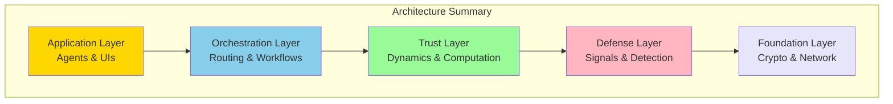

---

*Previous: [Glossary](../concepts/glossary.md) | Next: [Node Architecture](./node.md)*
