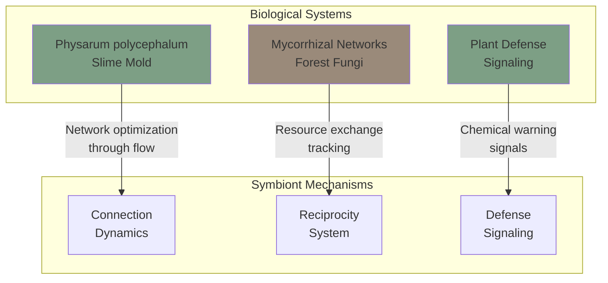
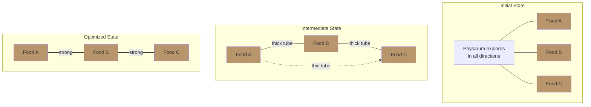
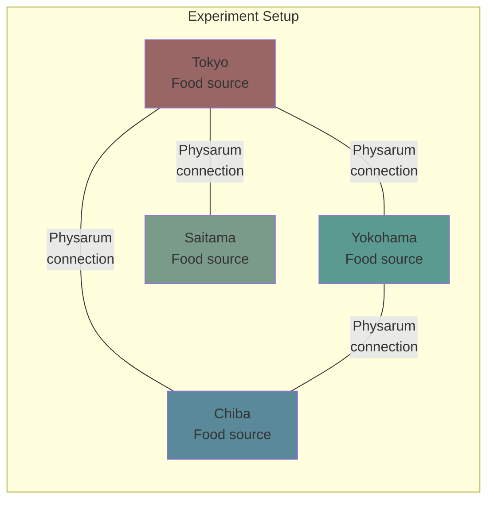
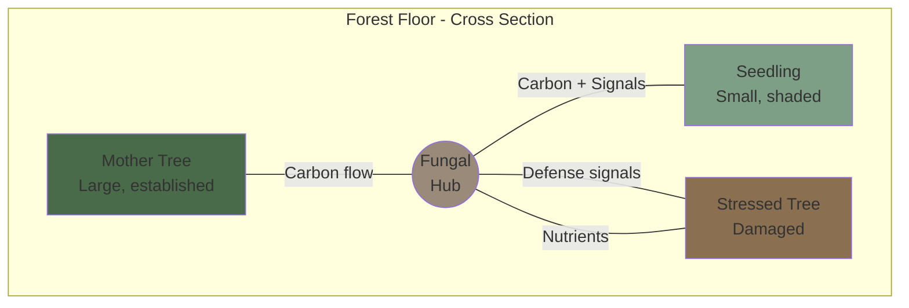
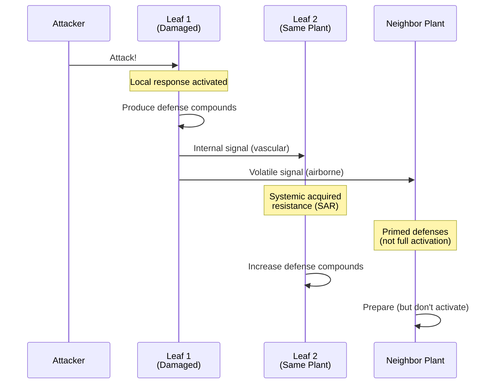
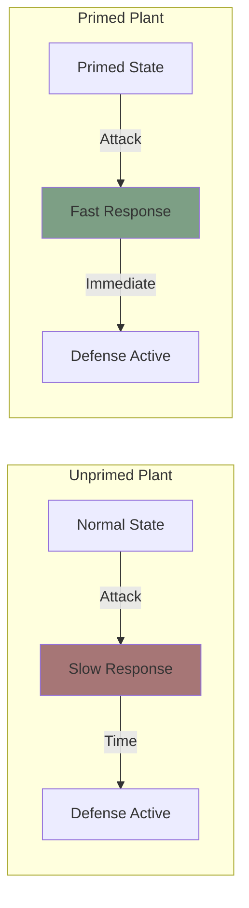
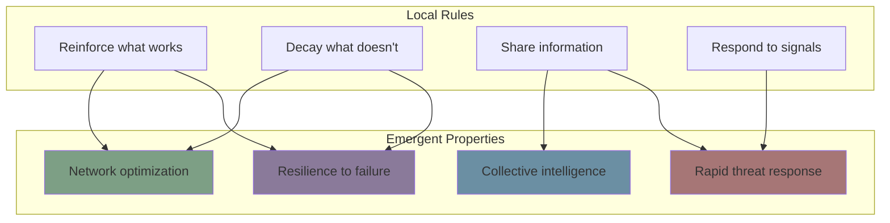

# Biological Foundations

**Document Version:** 1.0
**Last Updated:** December 2025
**Status:** Informative

---

## 1. Introduction

### 1.1 Purpose

This document describes the biological systems that inspire Symbiont's design. Understanding these natural systems provides insight into why Symbiont's mechanisms work and how they achieve emergent optimization without central control.

### 1.2 Overview

Symbiont draws from three biological inspirations:

---

## 2. Physarum Polycephalum: The Slime Mold

### 2.1 What is Physarum?

*Physarum polycephalum* is a single-celled organism belonging to the group Myxomycetes (slime molds). Despite lacking a brain or nervous system, Physarum exhibits remarkable problem-solving abilities:

- **Network optimization** — Finds efficient paths between food sources
- **Memory** — Remembers previously explored areas
- **Decision making** — Chooses between options based on quality
- **Adaptation** — Adjusts behavior to environmental conditions

### 2.2 The Physarum Network

When Physarum encounters multiple food sources, it forms a network of tubes to transport nutrients:

**Key Observation:** The network naturally optimizes—tubes carrying more nutrients grow thicker, while unused tubes shrink and disappear.

### 2.3 The Mathematical Model

Tero et al. (2010) formalized Physarum's behavior with the following equation:

$$\frac{dD_{ij}}{dt} = f(|Q_{ij}|) - \alpha D_{ij}$$

Where:
- **D_ij** = Diameter (conductivity) of tube between nodes i and j
- **Q_ij** = Flow through the tube
- **f(|Q|)** = Reinforcement function based on flow magnitude
- **α** = Decay rate

**Interpretation:**
- Tubes with high flow (|Q| large) grow (f(|Q|) > αD)
- Tubes with low flow shrink (f(|Q|) < αD)
- Over time, the network converges to an efficient structure

### 2.4 Experimental Validation

In a famous experiment, researchers placed Physarum on a map of Tokyo with food sources at major cities. The resulting network closely resembled the actual Tokyo rail system:

This demonstrates that simple local rules can produce globally optimal solutions—a key principle underlying Symbiont.

### 2.5 Application to Symbiont

Symbiont adapts the Physarum model for trust networks:

| Physarum Concept | Symbiont Equivalent |
|------------------|---------------------|
| Tube diameter (D) | Connection weight (w) |
| Nutrient flow (Q) | Interaction volume |
| Flow direction | Reciprocity balance |
| Tube quality | Interaction quality |
| Decay rate (α) | Connection decay rate |

The Symbiont Physarum equation:

$$\frac{dw}{dt} = \gamma \cdot |Q|^\mu \cdot \sigma(r) \cdot \psi(q) \cdot \phi(\tau) - \alpha \cdot w - D$$

**Enhancement over biological model:** Symbiont adds quality (q), reciprocity (r), and tone (τ) modifiers, plus defense dampening (D) for threat response.

---

## 3. Mycorrhizal Networks: The Wood Wide Web

### 3.1 What are Mycorrhizal Networks?

Mycorrhizal fungi form symbiotic relationships with plant roots, creating underground networks that connect trees across a forest:

### 3.2 Key Behaviors

Dr. Suzanne Simard's research revealed several remarkable properties:

**1. Resource Sharing**
- Larger trees share carbon with smaller seedlings
- Stressed trees receive nutrients from healthy neighbors
- Resources flow from abundance to need

**2. Kin Recognition**
- Trees recognize and preferentially support their offspring
- "Mother trees" nurture seedlings through the network

**3. Defense Communication**
- When attacked by pests, trees send chemical signals through the network
- Connected trees preemptively increase defense compounds

**4. Reciprocal Exchange**
- Trees exchange different resources (carbon, nitrogen, phosphorus)
- Long-term relationships maintain rough balance

### 3.3 Application to Symbiont

The mycorrhizal model informs Symbiont's reciprocity and affirmation systems:

| Mycorrhizal Behavior | Symbiont Mechanism |
|----------------------|-------------------|
| Resource sharing | Value exchange tracking |
| Kin recognition | Connection strength preferences |
| Defense signals | Defense signal propagation |
| Reciprocal exchange | Reciprocity score (r) |
| Mother tree nurturing | Vouching and mentorship |

**Reciprocity in Symbiont:**

$$r_{new} = \lambda \cdot r_{old} + (1-\lambda) \cdot \left(\log\left(\frac{in}{out + \epsilon}\right) + \theta \cdot (q - 0.5)\right)$$

Where:
- **in/out** = Ratio of value received to value given
- **q** = Quality of interaction
- Balanced exchange (in ≈ out) maintains r near 0
- Giving more than receiving (out > in) decreases r
- Receiving more than giving (in > out) increases r

---

## 4. Plant Defense Signaling

### 4.1 How Plants Communicate Danger

When a plant is attacked by herbivores or pathogens, it initiates a multi-stage defense response:

### 4.2 Types of Plant Signals

**1. Systemic Acquired Resistance (SAR)**
- Internal signaling within the plant
- Uses salicylic acid and other compounds
- Provides full activation of defenses

**2. Volatile Organic Compounds (VOCs)**
- Airborne signals that reach neighboring plants
- Recipients "prime" their defenses
- Lower threshold for full response

**3. Underground Signaling**
- Through mycorrhizal networks
- Chemical signals in fungal tissue
- Reaches connected plants regardless of distance

### 4.3 Priming vs. Activation

A crucial concept in plant defense is **priming**:

- **Unprimed:** Full defense activation is metabolically expensive; plants don't maintain it constantly
- **Primed:** Receiving a warning signal prepares the plant to respond faster, without full activation cost

### 4.4 Application to Symbiont

Symbiont's defense signaling mirrors plant defense:

| Plant Defense | Symbiont Mechanism |
|---------------|-------------------|
| Local response | Direct action against adversary |
| SAR (internal) | Update own threat beliefs |
| VOCs (external) | Emit defense signals to connections |
| Signal decay with distance | Confidence decay per hop |
| Priming | Elevated priming level (π) |
| Full activation | Defensive action threshold |

**Defense Signal Propagation:**

$$confidence_{hop_n} = confidence_{origin} \times (0.8)^n \times w_{connection}$$

**Priming Update:**

$$\pi_{new} = \min(1.0, \pi_{old} + signal.confidence \times 0.1)$$

---

## 5. Emergent Intelligence

### 5.1 The Common Thread

All three biological systems share a remarkable property: **complex, intelligent behavior emerges from simple local rules**.

### 5.2 Why This Matters for Symbiont

By following biological principles, Symbiont achieves:

| Property | How It Emerges |
|----------|----------------|
| **No central authority** | Each node follows local rules independently |
| **Self-optimization** | Physarum dynamics find efficient paths |
| **Adaptation** | Reciprocity tracking adjusts to behavior changes |
| **Collective defense** | Signal propagation enables network-wide response |
| **Graceful degradation** | No single point of failure |

### 5.3 Biomimicry as Design Principle

Symbiont is an example of **biomimicry** — designing systems by imitating nature's solutions:

> "Life has been solving problems for 3.8 billion years. Nature is the ultimate engineer."
> — Janine Benyus

The biological systems that inspired Symbiont have been refined by evolution over millions of years. By adapting their principles to multi-agent systems, Symbiont inherits their robustness, efficiency, and adaptability.

---

## 6. Summary

| Biological System | Key Principle | Symbiont Application |
|-------------------|---------------|----------------------|
| Physarum polycephalum | Flow-based reinforcement | Connection weight dynamics |
| Mycorrhizal networks | Reciprocal exchange | Reciprocity tracking |
| Plant defense | Signal propagation with priming | Defense signaling system |

These biological foundations provide not just inspiration, but a theoretical basis for why Symbiont's mechanisms produce robust, self-organizing trust networks.

---

## 7. References

1. Tero, A., Takagi, S., Saigusa, T., Ito, K., Bebber, D. P., Fricker, M. D., ... & Nakagaki, T. (2010). Rules for biologically inspired adaptive network design. *Science*, 327(5964), 439-442.

2. Nakagaki, T., Yamada, H., & Tóth, Á. (2000). Maze-solving by an amoeboid organism. *Nature*, 407(6803), 470-470.

3. Simard, S. W., Perry, D. A., Jones, M. D., Myrold, D. D., Durall, D. M., & Molina, R. (1997). Net transfer of carbon between ectomycorrhizal tree species in the field. *Nature*, 388(6642), 579-582.

4. Simard, S. W. (2018). Mycorrhizal networks facilitate tree communication, learning, and memory. In *Memory and Learning in Plants* (pp. 191-213). Springer.

5. Heil, M., & Ton, J. (2008). Long-distance signalling in plant defence. *Trends in Plant Science*, 13(6), 264-272.

6. Karban, R., Yang, L. H., & Edwards, K. F. (2014). Volatile communication between plants that affects herbivory: a meta-analysis. *Ecology Letters*, 17(1), 44-52.

---

*Previous: [Introduction](./introduction.md) | Next: [Core Principles](./core-principles.md)*
