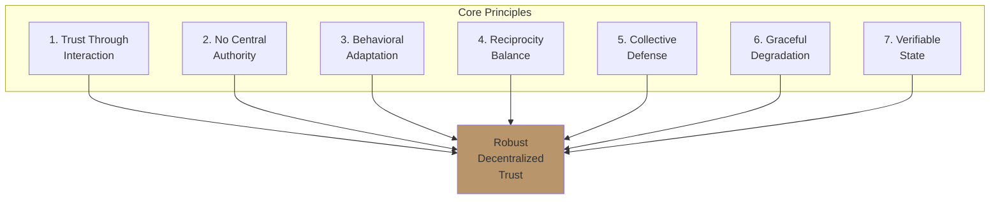
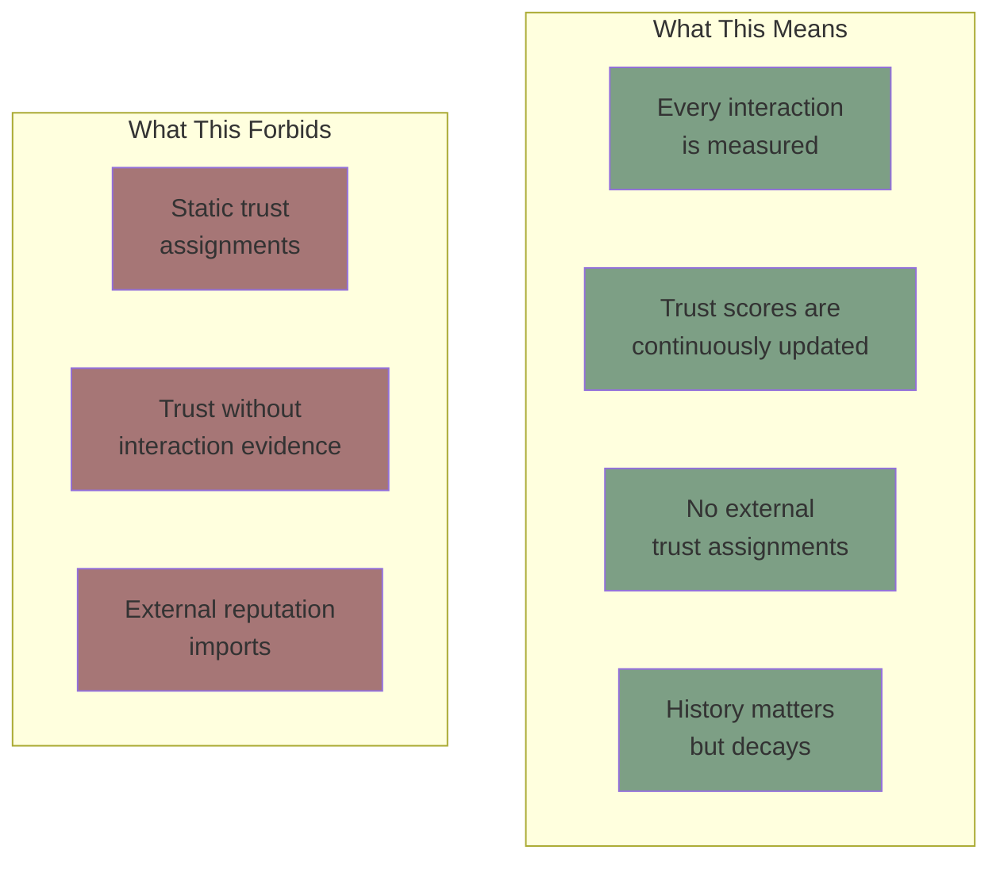
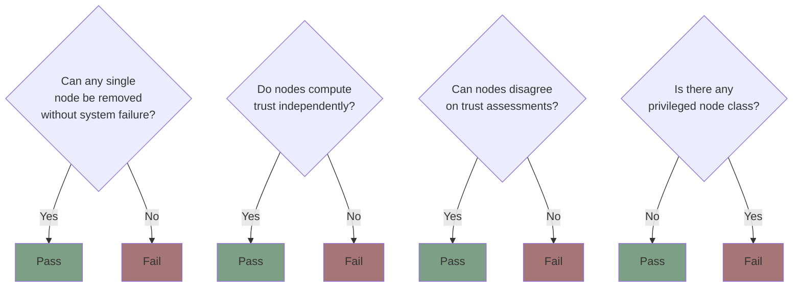
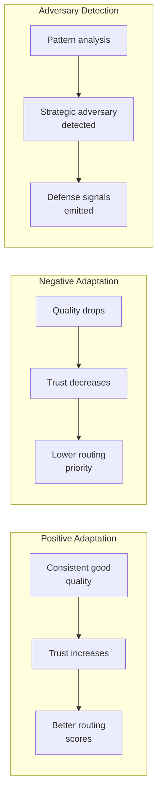
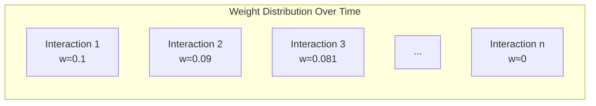
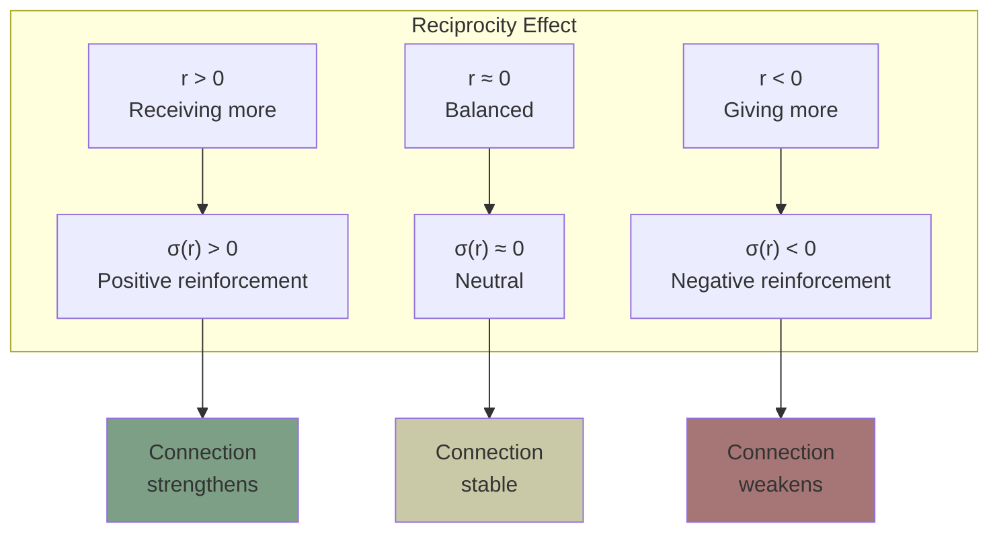
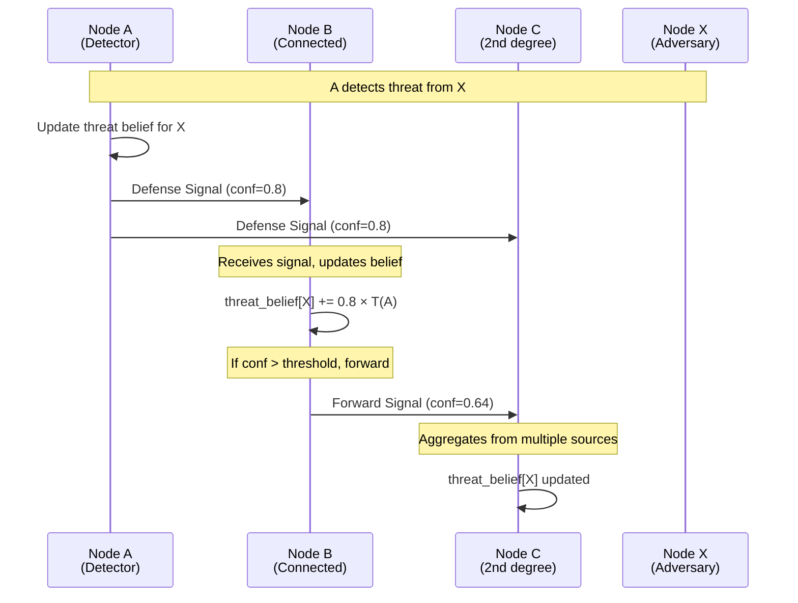
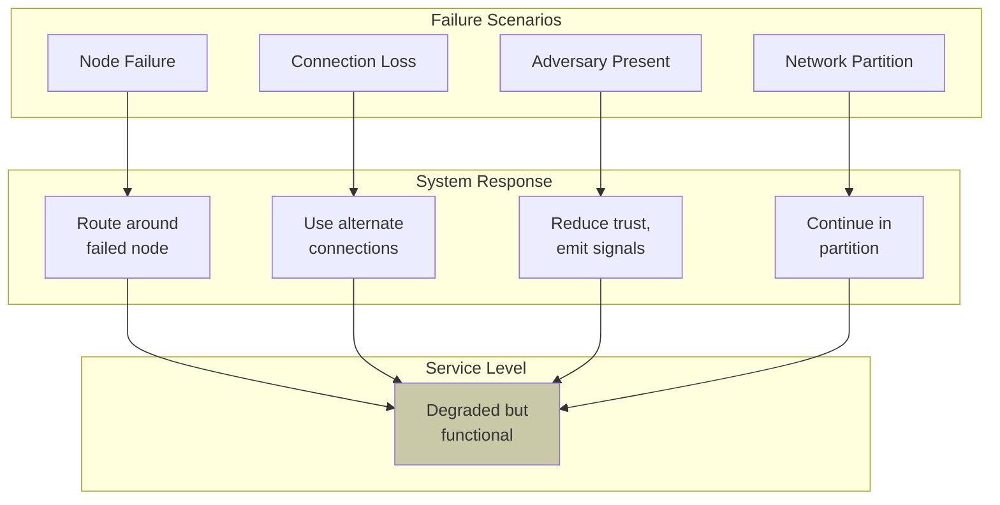
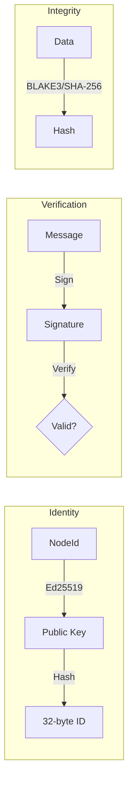
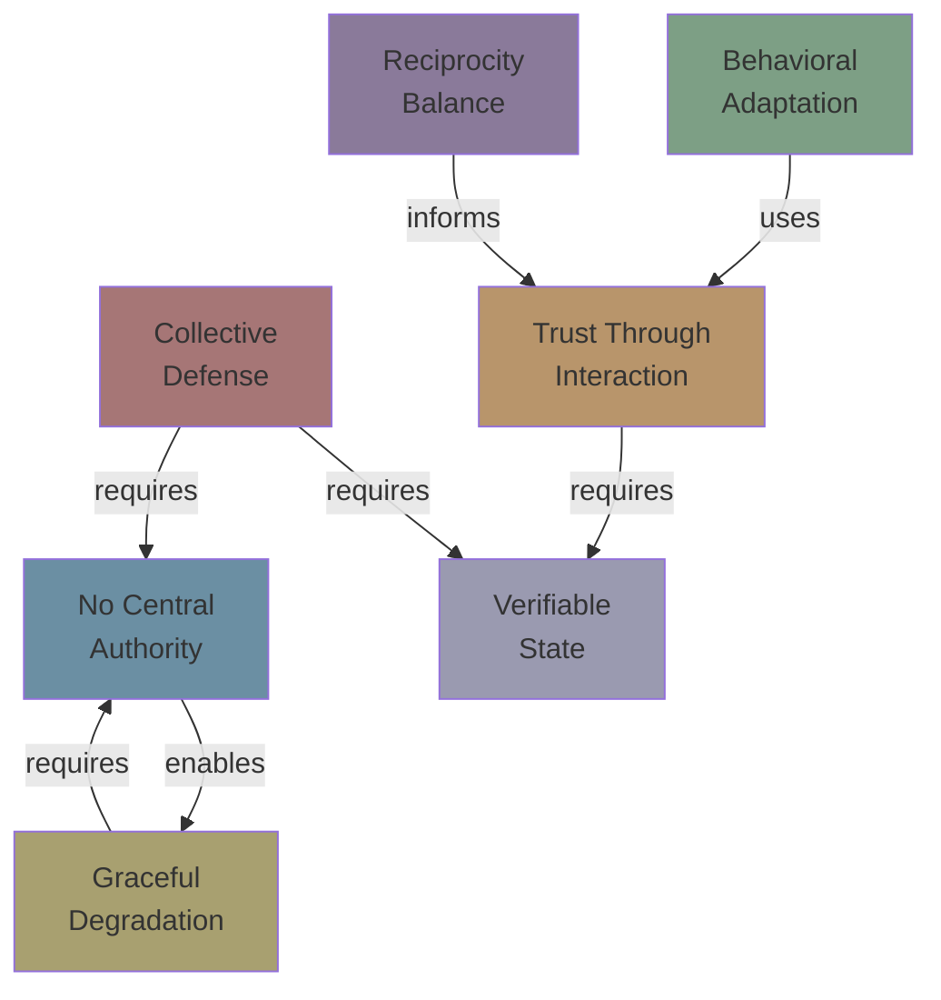

# Core Principles

**Document Version:** 1.0
**Last Updated:** December 2025
**Status:** Normative

---

## 1. Introduction

### 1.1 Purpose

This document defines the foundational principles that guide Symbiont's design and implementation. These principles are non-negotiable constraints that ensure the protocol achieves its goals of decentralized, emergent trust.

### 1.2 Scope

These principles apply to:
- All implementations of the Symbiont protocol
- Extensions and modifications to the core protocol
- Systems integrating with Symbiont networks

---

## 2. The Seven Core Principles

---

## 3. Principle 1: Trust Through Interaction

### 3.1 Statement

> **Trust is not assigned—it emerges from patterns of interaction.**

### 3.2 Rationale

Traditional trust systems rely on external authorities (certificate authorities, reputation servers, blockchain oracles) to assign trust scores. This creates dependencies and single points of failure.

In Symbiont, trust emerges naturally from how agents behave:
- Good behavior → Trust increases
- Bad behavior → Trust decreases
- No behavior → Trust decays

### 3.3 Implications

### 3.4 Mathematical Expression

Trust is computed from aggregated interaction metrics:

$$T(n) = \frac{w_Q \cdot Q_{agg} + w_R \cdot \sigma(R_{agg}) + w_S \cdot S_{social} + w_D \cdot D_{diversity}}{\sum w}$$

Where all components derive from interaction history.

---

## 4. Principle 2: No Central Authority

### 4.1 Statement

> **There is no master node, oracle, or single point of control.**

### 4.2 Rationale

Central authorities introduce:
- **Single points of failure** — If the authority fails, the system fails
- **Trust bottlenecks** — All trust flows through one entity
- **Attack targets** — Adversaries can focus on one point
- **Power concentration** — Central authority can abuse position

### 4.3 Implications

| Allowed | Forbidden |
|---------|-----------|
| Peer-to-peer communication | Master-slave architectures |
| Local trust computation | Centralized reputation servers |
| Distributed defense signaling | Central threat databases |
| Emergent coordination | Appointed coordinators |

### 4.4 Decentralization Verification

A valid Symbiont implementation must pass these tests:

---

## 5. Principle 3: Behavioral Adaptation

### 5.1 Statement

> **Trust must adapt to changing behavior over time.**

### 5.2 Rationale

Agents can change. A previously trustworthy agent may become adversarial, and vice versa. The trust system must:
- Respond to behavior changes
- Not be permanently locked by historical reputation
- Detect behavioral pattern shifts

### 5.3 Adaptation Mechanisms

### 5.4 Memory and Decay

The exponential moving average (EMA) with factor λ balances history and recency:

$$value_{new} = \lambda \cdot value_{old} + (1-\lambda) \cdot measurement$$

With λ = 0.9:
- Recent interactions have ~10% weight
- Older interactions decay exponentially
- Complete "memory reset" takes ~50 interactions

---

## 6. Principle 4: Reciprocity Balance

### 6.1 Statement

> **Sustainable relationships require balanced exchange.**

### 6.2 Rationale

Inspired by mycorrhizal networks, Symbiont requires that value flows bidirectionally over time. One-sided relationships are unsustainable and indicate potential exploitation.

### 6.3 Reciprocity Tracking

Each connection tracks the balance of exchange:

$$r_{new} = \lambda \cdot r_{old} + (1-\lambda) \cdot \left(\log\left(\frac{in}{out + \epsilon}\right) + \theta \cdot (q - 0.5)\right)$$

| Scenario | ρ = in/out | log(ρ) | Effect on r |
|----------|------------|--------|-------------|
| Balanced | 1.0 | 0 | Neutral |
| Giving more | 0.5 | -0.69 | Decreases |
| Receiving more | 2.0 | 0.69 | Increases |

### 6.4 Reciprocity in Connection Dynamics

The reciprocity score directly affects connection reinforcement:

---

## 7. Principle 5: Collective Defense

### 7.1 Statement

> **The network defends itself through coordinated signal propagation.**

### 7.2 Rationale

Individual nodes have limited visibility. By sharing threat information through trusted connections, the network can:
- Detect threats faster
- Respond before direct harm
- Isolate adversaries collectively

### 7.3 Defense Signal Flow

### 7.4 Signal Attenuation

Signals decay with network distance to prevent:
- Unbounded propagation
- Amplification attacks
- False positive cascades

$$confidence_{hop_n} = confidence_{origin} \times (DECAY\_PER\_HOP)^n \times w_{connection}$$

With DECAY_PER_HOP = 0.8 and MAX_HOPS = 5:

| Hop | Confidence (starting at 1.0) |
|-----|------------------------------|
| 0 | 1.00 |
| 1 | 0.80 |
| 2 | 0.64 |
| 3 | 0.51 |
| 4 | 0.41 |
| 5 | 0.33 (min) |

---

## 8. Principle 6: Graceful Degradation

### 8.1 Statement

> **The system continues functioning even when components fail or misbehave.**

### 8.2 Rationale

In decentralized systems, failures are inevitable. The protocol must:
- Continue operating with missing nodes
- Maintain service with adversarial nodes present
- Recover from partial network partitions

### 8.3 Degradation Scenarios

### 8.4 No Single Points of Failure

By Principle 2 (No Central Authority), every function must have redundancy:

| Function | Redundancy Mechanism |
|----------|----------------------|
| Task routing | Multiple candidates scored |
| Trust computation | Local computation per node |
| Defense signaling | Multi-path propagation |
| Workflow execution | Re-routing on failure |

---

## 9. Principle 7: Verifiable State

### 9.1 Statement

> **All state changes must be traceable to signed, verifiable events.**

### 9.2 Rationale

For trust to be meaningful, nodes must be able to:
- Verify that interactions occurred
- Confirm the identity of interaction partners
- Audit the history leading to trust scores

### 9.3 Cryptographic Requirements

### 9.4 What Must Be Signed

| Event Type | Signed By | Contains |
|------------|-----------|----------|
| Interaction | Both parties | Task, outcome, timestamp |
| Defense Signal | Originator | Threat, evidence hash, confidence |
| Affirmation | Sender | Type, strength, timestamp |
| Handoff | Sender | Task, context, signature chain |

---

## 10. Principle Interactions

The seven principles interact and reinforce each other:

---

## 11. Compliance Checklist

Implementations must satisfy all principles:

| # | Principle | Requirement | Verification |
|---|-----------|-------------|--------------|
| 1 | Trust Through Interaction | Trust derived from interaction metrics only | Audit trust computation |
| 2 | No Central Authority | No privileged nodes; peer-to-peer | Architecture review |
| 3 | Behavioral Adaptation | Trust changes with behavior; memory decays | Test with behavior changes |
| 4 | Reciprocity Balance | Exchange ratio tracked; affects dynamics | Verify reciprocity in equations |
| 5 | Collective Defense | Signals propagate through network | Test defense scenarios |
| 6 | Graceful Degradation | Service continues with failures | Fault injection testing |
| 7 | Verifiable State | All events signed and verifiable | Cryptographic audit |

---

## 12. Summary

The seven core principles ensure that Symbiont achieves its goal of decentralized, emergent trust:

1. **Trust Through Interaction** — No external trust sources
2. **No Central Authority** — Fully decentralized
3. **Behavioral Adaptation** — Responds to change
4. **Reciprocity Balance** — Sustainable relationships
5. **Collective Defense** — Network-wide security
6. **Graceful Degradation** — Fault tolerant
7. **Verifiable State** — Cryptographically auditable

These principles are not optional guidelines—they are constraints that define what Symbiont is and is not.

---

*Previous: [Biological Foundations](./biological-foundations.md) | Next: [Glossary](./glossary.md)*
