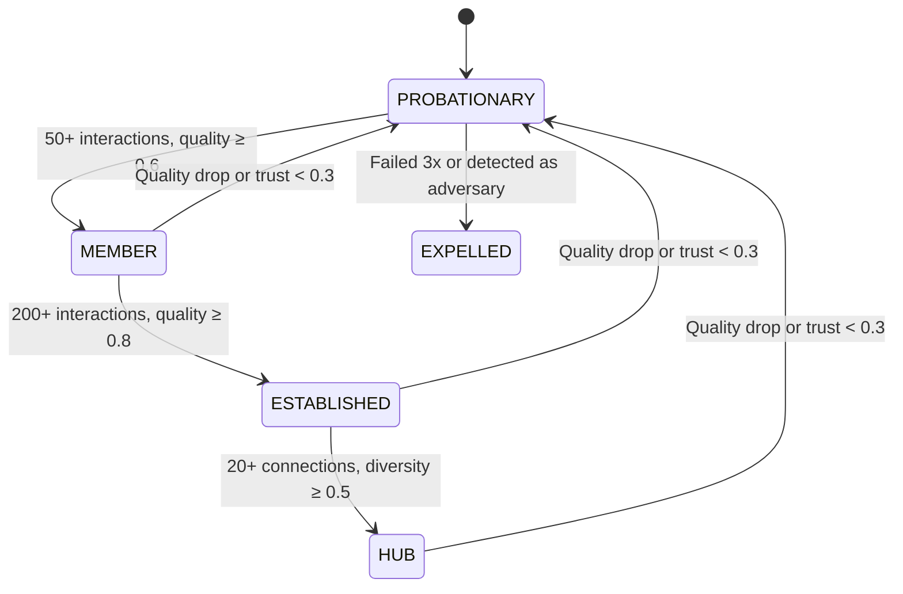

# Glossary

**Document Version:** 1.0
**Last Updated:** December 2025
**Status:** Normative

---

## Purpose

This glossary defines the terminology used throughout the Symbiont documentation. Terms are organized alphabetically within categories for easy reference.

---

## Quick Reference

| Symbol | Name | Range | Description |
|--------|------|-------|-------------|
| w | Weight | [0, 1] | Connection strength |
| T | Trust | [0, 1] | Node trustworthiness |
| r | Reciprocity | (-∞, +∞) | Exchange balance |
| q | Quality | [0, 1] | Interaction quality |
| τ | Tone | [-1, 1] | Interaction tone |
| π | Priming | [0, 1] | Defense readiness |
| γ | Gamma | 0.1 | Reinforcement rate |
| α | Alpha | 0.01 | Decay rate |
| β | Beta | 2.0 | Reciprocity sensitivity |
| λ | Lambda | 0.9 | Memory factor |

---

## Core Concepts

### Affirmation
**Definition:** A positive signal sent from one node to another acknowledging good performance.

**Context:** Affirmations strengthen connections and boost the recipient's self-confidence score. They are sent after high-quality, positive-tone interactions.

**Example:** After Node A receives excellent service from Node B, Node A sends an affirmation of type QUALITY with strength 0.85.

---

### Capability
**Definition:** A specific function or skill that a node can perform.

**Structure:**
```
Capability {
    id           : CapabilityId
    name         : string
    category     : { ANALYSIS, GENERATION, TRANSFORMATION, VALIDATION }
    input_types  : List<DataType>
    output_types : List<DataType>
}
```

**Example:** A node might have capabilities for "text-summarization", "code-review", and "data-analysis".

---

### Connection
**Definition:** A weighted, bidirectional relationship between two nodes in the network.

**Structure:**
```
Connection {
    partner_id   : NodeId
    w            : Weight         // Connection strength [0, 1]
    r            : float64        // Reciprocity score (unbounded)
    q            : Score          // Quality score [0, 1]
    τ            : SignedScore    // Tone score [-1, 1]
    π            : Score          // Priming level [0, 1]
    last_active  : Timestamp
    count        : uint32         // Interaction count
}
```

**Relationship to Trust:** Connections are the building blocks of trust. A node's trust score is computed by aggregating metrics across all its connections.

---

### Connection Weight (w)
**Definition:** A value in [0, 1] representing the strength of a connection between two nodes.

**Dynamics:** Weight evolves according to the Physarum equation:
$$\frac{dw}{dt} = \Phi - \alpha \cdot w - D$$

**Range:**
- W_MIN = 0.01 (minimum; below this, connection is removed)
- W_MAX = 1.0 (maximum possible strength)
- W_INIT = 0.3 (initial weight for new connections)

---

### Convergence
**Definition:** The process by which nodes reach agreement on a task or decision.

**States:**
| Score | State | Description |
|-------|-------|-------------|
| > 0.85 | CONVERGED | Nodes agree |
| 0.60-0.85 | CONVERGING | Moving toward agreement |
| 0.40-0.60 | EXPLORING | Investigating options |
| 0.20-0.40 | STUCK | Progress stalled |
| < 0.20 | POLARIZED | Strong disagreement |

---

### Decay
**Definition:** The natural weakening of connections over time when they are not actively used.

**Formula:**
$$w_{new} = w \cdot (1 - \alpha)$$

Where α = 0.01 is the decay rate.

**Purpose:** Ensures that stale relationships don't indefinitely influence trust calculations.

---

### Defense Signal
**Definition:** A message warning other nodes about a potential threat.

**Structure:**
```
DefenseSignal {
    type         : { GENERAL_ALERT, SPECIFIC_THREAT, BROADCAST }
    sender       : NodeId
    origin       : NodeId
    threat       : NodeId
    threat_type  : { CHEATING, SYBIL, COLLUSION, QUALITY_FRAUD, STRATEGIC }
    confidence   : Score
    evidence     : Hash
    hops         : uint8
    timestamp    : Timestamp
    signature    : Signature
}
```

---

### Diversity Score
**Definition:** A measure of how varied a node's interaction partners are.

**Formula:**
$$D = \frac{unique\_partners\_last\_100}{100}$$

**Purpose:** Prevents nodes from building artificial trust through narrow, potentially colluding relationships.

**Cap Effect:** Trust is capped at D + 0.3, ensuring diverse interaction is required for high trust.

---

## Mathematical Functions

### Exponential Moving Average (EMA)
**Definition:** A weighted average that gives more importance to recent values while retaining influence of historical values.

**Formula:**
$$value_{new} = \lambda \cdot value_{old} + (1-\lambda) \cdot measurement$$

**Parameter:** λ (Lambda) = 0.9

**Interpretation:** Each new measurement has ~10% influence; influence decays exponentially with age.

---

### Physarum Equation
**Definition:** The core differential equation governing connection weight dynamics, inspired by slime mold network optimization.

**Formula:**
$$\frac{dw}{dt} = \gamma \cdot |Q|^\mu \cdot \sigma(r) \cdot \psi(q) \cdot \phi(\tau) - \alpha \cdot w - D$$

**Components:**
| Component | Formula | Meaning |
|-----------|---------|---------|
| Reinforcement (Φ) | γ\|Q\|^μ σ(r) ψ(q) φ(τ) | Positive contribution from good interactions |
| Decay (αw) | 0.01 × w | Natural weakening over time |
| Defense (D) | δ × threat_level | Reduction from active threats |

---

### Quality Multiplier ψ(q)
**Definition:** Function that maps quality score to reinforcement modifier.

**Formula:**
$$\psi(q) = 0.5 + q$$

**Range:** [0.5, 1.5] for q ∈ [0, 1]

**Effect:**
- q = 0 → ψ = 0.5 (halves reinforcement)
- q = 0.5 → ψ = 1.0 (neutral)
- q = 1 → ψ = 1.5 (50% boost)

---

### Reciprocity Sigmoid σ(r)
**Definition:** Function that maps unbounded reciprocity score to [-1, 1].

**Formula:**
$$\sigma(r) = \frac{2}{1 + e^{-\beta r}} - 1$$

**Parameter:** β (Beta) = 2.0

**Effect:**
- r >> 0 → σ ≈ 1 (strong positive reinforcement)
- r = 0 → σ = 0 (neutral)
- r << 0 → σ ≈ -1 (negative reinforcement)

---

### Tone Multiplier φ(τ)
**Definition:** Function that maps tone score to reinforcement modifier.

**Formula:**
$$\phi(\tau) = 0.7 + 0.3 \cdot \tau$$

**Range:** [0.4, 1.0] for τ ∈ [-1, 1]

**Effect:**
- τ = -1 → φ = 0.4 (significant reduction)
- τ = 0 → φ = 0.7 (slight reduction)
- τ = 1 → φ = 1.0 (full reinforcement)

---

## Network Concepts

### Handoff
**Definition:** The transfer of a task from one node to another during workflow execution.

**Structure:**
```
Handoff {
    from_node   : NodeId
    to_node     : NodeId
    task        : Task
    context     : HandoffContext
    timestamp   : Timestamp
    signature   : Signature
}
```

---

### Hub
**Definition:** A node status indicating high connectivity and established trust.

**Requirements:**
- connection_count ≥ 20
- diversity ≥ 0.5
- quality ≥ 0.85

**Significance:** Hubs are well-connected nodes that play important roles in network routing and signal propagation.

---

### Interaction
**Definition:** A discrete exchange between two nodes involving task execution and value exchange.

**Structure:**
```
Interaction {
    initiator    : NodeId
    responder    : NodeId
    task_volume  : float64      // Q - amount of work/value
    capability   : CapabilityId
    quality      : Score
    tone         : SignedScore
    exchange_in  : float64
    exchange_out : float64
    timestamp    : Timestamp
}
```

---

### Node
**Definition:** An autonomous agent participating in the Symbiont network.

**Structure:**
```
Node {
    id              : NodeId          // 32-byte cryptographic identifier
    status          : NodeStatus      // PROBATIONARY, MEMBER, ESTABLISHED, HUB
    trust           : Score           // Overall trust level
    trust_cap       : Score           // Maximum allowed trust
    confidence      : Score           // Self-confidence
    priming         : Score           // Defense readiness
    connections     : Map<NodeId, Connection>
    capabilities    : Map<CapabilityId, CapabilityState>
    threat_beliefs  : Map<NodeId, ThreatBelief>
}
```

---

### Node Status
**Definition:** The lifecycle stage of a node in the network.

**States:**


---

### Priming (π)
**Definition:** A node's level of defense readiness, ranging from 0 (relaxed) to 1 (fully alert).

**Dynamics:**
- Increases when defense signals are received
- Decays naturally over time (PRIMING_DECAY = 0.99)

**Effect:** Primed nodes respond faster to threats and may take defensive action when priming exceeds threshold.

---

### Routing Score
**Definition:** The score used to select the best candidate for task routing.

**Formula:**
$$S_{route}(n) = T(n) \cdot q_{cap}(n) \cdot (1 - load) \cdot w_{conn} \cdot (1 - \theta_{threat})$$

**Components:**
| Factor | Description |
|--------|-------------|
| T(n) | Global trust score |
| q_cap(n) | Quality for required capability |
| (1 - load) | Availability (inverse of current load) |
| w_conn | Connection weight (W_INIT if no connection) |
| (1 - θ_threat) | Inverse of threat belief |

---

## Trust Concepts

### Quality Score (q)
**Definition:** A measure of interaction outcome quality, ranging from 0 (poor) to 1 (excellent).

**Computation from Feedback:**
$$Q_{raw} = \frac{\omega_{help} \cdot helpfulness + \omega_{acc} \cdot accuracy + \omega_{rel} \cdot relevance + \omega_{time} \cdot timeliness}{4}$$

**Weights:** ω_help = 0.4, ω_acc = 0.3, ω_rel = 0.2, ω_time = 0.1

---

### Reciprocity Score (r)
**Definition:** A measure of exchange balance, where positive values indicate receiving more than giving, and negative values indicate the opposite.

**Update Formula:**
$$r_{new} = \lambda \cdot r_{old} + (1-\lambda) \cdot \left(\log\left(\frac{in}{out + \epsilon}\right) + \theta \cdot (q - 0.5)\right)$$

---

### Swift Trust
**Definition:** Initial trust granted to new nodes to enable cold-start operation.

**Value:** SWIFT_TRUST_BASE = 0.4

**Purpose:** Allows new nodes to participate in the network while building interaction history.

**Conditions:** Swift trust is granted during the PROBATIONARY period and is adjusted based on voucher trust and role category.

---

### Threat Belief
**Definition:** A node's belief about the threat level posed by another node.

**Structure:**
```
ThreatBelief {
    level       : Score           // 0 = no threat, 1 = certain threat
    threat_type : ThreatType      // CHEATING, SYBIL, COLLUSION, etc.
    evidence    : List<Hash>      // Hashes of evidence
    updated     : Timestamp
}
```

**Update (Bayesian):**
$$belief_{new} = belief_{old} + weight \cdot (1 - belief_{old})$$

Where weight = T_sender × signal_confidence

---

### Tone Score (τ)
**Definition:** A measure of interaction tone/manner, ranging from -1 (hostile) to +1 (collaborative).

**Components:**
- Engagement (E): latency, elaboration, questions asked
- Framing (F): affirmative language, hedging, acknowledgment
- Collaboration (C): alternatives offered, building on ideas, credit giving

**Formula:**
$$\tau = \tanh(\omega_e \cdot E + \omega_f \cdot F + \omega_c \cdot C)$$

---

### Trust Score (T)
**Definition:** A node's overall trustworthiness, ranging from 0 to 1.

**Computation:**
$$T(n) = \frac{w_Q \cdot Q_{agg} + w_R \cdot \sigma(R_{agg}) + w_S \cdot S_{social} + w_D \cdot D_{diversity}}{\sum w}$$

**Caps Applied:**
- Diversity cap: T_final ≤ D + 0.3
- Trust cap: T_final ≤ trust_cap (can be reduced by flags)

---

## Workflow Concepts

### Task
**Definition:** A unit of work to be executed by a node.

**Structure:**
```
Task {
    id              : TaskId
    type            : { SINGLE, SEQUENTIAL, PARALLEL, DAG }
    required_caps   : List<CapabilityId>
    input           : TaskInput
    constraints     : TaskConstraints
    context         : TaskContext
    origin          : NodeId
}
```

---

### Workflow
**Definition:** A structured sequence of tasks to be executed across the network.

**Types:**
| Type | Description |
|------|-------------|
| SINGLE | One task, one node |
| SEQUENTIAL | Chain: A → B → C |
| PARALLEL | Concurrent: A, B, C then merge |
| DAG | Directed acyclic graph of dependencies |

---

## Protocol Constants

### Connection Constants
| Constant | Value | Description |
|----------|-------|-------------|
| W_MIN | 0.01 | Minimum connection weight |
| W_MAX | 1.0 | Maximum connection weight |
| W_INIT | 0.3 | Initial connection weight |

### Dynamics Constants
| Constant | Symbol | Value | Description |
|----------|--------|-------|-------------|
| GAMMA | γ | 0.1 | Reinforcement rate |
| MU | μ | 0.5 | Flow exponent (sublinear) |
| ALPHA | α | 0.01 | Decay rate |
| BETA | β | 2.0 | Reciprocity sensitivity |
| LAMBDA | λ | 0.9 | Memory factor (EMA) |
| THETA | θ | 0.5 | Quality weight in reciprocity |
| DELTA | δ | 0.2 | Defense dampening factor |
| EPSILON | ε | 0.001 | Division safety constant |

### Defense Constants
| Constant | Value | Description |
|----------|-------|-------------|
| PROPAGATE_THRESHOLD | 0.6 | Min confidence to forward signal |
| DECAY_PER_HOP | 0.8 | Confidence decay per network hop |
| MAX_HOPS | 5 | Maximum signal propagation depth |
| ACTION_THRESHOLD | 0.7 | Threat level triggering action |
| PRIMING_SENSITIVITY | 0.1 | Priming increase per signal |
| PRIMING_DECAY | 0.99 | Priming decay per tick |

### Status Constants
| Constant | Value | Description |
|----------|-------|-------------|
| SWIFT_TRUST_BASE | 0.4 | Initial trust for new nodes |
| PROBATION_COUNT | 50 | Interactions for probation |
| PROBATION_THRESHOLD | 0.6 | Quality needed to pass probation |
| VOUCH_PENALTY | 0.5 | Penalty if vouched node misbehaves |

---

## Abbreviations

| Abbreviation | Expansion |
|--------------|-----------|
| ATD | Agree-to-Disagree (protocol) |
| DAG | Directed Acyclic Graph |
| EMA | Exponential Moving Average |
| SAR | Systemic Acquired Resistance |
| VOC | Volatile Organic Compound |

---

*Previous: [Core Principles](./core-principles.md) | Next: [Architecture Overview](../architecture/overview.md)*
