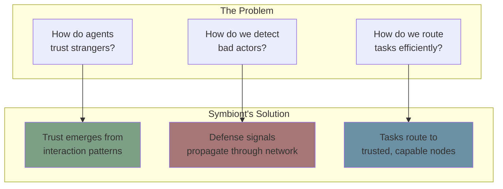
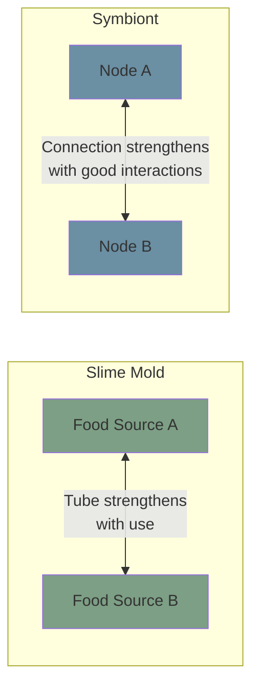
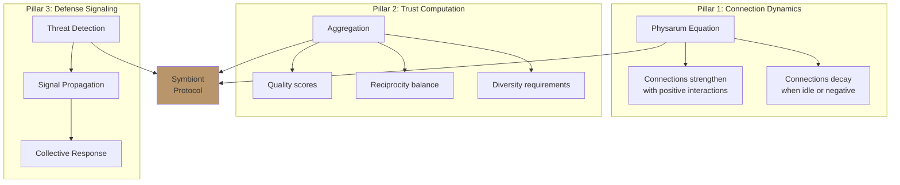
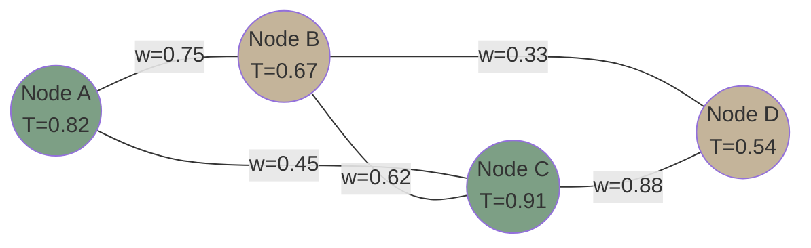
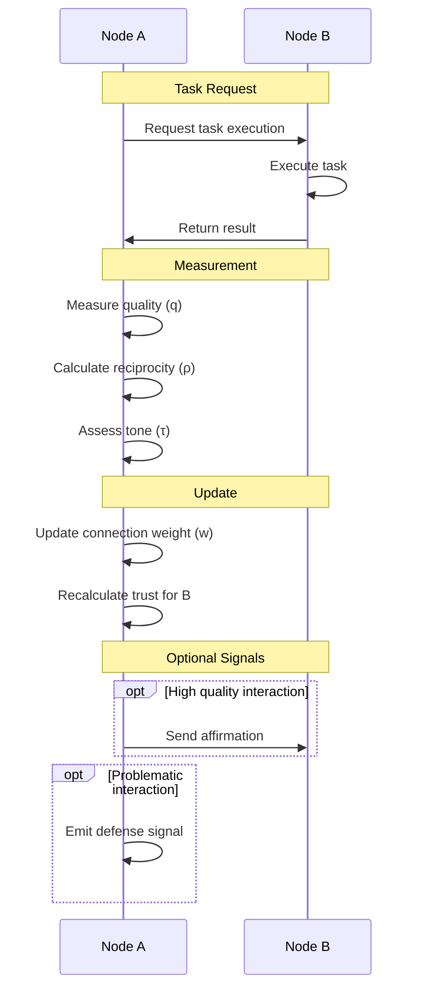

# Introduction to Symbiont

**Document Version:** 1.0
**Last Updated:** December 2025
**Status:** Normative

---

## 1. Purpose and Scope

### 1.1 Document Purpose

This document provides a comprehensive introduction to the Symbiont protocol, a bio-inspired trust and orchestration system for decentralized multi-agent networks. It establishes the foundational understanding required for all subsequent documentation.

### 1.2 Intended Audience

This document is intended for:

- **Software developers** implementing Symbiont-compatible systems
- **System architects** designing multi-agent architectures
- **Researchers** studying decentralized trust mechanisms
- **Students** learning about distributed systems and trust computation

### 1.3 Prerequisites

Readers should have a basic understanding of:

- Distributed systems concepts (nodes, networks, messages)
- Basic probability and statistics
- Fundamental programming concepts

---

## 2. Executive Summary

Symbiont is a **decentralized trust protocol** that enables autonomous agents to establish, maintain, and leverage trust relationships without central authority. The protocol draws inspiration from biological systems—specifically the network optimization behavior of slime mold (*Physarum polycephalum*) and the resource-sharing mechanisms of mycorrhizal fungal networks.

**Key Innovation:** Rather than relying on centralized reputation systems, blockchain-based consensus, or certificate authorities, Symbiont allows trust to *emerge* from the pattern of interactions between agents—much like how biological networks optimize themselves through local rules.

---

## 3. Problem Statement

### 3.1 The Trust Problem in Multi-Agent Systems

Modern multi-agent systems face a fundamental challenge: **How can autonomous agents collaborate effectively when they cannot inherently trust each other?**

Traditional approaches include:

| Approach | Description | Limitations |
|----------|-------------|-------------|
| **Central Authority** | A trusted server validates all agents | Single point of failure; requires trust in authority |
| **Blockchain Consensus** | Distributed ledger records reputation | High latency; energy intensive; complex |
| **Certificate Systems** | PKI-based identity verification | Doesn't capture behavioral trustworthiness |
| **Static Reputation** | Fixed scores assigned to agents | Cannot adapt to changing behavior |

### 3.2 Requirements for a Solution

An ideal trust system should:

1. **Operate without central authority** — No single point of failure
2. **Adapt to behavior** — Trust should change based on actions
3. **Resist manipulation** — Bad actors cannot easily game the system
4. **Enable intelligent routing** — Tasks should go to capable, trustworthy agents
5. **Scale efficiently** — Overhead should not grow prohibitively with network size

---

## 4. The Symbiont Approach

### 4.1 Core Insight

Symbiont's fundamental insight is that **trust relationships can be modeled as network flows**, similar to how slime mold (*Physarum polycephalum*) optimizes its tubular network to efficiently transport nutrients.

In slime mold:
- Tubes carrying more flow become thicker (reinforcement)
- Unused tubes shrink and disappear (decay)
- The network naturally optimizes for efficiency

In Symbiont:
- Connections with positive interactions strengthen
- Idle or negative connections weaken
- The trust network naturally optimizes for reliability

### 4.2 The Three Pillars

Symbiont rests on three foundational mechanisms:

**Pillar 1: Connection Dynamics**
Every pair of interacting nodes maintains a *connection weight* w ∈ [0, 1] that evolves according to the Physarum equation.

**Pillar 2: Trust Computation**
A node's overall *trust score* T ∈ [0, 1] is computed by aggregating quality, reciprocity, social proof, and diversity across all its connections.

**Pillar 3: Defense Signaling**
When a node detects adversarial behavior, it can emit *defense signals* that propagate through trusted connections, allowing the network to collectively respond to threats.

---

## 5. System Overview

### 5.1 Network Structure

A Symbiont network consists of **nodes** connected by **weighted edges**:

- **Nodes** represent autonomous agents (AI assistants, services, users)
- **Edge weights** represent connection strength (0 = no connection, 1 = maximum)
- **Trust scores (T)** represent overall trustworthiness of each node

### 5.2 Interaction Flow

When two nodes interact, the following sequence occurs:

### 5.3 Trust-Based Routing

When a node needs to delegate a task, it routes to the most suitable candidate:

**Routing Score Formula:**

$$S_{route}(n) = T(n) \cdot q_{cap}(n) \cdot (1 - load) \cdot w_{conn} \cdot (1 - \theta_{threat})$$

Where:
- **T(n)** = Global trust score of candidate node
- **q_cap(n)** = Quality score for the specific capability needed
- **load** = Current workload (0 = idle, 1 = maxed)
- **w_conn** = Connection weight to the candidate
- **θ_threat** = Threat belief level for the candidate

---

## 6. Key Terminology

| Term | Definition |
|------|------------|
| **Node** | An autonomous agent participating in the Symbiont network |
| **Connection** | A weighted relationship between two nodes |
| **Trust Score** | A value in [0, 1] representing overall trustworthiness |
| **Reciprocity** | The balance of value exchanged between nodes |
| **Quality Score** | Assessment of interaction outcomes |
| **Defense Signal** | A message warning of potential threats |
| **Capability** | A specific function or skill a node can perform |
| **Workflow** | A sequence of tasks routed through the network |

---

## 7. Document Organization

This documentation is organized into the following sections:

| Section | Contents |
|---------|----------|
| **Foundational Concepts** | Introduction, biological background, core principles, glossary |
| **System Architecture** | Component design, node structure, network topology |
| **Protocol Specification** | Mathematical definitions, state machines, algorithms |
| **Tutorials** | Step-by-step guides for common tasks |
| **API Reference** | Type definitions, function signatures, constants |

---

## 8. Normative References

The following documents are referenced in this specification:

1. Tero, A., et al. (2010). "Rules for Biologically Inspired Adaptive Network Design." *Science*, 327(5964), 439-442.

2. Simard, S. W. (2018). "Mycorrhizal Networks Facilitate Tree Communication, Learning, and Memory." In *Memory and Learning in Plants*. Springer.

3. Meyerson, D., Weick, K. E., & Kramer, R. M. (1996). "Swift Trust and Temporary Groups." In *Trust in Organizations*. Sage.

---

## 9. Revision History

| Version | Date | Author | Changes |
|---------|------|--------|---------|
| 1.0 | December 2025 | Symbiont Team | Initial release |

---

*Next: [Biological Foundations](./biological-foundations.md)*
