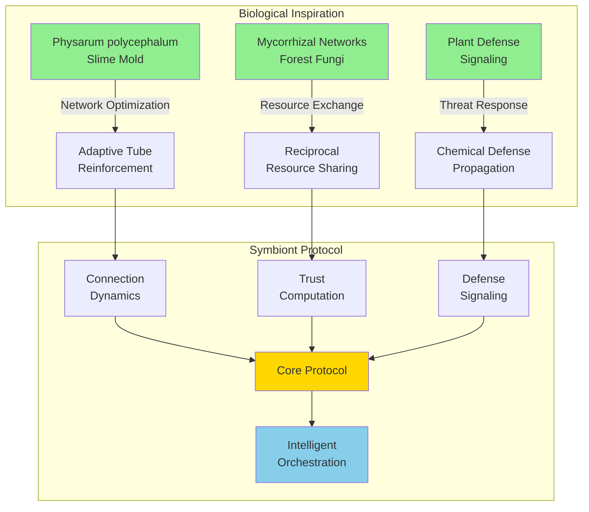
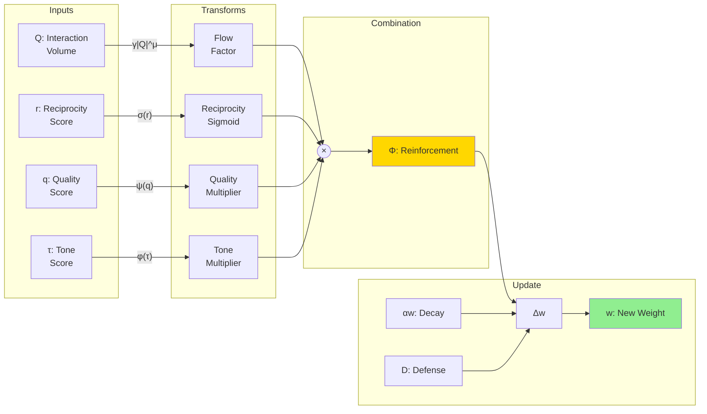
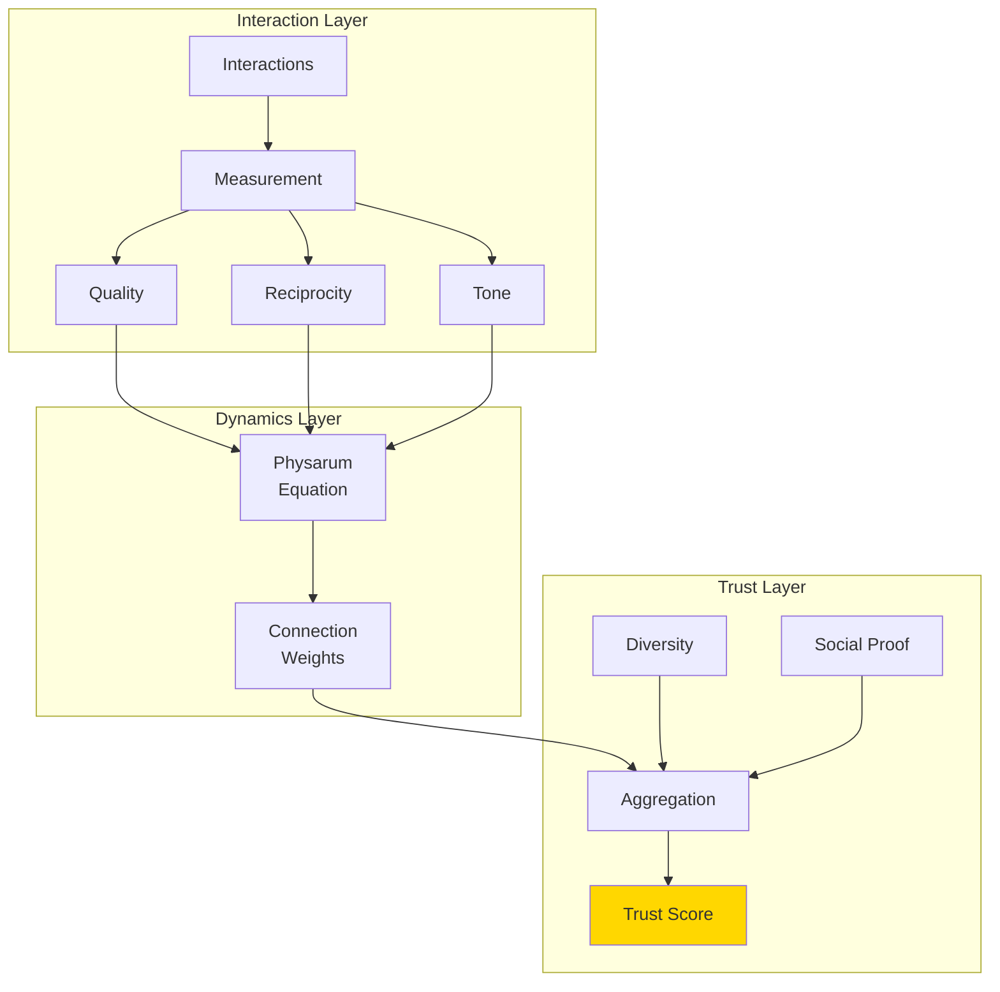
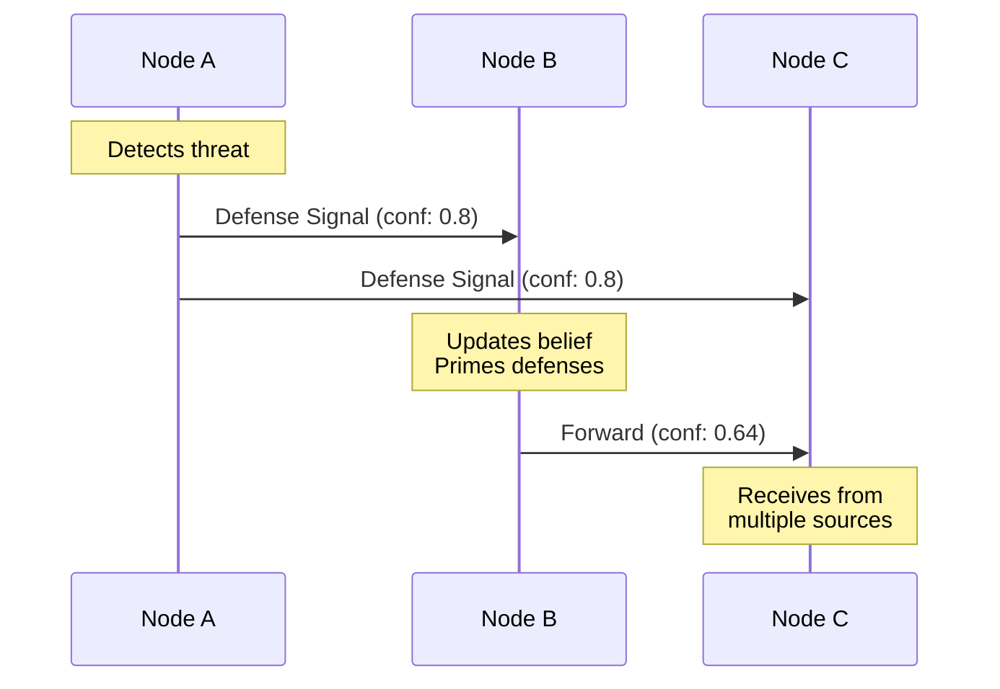

# Symbiont Documentation

## Bio-Inspired Trust and Orchestration Protocol

**Version 0.1 | December 2025**

---

## Abstract

Symbiont is a decentralized trust and orchestration protocol inspired by biological network optimization systems. Drawing from the adaptive behavior of *Physarum polycephalum* (slime mold) and mycorrhizal fungal networks, Symbiont enables multi-agent systems to establish trust, detect adversarial behavior, and intelligently route tasks without central authority.

This documentation provides a comprehensive technical reference following IEEE documentation standards while remaining accessible to undergraduate students in computer science and related fields.



---

## Table of Contents

### Foundational Concepts
| Document | Description | Recommended For |
|----------|-------------|-----------------|
| [Introduction to Symbiont](./concepts/introduction.md) | High-level overview and motivation | All readers |
| [Biological Foundations](./concepts/biological-foundations.md) | The science behind the protocol | Students, researchers |
| [Core Principles](./concepts/core-principles.md) | Key design principles and philosophy | All readers |
| [Glossary](./concepts/glossary.md) | Terminology and definitions | Quick reference |

### System Architecture
| Document | Description | Recommended For |
|----------|-------------|-----------------|
| [Architecture Overview](./architecture/overview.md) | System design and components | Developers, architects |
| [Node Architecture](./architecture/node.md) | Individual node structure | Implementers |
| [Network Topology](./architecture/network.md) | Network structure and properties | System designers |
| [Data Flow](./architecture/data-flow.md) | How information moves through the system | All technical readers |

### Protocol Specification
| Document | Description | Recommended For |
|----------|-------------|-----------------|
| [The Physarum Equation](./protocol/physarum-equation.md) | Core mathematical dynamics | Researchers, advanced developers |
| [Trust Computation](./protocol/trust-computation.md) | How trust emerges and is calculated | All technical readers |
| [Reciprocity System](./protocol/reciprocity.md) | Exchange balance tracking | Implementers |
| [Defense Signaling](./protocol/defense-signaling.md) | Threat detection and propagation | Security-focused readers |
| [Convergence Protocol](./protocol/convergence.md) | How agents reach consensus | Distributed systems developers |
| [State Machines](./protocol/state-machines.md) | Node and defense state transitions | Implementers |

### Tutorials
| Document | Description | Recommended For |
|----------|-------------|-----------------|
| [Getting Started](./tutorials/getting-started.md) | Installation and first steps | New users |
| [Running Simulations](./tutorials/running-simulations.md) | Using the simulation framework | Experimenters |
| [Understanding Trust](./tutorials/understanding-trust.md) | Interactive trust exploration | Students |
| [Building Workflows](./tutorials/building-workflows.md) | Creating multi-agent workflows | Developers |

### API Reference
| Document | Description | Recommended For |
|----------|-------------|-----------------|
| [Core Types](./api/types.md) | Type definitions and structures | Implementers |
| [Constants](./api/constants.md) | Protocol parameters | Configuration |
| [Mathematical Functions](./api/math.md) | Helper functions and equations | Implementers |
| [Node API](./api/node.md) | Node interface and methods | Developers |

### Master Specifications
| Document | Description | Recommended For |
|----------|-------------|-----------------|
| [Master Reference](./master%20design%20docs/Symbiont_Master_Reference.md) | Complete protocol specification | All readers |
| [Language-Agnostic Spec](./master%20design%20docs/Symbiont_v0.1_Language_Agnostic.md) | Implementation guide for any language | Implementers |
| [Complete Specification](./master%20design%20docs/Symbiont_v0.1_Complete_Specification.md) | Full technical specification | Advanced readers |

---

## Quick Start

### Prerequisites

- Rust 1.70 or later
- Cargo package manager

### Installation

```bash
# Clone the repository
git clone https://github.com/your-org/symbiont.git
cd symbiont

# Build all crates
cargo build --release

# Run tests
cargo test

# Run a simulation
cargo run -p symbiont-cli -- simulate trust-emergence
```

### Project Structure

```
symbiont/
├── symbiont-core/          # Core protocol library
│   └── src/
│       ├── types.rs        # Core types (NodeId, Score, Weight)
│       ├── node.rs         # Node structure and behavior
│       ├── connection.rs   # Connection dynamics (Physarum)
│       ├── trust.rs        # Trust computation
│       ├── defense.rs      # Defense signaling
│       ├── routing.rs      # Task routing
│       ├── workflow.rs     # Workflow orchestration
│       ├── handoff.rs      # Task handoff protocol
│       ├── detection.rs    # Adversary detection
│       ├── convergence.rs  # Convergence protocol
│       ├── math.rs         # Mathematical functions
│       └── constants.rs    # Protocol constants
│
├── symbiont-sim/           # Simulation harness
│   └── src/
│       ├── network.rs      # Network simulation
│       ├── agents.rs       # Agent behavior models
│       ├── scenarios/      # Test scenarios
│       └── metrics.rs      # Metrics collection
│
├── symbiont-cli/           # Command-line interface
│
└── docs/                   # This documentation
```

---

## The Core Equation

At the heart of Symbiont lies the **Physarum Equation**, which governs how connection strengths evolve:

$$\frac{dw}{dt} = \gamma \cdot |Q|^\mu \cdot \sigma(r) \cdot \psi(q) \cdot \phi(\tau) - \alpha \cdot w - D$$



| Symbol | Description | Range |
|--------|-------------|-------|
| w | Connection weight | [0, 1] |
| Q | Interaction volume (flow) | [0, ∞) |
| r | Reciprocity score | (-∞, +∞) |
| q | Quality score | [0, 1] |
| τ | Tone score | [-1, 1] |
| D | Defense dampening | [0, ∞) |
| γ | Reinforcement rate | 0.1 |
| μ | Flow exponent | 0.5 |
| α | Decay rate | 0.01 |

**Interpretation:**
- **Good interactions** strengthen connections (Φ increases w)
- **Poor quality** weakens connections (ψ(q) < 1)
- **Imbalanced exchange** weakens connections (σ(r) negative)
- **Threat signals** dampen connections (D > 0)
- **Idle connections** decay naturally (αw term)

---

## Key Concepts

### 1. Emergent Trust

Trust in Symbiont **emerges** from patterns of interaction rather than being assigned by authority:



### 2. Decentralized Orchestration

Tasks route intelligently without central coordination:

$$S_{route}(n) = T(n) \cdot q_{cap}(n) \cdot (1 - load) \cdot w_{conn} \cdot (1 - \theta_{threat})$$

### 3. Bio-Inspired Defense

Threat signals propagate like plant defense chemicals:



---

## Design Philosophy

### 1. Trust Through Interaction
Trust is not assigned—it emerges from consistent, high-quality, reciprocal interactions.

### 2. No Central Authority
There is no master node, no oracle, no single point of failure.

### 3. Biological Efficiency
Like slime mold networks, the system finds efficient solutions through local rules and gradual adaptation.

### 4. Graceful Degradation
The system continues to function even when some nodes fail or behave adversarially.

### 5. Verifiable Behavior
All state changes can be traced to specific interactions with cryptographic signatures.

---

## References

### Primary Sources

1. Tero, A., et al. (2010). "Rules for Biologically Inspired Adaptive Network Design." *Science*, 327(5964), 439-442.

2. Simard, S. W. (2018). "Mycorrhizal Networks Facilitate Tree Communication, Learning, and Memory." In *Memory and Learning in Plants* (pp. 191-213). Springer.

3. Meyerson, D., Weick, K. E., & Kramer, R. M. (1996). "Swift Trust and Temporary Groups." In *Trust in Organizations* (pp. 166-195). Sage.

4. Heil, M., & Ton, J. (2008). "Long-distance signalling in plant defence." *Trends in Plant Science*, 13(6), 264-272.

### Further Reading

- [Master Reference](./master%20design%20docs/Symbiont_Master_Reference.md) — Complete protocol specification
- [Language-Agnostic Spec](./master%20design%20docs/Symbiont_v0.1_Language_Agnostic.md) — Implementation guide for any language
- [Complete Specification](./master%20design%20docs/Symbiont_v0.1_Complete_Specification.md) — Full technical specification

---

## Contributing

See [CONTRIBUTING.md](../CONTRIBUTING.md) for guidelines on contributing to this project.

## License

This project is licensed under the terms specified in the repository root.

---

*Symbiont v0.1 — Trust emerges from interaction. Orchestration emerges from trust.*
