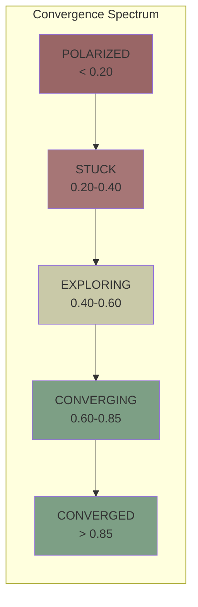
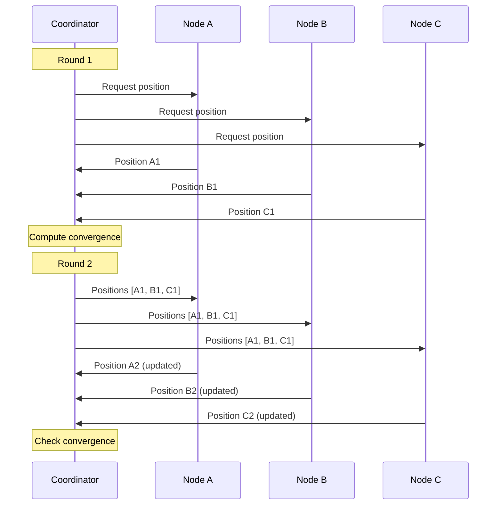
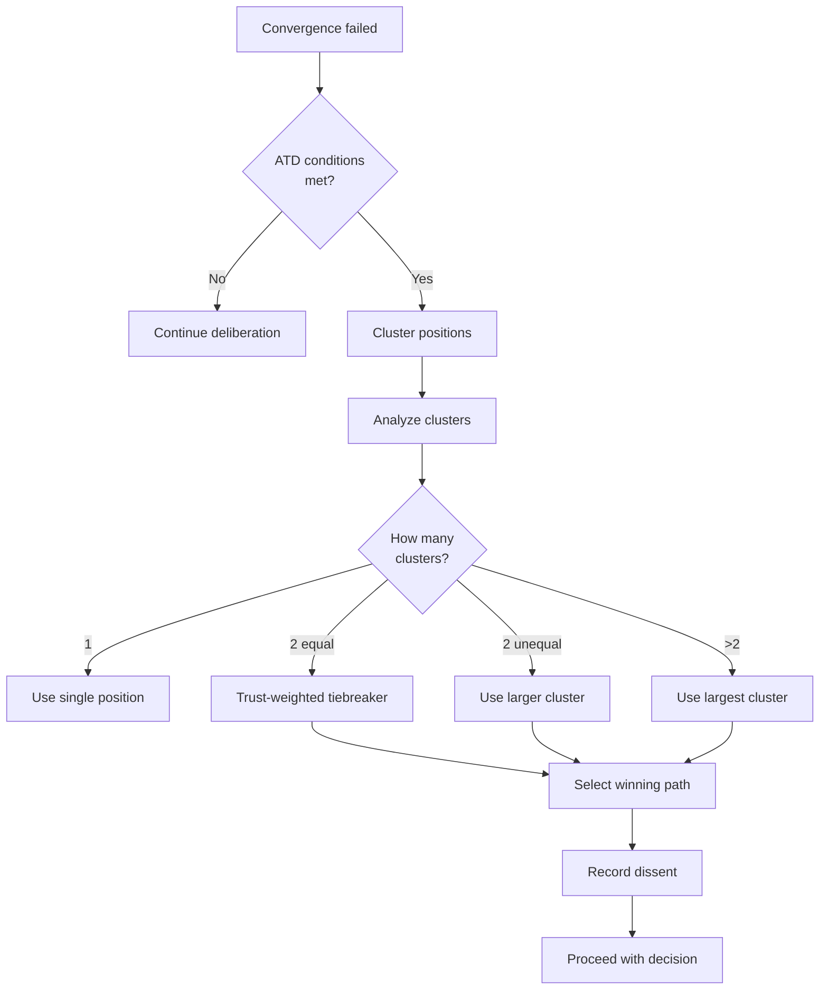
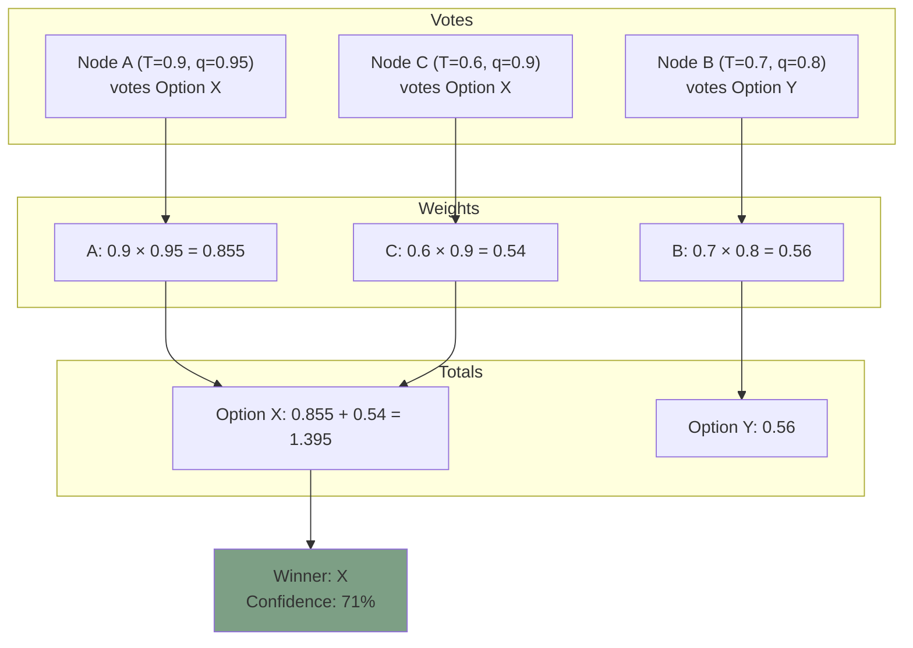
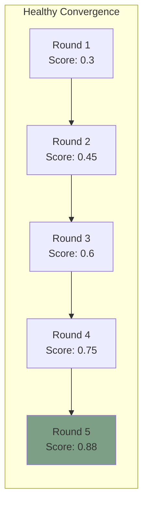

# Convergence Protocol

**Document Version:** 1.0
**Last Updated:** December 2025
**Status:** Normative

---

## 1. Introduction

### 1.1 Purpose

This document specifies Symbiont's convergence protocol—how multiple nodes reach agreement on tasks that benefit from consensus, and how the system handles persistent disagreement.

### 1.2 Scope

Convergence applies to:

- Multi-agent deliberation tasks
- Ensemble decision-making
- Collaborative problem-solving
- Conflict resolution

---

## 2. Convergence Fundamentals

### 2.1 Definition

**Convergence** is the process by which participating nodes move toward agreement on a position or decision.

### 2.2 Convergence Score

$$Conv(task) = 1 - \frac{Var(positions)}{Var_{max}}$$

Where:

- **Var(positions)** = Variance of node positions
- **Var_max** = Maximum possible variance

### 2.3 Convergence States

| Score | State | Description |
|-------|-------|-------------|
| > 0.85 | CONVERGED | Nodes have reached agreement |
| 0.60 - 0.85 | CONVERGING | Moving toward agreement |
| 0.40 - 0.60 | EXPLORING | Actively investigating options |
| 0.20 - 0.40 | STUCK | Progress has stalled |
| < 0.20 | POLARIZED | Strong, persistent disagreement |



---

## 3. Convergence Tracking

### 3.1 Position Representation

Positions can be represented as:

- **Discrete:** Choice from enumerated options
- **Continuous:** Point in feature space
- **Structured:** Complex object with comparable fields

### 3.2 Distance Computation

For computing variance, positions need a distance metric:

```
FUNCTION distance(pos_a, pos_b):
    SWITCH position_type:
        CASE DISCRETE:
            RETURN 0 if pos_a == pos_b else 1

        CASE CONTINUOUS:
            RETURN euclidean_distance(pos_a, pos_b)

        CASE STRUCTURED:
            RETURN weighted_field_distance(pos_a, pos_b)
```

### 3.3 Convergence Computation

```
FUNCTION track_convergence(task, positions):

    // Compute pairwise distances
    distances = []
    nodes = keys(positions)

    FOR i FROM 0 TO len(nodes) - 1:
        FOR j FROM i + 1 TO len(nodes) - 1:
            d = distance(positions[nodes[i]], positions[nodes[j]])
            distances.append(d)

    IF len(distances) == 0:
        RETURN 1.0  // Single participant = converged

    // Compute variance
    variance = var(distances)
    max_variance = compute_max_variance(task)

    // Convergence score
    convergence = 1 - (variance / max_variance)

    RETURN clamp(convergence, 0, 1)
```

### 3.4 Tracking Over Rounds

```
STRUCTURE ConvergenceTracker {
    task_id          : TaskId
    round_count      : uint32
    current_score    : Score
    score_history    : List<Score>
    positions        : Map<NodeId, Position>
    trend            : Trend  // IMPROVING, STABLE, WORSENING
}

FUNCTION update_tracker(tracker, new_positions):

    tracker.positions = new_positions
    tracker.round_count += 1

    new_score = track_convergence(tracker.task_id, new_positions)
    tracker.score_history.append(new_score)
    tracker.current_score = new_score

    // Compute trend
    IF len(tracker.score_history) >= 3:
        recent = tracker.score_history[-3:]
        IF all_increasing(recent):
            tracker.trend = IMPROVING
        ELSE IF all_stable(recent):
            tracker.trend = STABLE
        ELSE:
            tracker.trend = WORSENING
```

---

## 4. Deliberation Process

### 4.1 Deliberation Rounds



### 4.2 Position Update Rules

Nodes update positions based on:

1. **Trust-weighted influence:** Higher-trust nodes have more pull
2. **Quality of reasoning:** Better arguments carry more weight
3. **Prior consistency:** Nodes with consistent history are more influential

```
FUNCTION compute_position_update(self, all_positions, network):

    weighted_sum = 0
    weight_total = 0

    FOR EACH (node_id, position) IN all_positions:
        trust = network.get_trust(node_id)
        quality = network.get_quality(node_id, task.capability)

        weight = trust * quality

        weighted_sum += position * weight
        weight_total += weight

    target = weighted_sum / weight_total

    // Move toward target, but maintain some independence
    new_position = self.current_position * 0.3 + target * 0.7

    RETURN new_position
```

---

## 5. Agree-to-Disagree Protocol

### 5.1 Purpose

When convergence fails, the **Agree-to-Disagree (ATD)** protocol allows the network to proceed without forcing artificial consensus.

### 5.2 ATD Conditions

ATD is invoked when:

```
should_invoke_atd = (
    tracker.round_count >= 5 AND
    tracker.state IN {STUCK, POLARIZED} AND
    tracker.trend == STABLE AND
    task.criticality < 0.8
)
```

### 5.3 ATD Process



### 5.4 ATD Implementation

```
FUNCTION maybe_agree_to_disagree(tracker):

    // Check conditions
    IF NOT should_invoke_atd(tracker):
        RETURN null

    // Cluster positions
    positions = tracker.positions
    clusters = cluster_positions(positions)

    // Choose winning path
    IF len(clusters) == 2 AND sizes_roughly_equal(clusters):
        winning = tiebreaker_by_trust_weight(clusters)
    ELSE:
        winning = largest_cluster(clusters)

    // Record dissent (not penalty!)
    FOR EACH (node, position) IN positions:
        IF position NOT IN winning.positions:
            record_dissent(node, position, winning)

    RETURN ATDResult {
        chosen_path = winning
        dissenting_nodes = get_dissenting_nodes()
        confidence = compute_decision_confidence()
    }
```

### 5.5 Dissent Recording

**Important:** Dissent is not punished. Recording serves to:

1. Maintain audit trail
2. Allow future re-evaluation
3. Inform weight for future decisions

```
FUNCTION record_dissent(node, position, winning):

    dissent_record = DissentRecord {
        node_id      = node.id
        position     = position
        winning_path = winning
        timestamp    = now()
        reasoning    = node.get_reasoning()
    }

    // Store but do not penalize
    append_to_history(dissent_record)
```

---

## 6. Trust-Weighted Consensus

### 6.1 Weighted Voting

For discrete decisions, votes are weighted by trust:

```
FUNCTION weighted_vote(options, votes):

    scores = Map<Option, float>()

    FOR EACH (node, vote) IN votes:
        trust = get_trust(node)
        quality = get_capability_quality(node)
        weight = trust * quality

        scores[vote.option] += weight

    winner = argmax(scores)
    confidence = scores[winner] / sum(scores.values())

    RETURN (winner, confidence)
```

### 6.2 Example



---

## 7. Convergence Dynamics

### 7.1 Forces Toward Convergence

| Force | Mechanism |
|-------|-----------|
| Trust influence | High-trust positions attract others |
| Quality signaling | Better reasoning is more persuasive |
| Social proof | Majority positions gain momentum |
| Reciprocity | Nodes with balanced exchange are heard |

### 7.2 Forces Against Convergence

| Force | Mechanism |
|-------|-----------|
| Diversity value | Novel positions are preserved |
| Confidence | Strongly held positions resist change |
| Evidence | Strong evidence maintains position |
| Independence | Nodes maintain some autonomy |

### 7.3 Healthy Convergence Pattern



---

## 8. Edge Cases

### 8.1 Single Participant

```
IF len(positions) == 1:
    RETURN 1.0  // Trivially converged
```

### 8.2 All Identical Positions

```
IF all_equal(positions):
    RETURN 1.0  // Perfect agreement
```

### 8.3 Maximum Disagreement

```
IF max_pairwise_distance(positions) == max_possible:
    RETURN 0.0  // Complete polarization
```

### 8.4 Critical Tasks

For critical tasks (criticality ≥ 0.8):

- ATD is not invoked automatically
- Require explicit escalation or more rounds
- May require human intervention

---

## 9. Implementation Reference

### 9.1 Complete Convergence Check

```rust
pub fn check_convergence(
    tracker: &ConvergenceTracker,
    positions: &HashMap<NodeId, Position>,
) -> ConvergenceResult {
    // Compute current score
    let score = compute_convergence_score(positions);

    // Determine state
    let state = match score {
        s if s > 0.85 => ConvergenceState::Converged,
        s if s > 0.60 => ConvergenceState::Converging,
        s if s > 0.40 => ConvergenceState::Exploring,
        s if s > 0.20 => ConvergenceState::Stuck,
        _ => ConvergenceState::Polarized,
    };

    // Check for ATD
    let atd_result = if should_invoke_atd(tracker, state) {
        Some(execute_atd(positions))
    } else {
        None
    };

    ConvergenceResult {
        score,
        state,
        atd_result,
        round: tracker.round_count,
    }
}
```

### 9.2 Position Distance Function

```rust
pub fn position_distance(a: &Position, b: &Position) -> f64 {
    match (a, b) {
        (Position::Discrete(va), Position::Discrete(vb)) => {
            if va == vb { 0.0 } else { 1.0 }
        }
        (Position::Continuous(va), Position::Continuous(vb)) => {
            euclidean_distance(va, vb)
        }
        (Position::Structured(va), Position::Structured(vb)) => {
            weighted_struct_distance(va, vb)
        }
        _ => panic!("Incompatible position types"),
    }
}
```

---

## 10. Summary

The convergence protocol enables:

| Feature | Mechanism |
|---------|-----------|
| **Progress tracking** | Convergence score and states |
| **Trust-weighted influence** | Higher-trust nodes have more pull |
| **Graceful disagreement** | ATD protocol when stuck |
| **Audit trail** | Dissent recording without penalty |
| **Flexibility** | Works with discrete, continuous, structured positions |

Convergence is not forced—it emerges from trust dynamics. When genuine disagreement persists, the ATD protocol allows progress while respecting minority positions.

---

*Previous: [Defense Signaling](./defense-signaling.md) | Next: [State Machines](./state-machines.md)*
