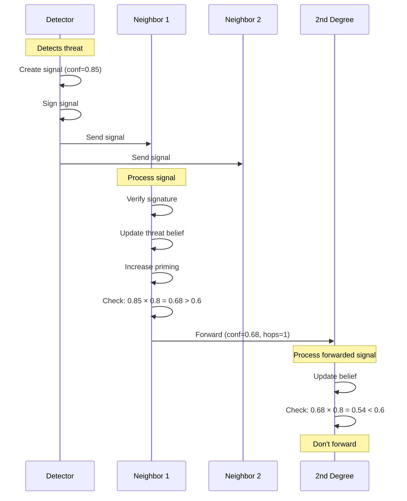
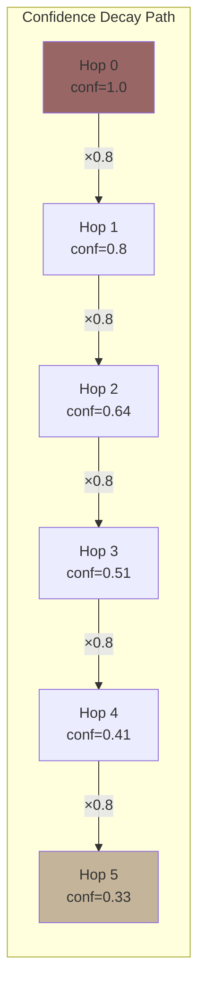
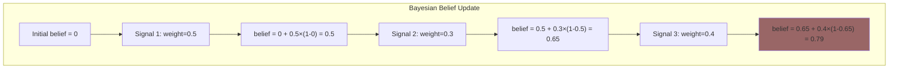
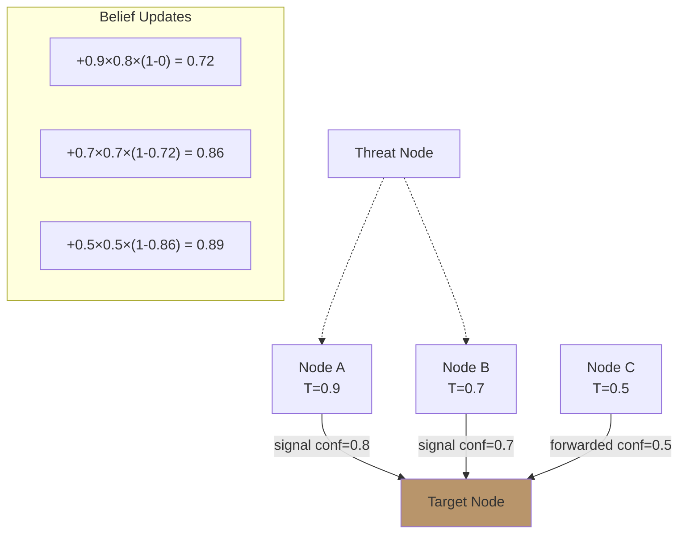
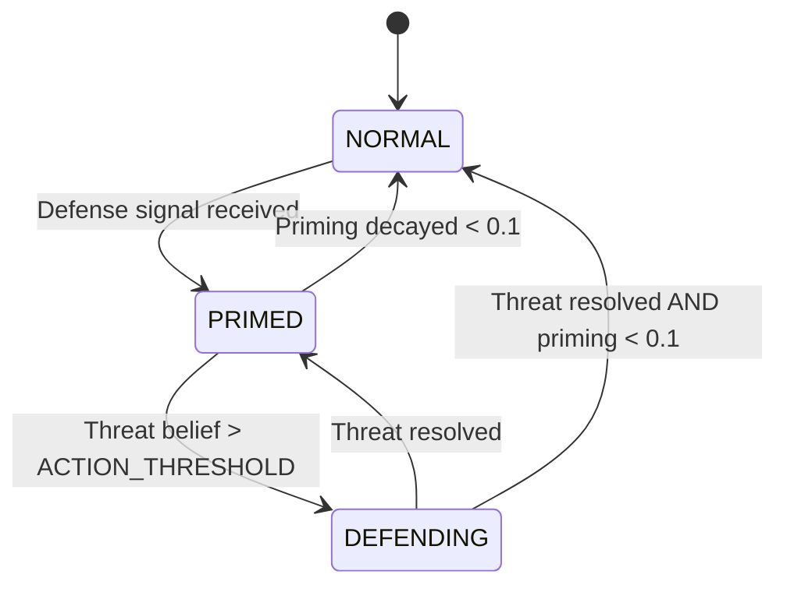

# Defense Signaling

**Document Version:** 1.0
**Last Updated:** December 2025
**Status:** Normative

---

## 1. Introduction

### 1.1 Purpose

This document specifies Symbiont's defense signaling system—how nodes detect threats, communicate warnings, and coordinate responses across the network.

### 1.2 Biological Inspiration

Defense signaling in Symbiont mirrors plant defense communication:

| Plant Behavior | Symbiont Equivalent |
|----------------|---------------------|
| Damaged leaf releases VOCs | Node emits defense signal |
| Neighboring plants receive signals | Connected nodes receive signals |
| Signal strength decreases with distance | Confidence decays per hop |
| Plants "prime" defenses | Nodes increase priming level |
| Full activation on direct attack | Action on high threat belief |

---

## 2. Defense Signal Structure

### 2.1 Signal Definition

```
STRUCTURE DefenseSignal {
    type         : SignalType
    sender       : NodeId          // Node sending this signal
    origin       : NodeId          // Node that first detected threat
    threat       : NodeId          // The threatening node
    threat_type  : ThreatType      // Category of threat
    confidence   : Score           // Confidence in threat [0, 1]
    evidence     : Hash            // Hash of evidence
    hops         : uint8           // Hops from origin
    timestamp    : Timestamp
    signature    : Signature       // Sender's signature
}

ENUM SignalType {
    GENERAL_ALERT,      // General warning
    SPECIFIC_THREAT,    // Specific node identified
    BROADCAST           // Network-wide alert
}

ENUM ThreatType {
    CHEATING,           // Intentionally wrong results
    SYBIL,              // Fake identity cluster
    COLLUSION,          // Coordinated gaming
    QUALITY_FRAUD,      // Fake quality ratings
    STRATEGIC           // Build trust then defect
}
```

### 2.2 Signal Lifecycle



---

## 3. Signal Generation

### 3.1 Detection Triggers

Nodes emit signals when detecting:

| Detection | Trigger Condition |
|-----------|-------------------|
| Quality drop | quality < 0.3 for multiple interactions |
| Strategic adversary | Pattern matches (see Section 3.2) |
| Collusion | Cluster detected (see Section 3.3) |
| Sybil attack | Multiple similar identities detected |
| Direct attack | Malicious input or behavior |

### 3.2 Strategic Adversary Detection

```
FUNCTION detect_strategic_adversary(node):

    history = node.interaction_history[last 100]
    IF len(history) < 100:
        RETURN false

    early = history[0:50]
    recent = history[50:100]

    early_quality = mean([i.quality FOR i IN early])
    recent_quality = mean([i.quality FOR i IN recent])
    early_variance = variance([i.quality FOR i IN early])

    // Suspiciously perfect early behavior
    IF early_quality > 0.95 AND early_variance < 0.01:
        RETURN true

    // Quality drop after building trust
    IF node.trust > 0.7 AND (early_quality - recent_quality) > 0.3:
        RETURN true

    RETURN false
```

### 3.3 Collusion Detection

```
FUNCTION detect_collusion(network):

    graph = build_interaction_graph(network)
    communities = find_communities(graph)
    suspicious = []

    FOR EACH community IN communities:
        IF size(community) < 3:
            CONTINUE

        // Check for suspicious patterns
        internal_density = edges_within / max_possible_edges
        external_ratio = edges_outside / (size × 0.5)
        mutual_rating = mean_internal_ratings

        IF internal_density > 0.8 AND
           external_ratio < 1.0 AND
           mutual_rating > 0.9:
            suspicious.add(community)

    RETURN suspicious
```

### 3.4 Signal Creation

```
FUNCTION create_defense_signal(self, threat_node, threat_type, evidence):

    confidence = compute_detection_confidence(threat_type, evidence)

    signal = DefenseSignal {
        type        = SPECIFIC_THREAT
        sender      = self.id
        origin      = self.id
        threat      = threat_node.id
        threat_type = threat_type
        confidence  = confidence
        evidence    = hash(evidence)
        hops        = 0
        timestamp   = now()
    }

    signal.signature = self.sign(signal)

    RETURN signal
```

---

## 4. Signal Propagation

### 4.1 Propagation Rules

```
CONST PROPAGATE_THRESHOLD = 0.6    // Min confidence to forward
CONST DECAY_PER_HOP = 0.8          // Confidence decay
CONST MAX_HOPS = 5                 // Maximum propagation depth
CONST MIN_SIGNAL = 0.1             // Minimum signal strength
```

### 4.2 Propagation Algorithm

```
FUNCTION propagate_signal(self, signal):

    // Check if should propagate
    IF signal.hops >= MAX_HOPS:
        RETURN

    new_confidence = signal.confidence × DECAY_PER_HOP

    IF new_confidence < MIN_SIGNAL:
        RETURN

    IF new_confidence < PROPAGATE_THRESHOLD:
        RETURN

    // Create forwarded signal
    forwarded = DefenseSignal {
        type        = signal.type
        sender      = self.id              // I'm forwarding
        origin      = signal.origin        // Original detector
        threat      = signal.threat
        threat_type = signal.threat_type
        confidence  = new_confidence
        evidence    = signal.evidence
        hops        = signal.hops + 1
        timestamp   = now()
    }

    forwarded.signature = self.sign(forwarded)

    // Send to connections (weighted by connection strength)
    FOR EACH conn IN self.connections:
        IF conn.partner_id != signal.sender:  // Don't send back
            IF conn.w > 0.3:                   // Only strong connections
                send(conn.partner_id, forwarded)
```

### 4.3 Confidence Decay



### 4.4 Connection-Weighted Decay

Actual confidence also depends on connection weight:

$$confidence_{received} = confidence_{sent} \times w_{connection}$$

This means signals propagate more strongly through trusted connections.

---

## 5. Signal Processing

### 5.1 Receiving a Signal

```
FUNCTION handle_defense_signal(self, signal):

    // Step 1: Validate signature
    IF NOT verify(signal.signature, signal.sender):
        RETURN  // Invalid signal

    // Step 2: Update threat belief
    update_threat_belief(self, signal)

    // Step 3: Increase priming
    update_priming(self, signal)

    // Step 4: Maybe take action
    IF should_take_action(self, signal.threat):
        take_defensive_action(self, signal.threat)

    // Step 5: Maybe propagate
    IF should_propagate(signal):
        propagate_signal(self, signal)
```

### 5.2 Threat Belief Update (Bayesian)

```
FUNCTION update_threat_belief(self, signal):

    // Get or create belief
    IF signal.threat NOT IN self.threat_beliefs:
        self.threat_beliefs[signal.threat] = ThreatBelief {
            level = 0
            threat_type = signal.threat_type
            evidence = []
            updated = now()
        }

    belief = self.threat_beliefs[signal.threat]

    // Compute update weight
    sender_trust = get_trust(signal.sender)
    weight = sender_trust × signal.confidence

    // Bayesian update: moves belief toward 1
    belief.level = belief.level + weight × (1 - belief.level)

    // Record evidence
    belief.evidence.append(signal.evidence)
    belief.updated = now()
```

### 5.3 Bayesian Update Visualization



**Property:** Multiple signals from different sources compound, but with diminishing returns (approaches but never exceeds 1.0).

---

## 6. Priming System

### 6.1 Priming Definition

**Priming** (π) is a node's defense readiness level, ranging from 0 (relaxed) to 1 (fully alert).

### 6.2 Priming Update

```
FUNCTION update_priming(self, signal):

    boost = signal.confidence × PRIMING_SENSITIVITY  // 0.1
    self.priming = min(1.0, self.priming + boost)
```

### 6.3 Priming Decay

Priming decays naturally over time:

```
FUNCTION decay_priming(self):

    self.priming = self.priming × PRIMING_DECAY  // 0.99
```

### 6.4 Priming Effects

| Priming Level | State | Effect |
|---------------|-------|--------|
| 0.0 - 0.2 | Relaxed | Normal operation |
| 0.2 - 0.5 | Alert | Faster response to signals |
| 0.5 - 0.8 | Heightened | May preemptively reduce trust |
| 0.8 - 1.0 | Critical | May refuse interactions with suspicious nodes |

---

## 7. Defensive Actions

### 7.1 Action Threshold

```
CONST ACTION_THRESHOLD = 0.7  // Threat belief level triggering action
```

### 7.2 Available Actions

```
FUNCTION take_defensive_action(self, threat_id):

    threat_level = self.threat_beliefs[threat_id].level

    IF threat_level > 0.9:
        // Severe: Block entirely
        block_node(threat_id)
        remove_connection(threat_id)

    ELSE IF threat_level > 0.7:
        // High: Significantly reduce trust
        reduce_trust_cap(threat_id, 0.3)
        flag_for_investigation(threat_id)

    ELSE IF threat_level > 0.5:
        // Moderate: Reduce connection weight
        IF threat_id IN self.connections:
            self.connections[threat_id].w *= 0.5

    // Always: Apply defense dampening in Physarum equation
    // D = δ × threat_level is applied automatically
```

### 7.3 Defense Dampening in Connection Dynamics

Threat beliefs directly affect connection weight updates:

$$D = \delta \times \theta_{threat}$$

Where δ = 0.2 and θ_threat is the threat belief level.

This creates automatic weakening of connections to suspected adversaries.

---

## 8. Multi-Source Signals

### 8.1 Aggregating Multiple Sources

When signals arrive from multiple sources:



**Result:** Multiple corroborating signals from trusted sources rapidly increase belief.

### 8.2 Conflicting Signals

If signals conflict (some say threat, some say safe):
- Each signal updates belief independently
- Net effect depends on trust-weighted signals
- System is resilient to minority false reports

---

## 9. Signal Validation

### 9.1 Signature Verification

```
FUNCTION validate_signal(signal):

    // Check signature
    IF NOT verify(signal.signature, signal.sender):
        RETURN INVALID_SIGNATURE

    // Check timestamp (not too old)
    IF age(signal.timestamp) > MAX_SIGNAL_AGE:
        RETURN EXPIRED

    // Check hops
    IF signal.hops > MAX_HOPS:
        RETURN TOO_MANY_HOPS

    // Check sender trust
    IF get_trust(signal.sender) < MIN_SENDER_TRUST:
        RETURN UNTRUSTED_SENDER

    RETURN VALID
```

### 9.2 Preventing Abuse

| Attack | Prevention |
|--------|------------|
| Fake signals | Signature verification |
| Signal flooding | Rate limiting, hop limit |
| False accusations | Trust-weighted belief updates |
| Signal amplification | Decay per hop |

---

## 10. Defense State Machine

### 10.1 States

```
ENUM DefenseState {
    NORMAL,     // No active threats
    PRIMED,     // Received signals, heightened awareness
    DEFENDING   // Actively defending against threat
}
```

### 10.2 Transitions



---

## 11. Implementation Reference

### 11.1 Complete Signal Handler

```rust
pub fn handle_defense_signal(&mut self, signal: DefenseSignal) -> Result<()> {
    // Validate
    if !signal.verify_signature()? {
        return Err(Error::InvalidSignature);
    }

    // Update threat belief
    let sender_trust = self.network.get_trust(&signal.sender)?;
    let weight = sender_trust * signal.confidence;

    let belief = self.threat_beliefs
        .entry(signal.threat)
        .or_insert(ThreatBelief::default());

    belief.level = belief.level + weight * (1.0 - belief.level);
    belief.threat_type = signal.threat_type;
    belief.evidence.push(signal.evidence);
    belief.updated = Timestamp::now();

    // Update priming
    self.priming = (self.priming + signal.confidence * PRIMING_SENSITIVITY)
        .min(1.0);

    // Maybe take action
    if belief.level > ACTION_THRESHOLD {
        self.take_defensive_action(&signal.threat)?;
    }

    // Maybe propagate
    if signal.hops < MAX_HOPS {
        let new_conf = signal.confidence * DECAY_PER_HOP;
        if new_conf >= PROPAGATE_THRESHOLD {
            self.propagate_signal(signal, new_conf)?;
        }
    }

    Ok(())
}
```

---

## 12. Summary

Defense signaling enables collective network security:

| Aspect | Mechanism |
|--------|-----------|
| **Detection** | Local pattern recognition |
| **Communication** | Signed signals through connections |
| **Attenuation** | Confidence decay per hop |
| **Belief Update** | Bayesian aggregation |
| **Priming** | Heightened readiness |
| **Action** | Trust reduction, blocking |

The system balances sensitivity (detecting real threats) with stability (not overreacting to noise) through trust-weighted updates and gradual belief formation.

---

*Previous: [Reciprocity System](./reciprocity.md) | Next: [Convergence Protocol](./convergence.md)*
