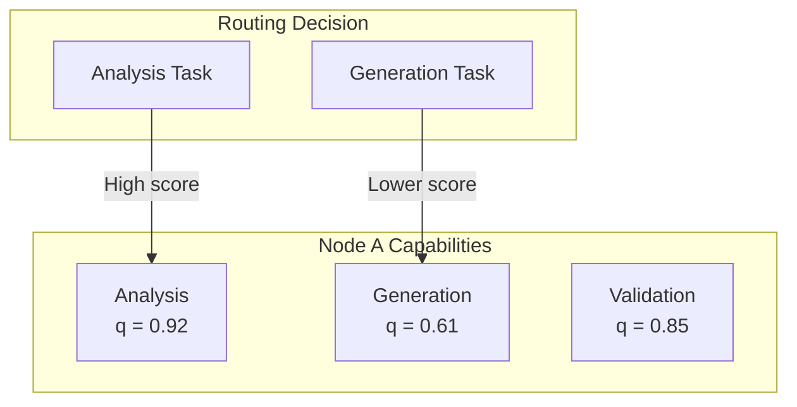
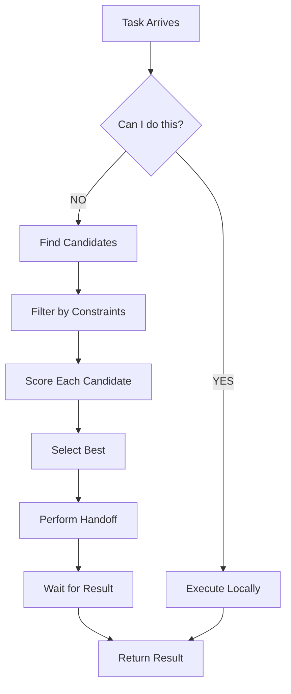
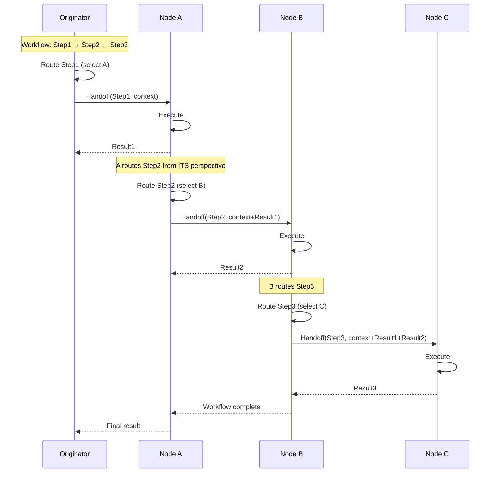
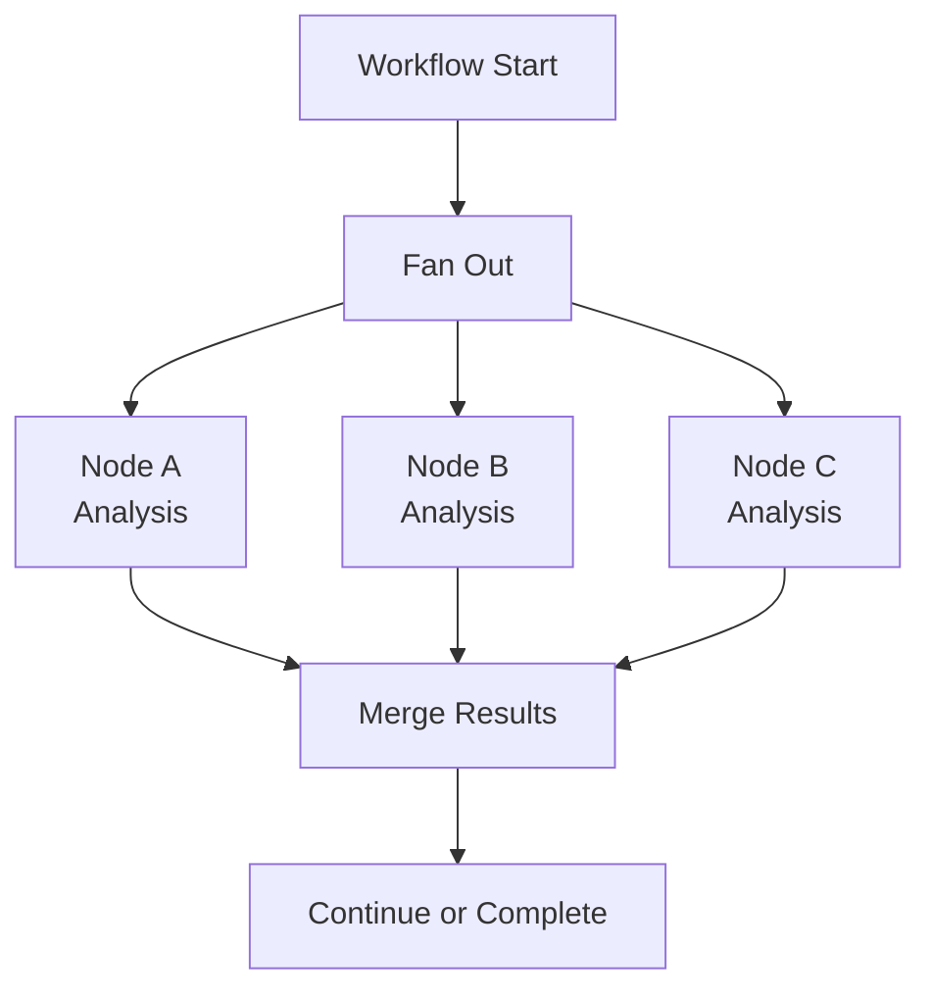
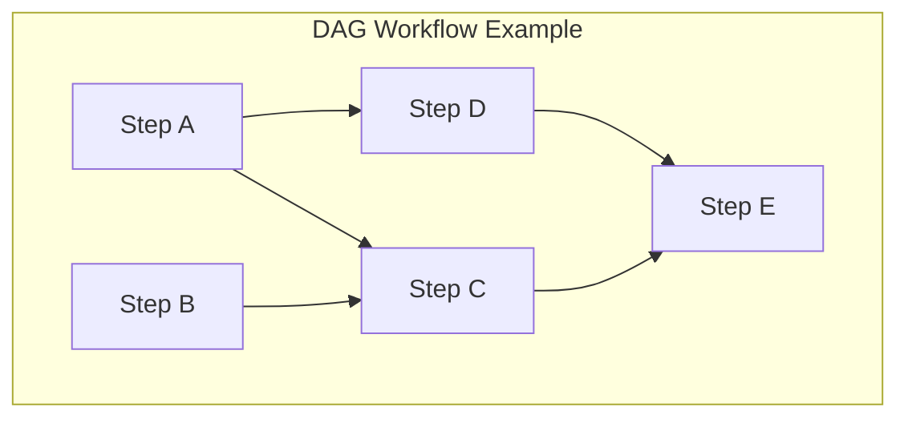
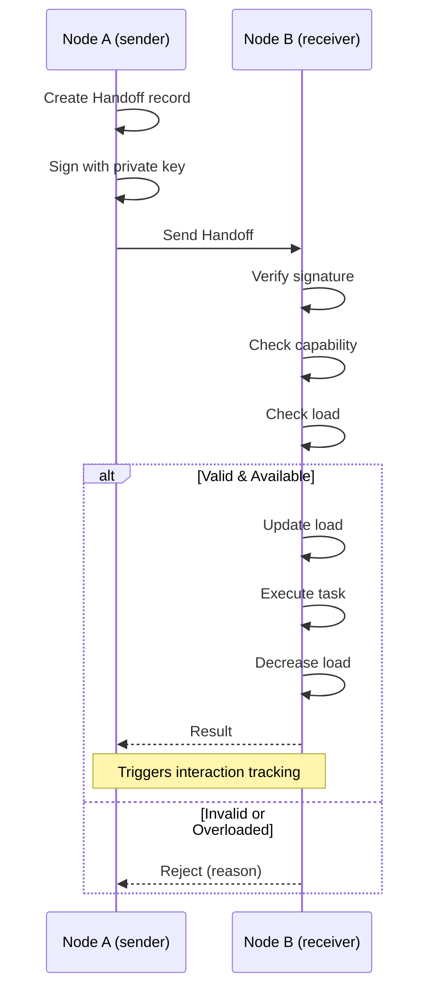
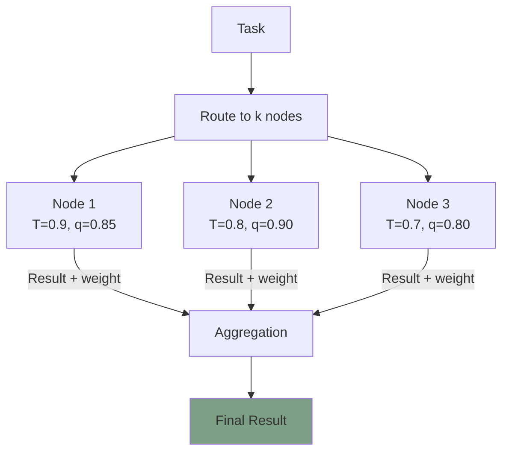
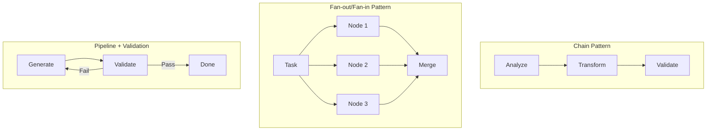

# Orchestration Protocol

**Document Version:** 1.0
**Last Updated:** December 2025
**Status:** Normative

---

## 1. Introduction

### 1.1 Purpose

This document specifies how orchestration works in Symbiont. Orchestration encompasses task routing, workflow execution, handoff protocols, and capability-based node selection.

### 1.2 Core Principle

> **Orchestration emerges from trust dynamics.** There is no separate "orchestrator"—routing, selection, and workflow decisions are computed from the same equations that govern trust.

```
┌─────────────────────────────────────────────────────────────────┐
│                                                                 │
│   Traditional: Orchestrator decides → Agents execute            │
│                                                                 │
│   Symbiont:    Trust dynamics determine → Best path emerges     │
│                                                                 │
└─────────────────────────────────────────────────────────────────┘
```

### 1.3 Scope

This document covers:

- Capability model and per-capability quality tracking
- Task routing algorithm and scoring
- Workflow execution patterns
- Handoff protocol
- Load balancing through reciprocity
- Ensemble decision-making

---

## 2. Capability Model

### 2.1 Capability Declaration

Each node declares its capabilities—the types of tasks it can perform:

```
STRUCTURE Capability {
    id           : CapabilityId
    name         : string
    category     : enum { ANALYSIS, GENERATION, TRANSFORMATION, VALIDATION }
    input_types  : List<DataType>
    output_types : List<DataType>
    constraints  : Map<string, any>    // e.g., max_size, timeout
}
```

### 2.2 Capability State

For each capability a node possesses, state is tracked:

```
STRUCTURE CapabilityState {
    capability   : Capability
    quality      : Score              // Quality score FOR THIS CAPABILITY
    volume       : uint32             // Times used
    last_used    : Timestamp
    available    : boolean            // Currently available?
    load         : Score              // Current load (0 = idle, 1 = maxed)
}
```

### 2.3 Per-Capability Quality Tracking

Quality scores are tracked **per capability**, not just globally:

```
q_capability(node, cap) = aggregated quality for node performing capability cap

Q_agg(node) = weighted average across all capabilities by volume
```

This enables nuanced routing decisions:

> "Node A is excellent at analysis but mediocre at generation."



---

## 3. Task Structure

### 3.1 Task Definition

```
STRUCTURE Task {
    id              : TaskId
    type            : enum { SINGLE, SEQUENTIAL, PARALLEL, DAG }
    required_caps   : List<CapabilityId>
    input           : TaskInput
    constraints     : TaskConstraints
    context         : TaskContext
    origin          : NodeId
}
```

### 3.2 Task Constraints

```
STRUCTURE TaskConstraints {
    timeout         : Duration
    priority        : enum { LOW, NORMAL, HIGH, CRITICAL }
    min_trust       : Score             // Minimum trust required
    min_quality     : Score             // Minimum quality required
    preferred_nodes : List<NodeId>      // Hints (not requirements)
    excluded_nodes  : List<NodeId>      // Hard exclusions
}
```

### 3.3 Task Context

Context travels with tasks through workflows:

```
STRUCTURE TaskContext {
    workflow_id  : Option<WorkflowId>
    step_index   : Option<uint32>
    metadata     : Map<string, bytes>
}
```

---

## 4. Task Routing

### 4.1 Routing Score

For a task requiring capability `cap`, the routing score for candidate node `n` is:

$$S_{route}(n, cap, task) = T(n) \cdot q_{cap}(n) \cdot (1 - load(n)) \cdot \phi_{conn} \cdot (1 - \theta_{threat})$$

| Component | Formula | Meaning |
|-----------|---------|---------|
| T(n) | Global trust | Overall trustworthiness |
| q_cap(n) | Capability quality | How good at THIS task type |
| (1 - load(n)) | Availability | Not overloaded |
| φ_conn | Connection factor | w_ij if connected, else W_INIT |
| (1 - θ_threat) | Safety factor | Reduced if defense signals active |

### 4.2 Routing Flow



### 4.3 Routing Algorithm

```
FUNCTION route_task(task, from_node, network):

    required_cap = task.required_caps[0]

    // 1. Find candidates with capability
    candidates = []
    FOR EACH node IN network.nodes:
        IF node.has_capability(required_cap):
            IF node.capabilities[required_cap].available:
                IF node.id NOT IN task.constraints.excluded_nodes:
                    candidates.append(node)

    // 2. Filter by constraints
    candidates = filter(candidates, WHERE:
        T(node) >= task.constraints.min_trust AND
        q_cap(node, required_cap) >= task.constraints.min_quality
    )

    // 3. Score candidates
    scored = []
    FOR EACH node IN candidates:

        // Base score
        score = T(node) × q_cap(node, required_cap) × (1 - node.load)

        // Connection bonus (prefer existing relationships)
        IF node.id IN from_node.connections:
            conn = from_node.connections[node.id]
            score = score × conn.w
        ELSE:
            score = score × W_INIT

        // Defense penalty
        IF node.id IN from_node.threat_beliefs:
            threat = from_node.threat_beliefs[node.id].level
            score = score × (1 - threat)

        // Preference bonus
        IF node.id IN task.constraints.preferred_nodes:
            score = score × 1.2

        scored.append((node, score))

    // 4. Select best
    scored.sort(BY score DESC)

    IF scored is empty:
        RETURN RoutingResult.NO_CANDIDATES

    RETURN RoutingResult.SUCCESS(scored[0].node)
```

### 4.4 Routing Decision Factors

```mermaid
graph LR
    subgraph "Routing Score Components"
        T[Trust T(n)]
        Q[Capability Quality<br/>q_cap]
        L[Availability<br/>1-load]
        W[Connection Weight<br/>w or W_INIT]
        TH[Safety<br/>1-threat]
    end

    T --> MULT((×))
    Q --> MULT
    L --> MULT
    W --> MULT
    TH --> MULT

    MULT --> SCORE[Final Score]

    style SCORE fill:#7d9f85
```

---

## 5. Workflow Execution

### 5.1 Workflow Types

| Type | Description | Use Case |
|------|-------------|----------|
| SINGLE | One task, one agent | Simple requests |
| SEQUENTIAL | A → B → C (chain) | Pipeline processing |
| PARALLEL | A, B, C simultaneously | Fan-out/fan-in |
| DAG | Directed acyclic graph | Complex dependencies |

### 5.2 Workflow Structure

```
STRUCTURE Workflow {
    id          : WorkflowId
    type        : WorkflowType
    steps       : List<WorkflowStep>
    context     : WorkflowContext
    status      : enum { PENDING, RUNNING, COMPLETED, FAILED }
}

STRUCTURE WorkflowStep {
    step_id     : StepId
    task        : Task
    assigned_to : NodeId              // Filled during execution
    depends_on  : List<StepId>        // For DAG workflows
    status      : StepStatus
    result      : Option<StepResult>
}

STRUCTURE WorkflowContext {
    input       : bytes               // Initial input
    accumulated : Map<string, bytes>  // Accumulated data
    lineage     : List<NodeId>        // Nodes that processed this
}
```

### 5.3 Sequential Workflow Execution



### 5.4 Sequential Execution Algorithm

```
FUNCTION execute_sequential_workflow(workflow, initiator, network):

    context = workflow.context
    current_node = initiator

    FOR EACH step IN workflow.steps:

        // 1. Route to best candidate FROM CURRENT NODE'S PERSPECTIVE
        routing = route_task(step.task, current_node, network)

        IF routing.failed:
            workflow.status = FAILED
            RETURN WorkflowResult.FAILED(step, routing.reason)

        target = routing.node
        step.assigned_to = target.id

        // 2. Execute task (triggers normal interaction)
        result = execute_and_track(current_node, target, step.task, context)

        IF result.failed:
            workflow.status = FAILED
            RETURN WorkflowResult.FAILED(step, result.error)

        step.status = COMPLETED
        step.result = result

        // 3. Update context with output
        context = merge_context(context, result.output)
        context.lineage.append(target.id)

        // 4. HANDOFF: Next step routes from target's perspective
        current_node = target

    workflow.status = COMPLETED
    RETURN WorkflowResult.SUCCESS(context)
```

### 5.5 Parallel Workflow Execution



```
FUNCTION execute_parallel_workflow(workflow, initiator, network):

    // 1. Route all parallel tasks
    assignments = []
    FOR EACH step IN workflow.steps WHERE step.depends_on is empty:
        routing = route_task(step.task, initiator, network)
        IF routing.failed:
            RETURN WorkflowResult.FAILED(step, routing.reason)
        assignments.append((step, routing.node))

    // 2. Execute in parallel
    results = parallel_execute(assignments)

    // 3. Aggregate results
    aggregated = aggregate_results(results, workflow.aggregation_strategy)

    // 4. Continue with dependent steps if any
    IF workflow has merge_step:
        context = merge_context(workflow.context, aggregated)
        // Continue with downstream steps...

    RETURN WorkflowResult.SUCCESS(aggregated)
```

### 5.6 DAG Workflow Execution



DAG workflows execute steps as their dependencies complete, enabling maximum parallelism while respecting ordering constraints.

---

## 6. Handoff Protocol

### 6.1 Handoff Structure

When work passes from node A to node B:

```
STRUCTURE Handoff {
    from_node   : NodeId
    to_node     : NodeId
    task        : Task
    context     : HandoffContext
    timestamp   : Timestamp
    signature   : Signature           // Signed by from_node
}

STRUCTURE HandoffContext {
    workflow_id  : WorkflowId
    step_index   : uint32
    prior_results: List<StepResult>   // Results from prior steps
    accumulated  : Map<string, bytes> // Key-value context
    lineage      : List<NodeId>       // Who touched this workflow
}
```

### 6.2 Handoff Flow



### 6.3 Handoff Execution

```
FUNCTION perform_handoff(from_node, to_node, task, context):

    // 1. Create handoff record
    handoff = Handoff {
        from_node = from_node.id
        to_node   = to_node.id
        task      = task
        context   = context
        timestamp = now()
        signature = from_node.sign(hash(task, context))
    }

    // 2. Update connection activity
    conn = from_node.connections[to_node.id]
    conn.last_active = now()

    // 3. Send to target
    send(to_node, handoff)

    RETURN handoff


FUNCTION receive_handoff(self, handoff):

    // 1. Validate signature
    IF NOT verify(handoff.signature, handoff.from_node):
        RETURN HandoffResult.INVALID_SIGNATURE

    // 2. Check capability
    required_cap = handoff.task.required_caps[0]
    IF NOT self.has_capability(required_cap):
        RETURN HandoffResult.MISSING_CAPABILITY

    // 3. Check load
    IF self.capabilities[required_cap].load > 0.95:
        RETURN HandoffResult.OVERLOADED

    // 4. Execute task
    self.capabilities[required_cap].load += task_load_estimate(handoff.task)
    result = self.execute(handoff.task, handoff.context)
    self.capabilities[required_cap].load -= task_load_estimate(handoff.task)

    // 5. Send result (triggers interaction tracking on both sides)
    send_result(handoff.from_node, result)

    RETURN HandoffResult.SUCCESS(result)
```

---

## 7. Load Balancing

### 7.1 Load Balancing Through Reciprocity

**Key insight:** Load balancing is AUTOMATIC via reciprocity dynamics. No separate load balancer is needed.

When a node becomes overloaded:

1. It's giving more than receiving → ρ < 1
2. Reciprocity score drops → r goes negative
3. Connection reinforcement drops → σ(r) < 0
4. Routing score drops → tasks route elsewhere

```mermaid
graph LR
    OVERLOAD[Node Overloaded] --> IMBALANCE[ρ < 1<br/>Giving > Receiving]
    IMBALANCE --> R_DROP[r decreases]
    R_DROP --> SIGMA_DROP[σ(r) negative]
    SIGMA_DROP --> W_DROP[Connection<br/>weight drops]
    W_DROP --> ROUTE_AWAY[Tasks routed<br/>to other nodes]
    ROUTE_AWAY --> BALANCE[Load balances]

    style BALANCE fill:#7d9f85
```

### 7.2 Explicit Load Signaling

Nodes can also explicitly signal load:

```
// Temporary unavailability
node.capabilities[cap].available = false

// Current load factor
node.capabilities[cap].load = current_tasks / max_capacity

// Load affects routing score
routing_score = ... × (1 - load) × ...
```

### 7.3 Reciprocity as Natural Load Balancer

| Situation | Reciprocity Effect | Routing Effect |
|-----------|-------------------|----------------|
| Node overloaded | r decreases (giving more) | Lower routing score |
| Node underutilized | r increases (receiving more) | Higher routing score |
| Node balanced | r ≈ 0 | Stable routing score |

---

## 8. Ensemble Decisions

### 8.1 When to Use Ensembles

Ensembles route the same task to multiple nodes for:

- **Redundancy** — Protection against failures
- **Consensus** — Agreement on subjective tasks
- **Quality** — Aggregating multiple perspectives

### 8.2 Ensemble Routing

```
FUNCTION route_ensemble(task, from_node, network, k):

    // Get top-k candidates instead of just best
    scored = score_all_candidates(task, from_node, network)
    scored.sort(BY score DESC)

    top_k = scored[0:k]

    // Ensure diversity (not all from same cluster)
    IF too_similar(top_k):
        top_k = diversify(scored, k)

    RETURN top_k
```

### 8.3 Ensemble Aggregation Strategies

```
FUNCTION aggregate_ensemble(results, nodes, strategy):

    SWITCH strategy:

        CASE VOTING:
            // Weight votes by trust × capability quality
            votes = {}
            FOR EACH (node, result) IN zip(nodes, results):
                weight = T(node) × q_cap(node, task.cap)
                votes[result.answer] += weight
            RETURN max_vote(votes)

        CASE AVERAGING:
            // Weighted average of numeric results
            weights = [T(n) × q_cap(n, task.cap) FOR n IN nodes]
            RETURN weighted_average(results, weights)

        CASE CONSENSUS:
            // Use convergence dynamics
            RETURN run_convergence(results, nodes)

        CASE BEST_EFFORT:
            // Take result from highest-scored node
            best = max(nodes, BY T(n) × q_cap(n, task.cap))
            RETURN results[index(best)]
```

### 8.4 Ensemble Aggregation Diagram



---

## 9. Predefined Workflow Patterns

### 9.1 Common Patterns

```
PATTERN chain(caps: List<Capability>):
    // Sequential: A → B → C
    RETURN Workflow {
        type = SEQUENTIAL
        steps = [WorkflowStep(cap) FOR cap IN caps]
    }

PATTERN fan_out_fan_in(parallel_cap: Capability, k: int, merge_cap: Capability):
    // Parallel execution then merge
    RETURN Workflow {
        type = DAG
        steps = [
            ...k WorkflowSteps for parallel_cap,
            WorkflowStep(merge_cap, depends_on=parallel_steps)
        ]
    }

PATTERN pipeline_with_validation(main_cap: Capability, validate_cap: Capability):
    // Do work, then validate
    RETURN Workflow {
        type = SEQUENTIAL
        steps = [
            WorkflowStep(main_cap),
            WorkflowStep(validate_cap)
        ]
    }

PATTERN redundant_execution(cap: Capability, k: int):
    // Same task to k nodes, aggregate results
    RETURN EnsembleWorkflow {
        capability = cap
        ensemble_size = k
        aggregation = VOTING
    }
```

### 9.2 Pattern Examples



---

## 10. Orchestration Integration Summary

### 10.1 How Orchestration Uses Trust

| Orchestration Function | Symbiont Component | Equation/Logic |
|------------------------|-------------------|----------------|
| **Who can do this?** | Capability registry | Node.capabilities |
| **Who's best?** | Per-capability quality | q_cap(n) |
| **Who to route to?** | Routing score | S = T × q_cap × (1-load) × w × (1-θ) |
| **Who to avoid?** | Defense signals | θ_threat from threat beliefs |
| **Load balancing?** | Reciprocity dynamics | Overloaded → r < 0 → lower score |
| **Handoff trust?** | Connection weight | Use existing w_ij |
| **Ensemble weighting?** | Trust × quality | T(n) × q_cap(n) |
| **Workflow paths?** | Connection graph | Follow strong connections |

### 10.2 Complete Task Processing Flow

```
┌─────────────────────────────────────────────────────────────────────────────┐
│                           TASK PROCESSING FLOW                               │
└─────────────────────────────────────────────────────────────────────────────┘

                              TASK ARRIVES
                                   │
                                   ▼
                        ┌─────────────────────┐
                        │  Can I do this?     │
                        │  (check capability) │
                        └──────────┬──────────┘
                                   │
                    ┌──────────────┴──────────────┐
                    │ YES                         │ NO
                    ▼                             ▼
           ┌───────────────┐            ┌───────────────────┐
           │ Execute local │            │ ROUTE TO BEST     │
           └───────────────┘            │                   │
                                        │ Score = T × q_cap │
                                        │   × (1-load) × w  │
                                        │   × (1-threat)    │
                                        └─────────┬─────────┘
                                                  │
                                                  ▼
                                        ┌───────────────────┐
                                        │ HANDOFF           │
                                        │ (task + context)  │
                                        └─────────┬─────────┘
                                                  │
                                                  ▼
                                        ┌───────────────────┐
                                        │ TARGET EXECUTES   │
                                        └─────────┬─────────┘
                                                  │
                                                  ▼
                              ┌────────────────────────────────┐
                              │      INTERACTION RECORDED       │
                              │                                │
                              │  1. Measure quality, tone, ρ   │
                              │  2. Update r (reciprocity)     │
                              │  3. Update q (quality)         │
                              │  4. Update q_cap (per-cap)     │
                              │  5. Compute Φ (reinforcement)  │
                              │  6. Update w connection weight │
                              │  7. Maybe affirmation          │
                              │  8. Maybe defense signal       │
                              └────────────────┬───────────────┘
                                               │
                              ┌────────────────┴───────────────┐
                              │                                │
                              ▼                                ▼
                     ┌───────────────┐               ┌───────────────┐
                     │ If workflow:  │               │ Update global │
                     │ Next step     │               │ T(n) trust    │
                     │ routes from   │               │               │
                     │ target's POV  │               │ Route future  │
                     └───────────────┘               │ tasks based   │
                                                     │ on new scores │
                                                     └───────────────┘
```

---

## 11. Implementation Notes

### 11.1 Minimal Orchestration Implementation

For a minimal implementation, you need:

1. **Capability tracking** — Map of capability → quality per node
2. **Routing score** — `T × q_cap × (1-load) × w × (1-threat)`
3. **Handoff** — Signed task transfer with context
4. **Sequential workflow** — Chain of handoffs

Everything else (parallel, DAG, ensemble) can be added incrementally.

### 11.2 Concurrency Considerations

| Component | Concurrency Model |
|-----------|-------------------|
| Routing decisions | Per-task, can parallelize |
| Workflow state | Per-workflow lock |
| Capability load | Atomic updates |
| Connection weights | Read-mostly, occasional write |

### 11.3 Failure Handling

```
IF handoff fails:
    // Try next-best candidate
    candidates.remove(failed_node)
    retry with next candidate

IF step fails in workflow:
    IF retries < MAX_RETRIES:
        retry step
    ELSE:
        mark workflow FAILED
        notify originator
```

---

## 12. Summary

Symbiont orchestration achieves:

- **No central orchestrator** — Routing emerges from trust dynamics
- **Capability-aware** — Per-capability quality tracking enables smart routing
- **Self-balancing** — Reciprocity naturally balances load
- **Trust-weighted** — All decisions incorporate trust scores
- **Composable** — Workflows combine simple patterns into complex flows

| Aspect | Mechanism |
|--------|-----------|
| Task routing | Score = T × q_cap × availability × connection × safety |
| Load balancing | Reciprocity dynamics (automatic) |
| Workflow execution | Sequential handoffs, perspective shifts |
| Failure handling | Retry with next-best candidate |
| Ensemble | Trust-weighted aggregation |

---

*Previous: [State Machines](./state-machines.md) | Next: [Getting Started](../tutorials/getting-started.md)*
