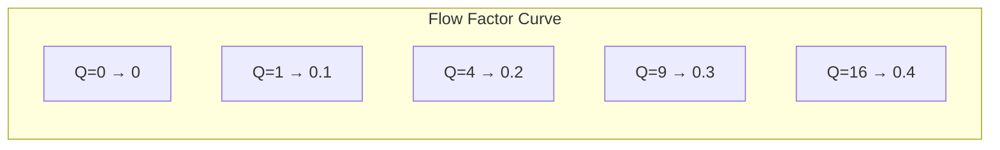
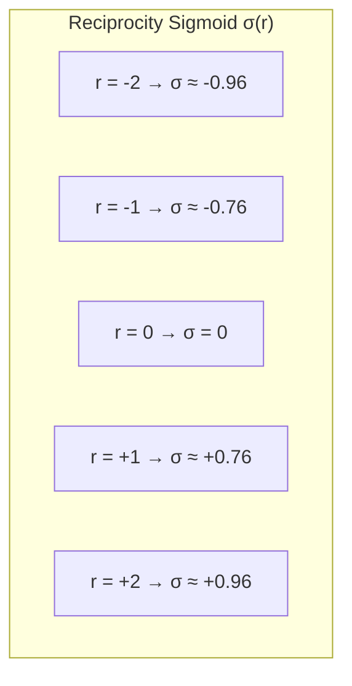
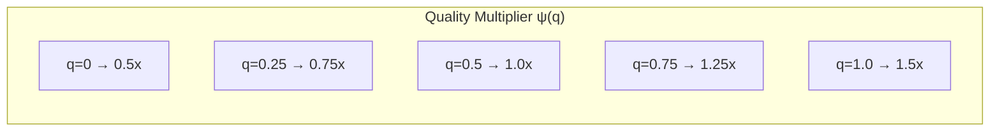
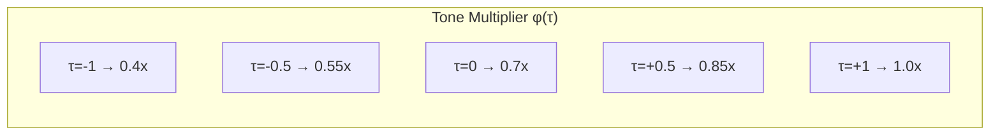
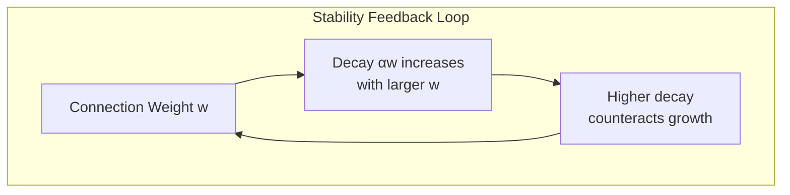
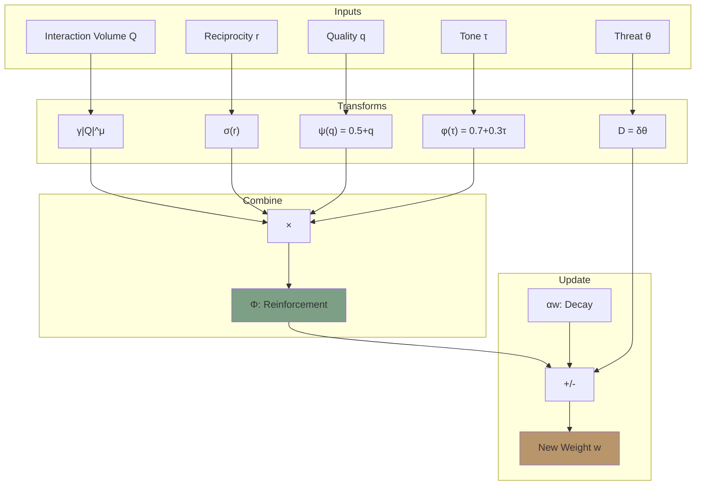

# The Physarum Equation

**Document Version:** 1.0
**Last Updated:** December 2025
**Status:** Normative

---

## 1. Introduction

### 1.1 Purpose

This document provides a rigorous mathematical specification of the Physarum equation—the core differential equation governing connection weight dynamics in Symbiont. This equation is the foundation upon which all trust emergence is built.

### 1.2 Biological Origin

The equation is adapted from Tero et al.'s (2010) mathematical model of *Physarum polycephalum* network optimization:

$$\frac{dD_{ij}}{dt} = f(|Q_{ij}|) - \alpha D_{ij}$$

Where D is tube diameter and Q is flow. Symbiont extends this with quality, reciprocity, and tone factors.

---

## 2. The Complete Equation

### 2.1 Differential Form

$$\frac{dw}{dt} = \Phi(Q, r, q, \tau) - \alpha \cdot w - D$$

Where:
- **w** ∈ [W_MIN, W_MAX] — Connection weight
- **Φ** — Reinforcement function
- **α** — Decay rate constant
- **D** — Defense dampening term

### 2.2 Reinforcement Function

$$\Phi(Q, r, q, \tau) = \gamma \cdot |Q|^\mu \cdot \sigma(r) \cdot \psi(q) \cdot \phi(\tau)$$

### 2.3 Discrete Update Form

For implementation, the continuous equation is discretized:

$$w_{t+\Delta t} = \text{clamp}\left(w_t + \Delta t \cdot \left(\Phi - \alpha \cdot w_t - D\right), W_{MIN}, W_{MAX}\right)$$

With Δt = 1 (per interaction):

$$w_{new} = \text{clamp}\left(w + \Phi - \alpha \cdot w - D, W_{MIN}, W_{MAX}\right)$$

---

## 3. Component Functions

### 3.1 Flow Factor: γ|Q|^μ

**Purpose:** Converts interaction volume to reinforcement magnitude.

**Parameters:**
- **γ** (gamma) = 0.1 — Reinforcement rate
- **μ** (mu) = 0.5 — Flow exponent (sublinear)

**Formula:**
$$\text{flow\_factor} = \gamma \cdot |Q|^\mu = 0.1 \cdot |Q|^{0.5} = 0.1 \cdot \sqrt{|Q|}$$

**Properties:**
- Sublinear (μ < 1): Diminishing returns for larger interactions
- Always non-negative
- Q = 0 → flow_factor = 0 (no interaction, no reinforcement)



**Rationale:** The square root ensures:
1. Small interactions still contribute meaningfully
2. Very large interactions don't dominate unfairly
3. Consistent with biological tube reinforcement

### 3.2 Reciprocity Sigmoid: σ(r)

**Purpose:** Maps unbounded reciprocity score to [-1, 1] range.

**Formula:**
$$\sigma(r) = \frac{2}{1 + e^{-\beta r}} - 1$$

**Parameter:**
- **β** (beta) = 2.0 — Reciprocity sensitivity

**Properties:**
- Domain: r ∈ (-∞, +∞)
- Range: σ(r) ∈ (-1, +1)
- σ(0) = 0 (balanced exchange → neutral)
- σ(r) > 0 when r > 0 (receiving more → positive)
- σ(r) < 0 when r < 0 (giving more → negative)



**Implementation:**
```
FUNCTION reciprocity_sigmoid(r):
    // Overflow protection
    x = -β × r
    IF x > 700:  RETURN -1.0
    IF x < -700: RETURN 1.0
    RETURN (2 / (1 + exp(x))) - 1
```

### 3.3 Quality Multiplier: ψ(q)

**Purpose:** Scales reinforcement based on interaction quality.

**Formula:**
$$\psi(q) = 0.5 + q$$

**Properties:**
- Domain: q ∈ [0, 1]
- Range: ψ(q) ∈ [0.5, 1.5]
- ψ(0) = 0.5 (poor quality halves reinforcement)
- ψ(0.5) = 1.0 (neutral quality, no modification)
- ψ(1) = 1.5 (excellent quality, 50% boost)



**Design Choice:** Linear mapping was chosen for:
1. Simplicity and predictability
2. Quality always has positive effect (ψ > 0)
3. Both reward and penalty are proportional

### 3.4 Tone Multiplier: φ(τ)

**Purpose:** Adjusts reinforcement based on interaction tone.

**Formula:**
$$\phi(\tau) = 0.7 + 0.3 \cdot \tau$$

**Properties:**
- Domain: τ ∈ [-1, 1]
- Range: φ(τ) ∈ [0.4, 1.0]
- φ(-1) = 0.4 (hostile tone, 60% reduction)
- φ(0) = 0.7 (neutral tone, 30% reduction)
- φ(1) = 1.0 (collaborative tone, full reinforcement)



**Design Choice:**
1. Tone is secondary to quality (narrower range)
2. Neutral tone still incurs slight penalty (encourages positive interaction)
3. Cannot boost above 1.0 (tone alone doesn't add value)

### 3.5 Decay Term: αw

**Purpose:** Natural weakening of connections over time.

**Formula:**
$$\text{decay} = \alpha \cdot w = 0.01 \cdot w$$

**Parameter:**
- **α** (alpha) = 0.01 — Decay rate

**Properties:**
- Proportional to current weight (stronger connections decay more in absolute terms)
- Continuous drain on all connections
- Counterbalanced by reinforcement from active connections

**Biological Analog:** Like slime mold tubes that shrink when not carrying flow.

### 3.6 Defense Dampening: D

**Purpose:** Reduces connection strength when a threat is detected.

**Formula:**
$$D = \delta \cdot \theta_{threat}$$

Where:
- **δ** (delta) = 0.2 — Defense dampening factor
- **θ_threat** — Threat belief level for this partner ∈ [0, 1]

**Properties:**
- D = 0 when no threat detected (θ = 0)
- D = 0.2 when certain threat (θ = 1)
- Subtractive: directly reduces weight gain/increases loss

---

## 4. Combined Behavior

### 4.1 Case Analysis

| Scenario | Q | r | q | τ | D | Φ | Net Δw |
|----------|---|---|---|---|---|---|--------|
| Good interaction | 4 | 0.5 | 0.8 | 0.5 | 0 | 0.1×2×0.46×1.3×0.85 ≈ 0.10 | +0.10 - 0.01w |
| Balanced, neutral | 4 | 0 | 0.5 | 0 | 0 | 0.1×2×0×1.0×0.7 = 0 | -0.01w |
| Giving too much | 4 | -1 | 0.6 | 0.3 | 0 | 0.1×2×(-0.76)×1.1×0.79 ≈ -0.13 | -0.13 - 0.01w |
| Threat present | 4 | 0.5 | 0.8 | 0.5 | 0.16 | 0.10 | +0.10 - 0.01w - 0.16 |

### 4.2 Equilibrium Analysis

At equilibrium, dw/dt = 0:

$$\Phi = \alpha \cdot w + D$$

$$w_{eq} = \frac{\Phi - D}{\alpha}$$

For a healthy connection (Φ = 0.05, D = 0):
$$w_{eq} = \frac{0.05}{0.01} = 5.0 \rightarrow \text{clamped to } W_{MAX} = 1.0$$

For a problematic connection (Φ = -0.05, D = 0):
$$w_{eq} = \frac{-0.05}{0.01} = -5.0 \rightarrow \text{clamped to } W_{MIN} = 0.01$$

### 4.3 Stability Properties

The system is **stable** because:
1. Decay (αw) provides negative feedback
2. Weight is bounded: w ∈ [W_MIN, W_MAX]
3. All multipliers are bounded



---

## 5. Parameter Sensitivity

### 5.1 Parameter Summary

| Parameter | Symbol | Default | Range | Effect |
|-----------|--------|---------|-------|--------|
| Reinforcement rate | γ | 0.1 | [0.01, 0.5] | Speed of weight growth |
| Flow exponent | μ | 0.5 | [0.3, 0.8] | Sensitivity to interaction size |
| Decay rate | α | 0.01 | [0.001, 0.1] | Speed of weight decay |
| Reciprocity sensitivity | β | 2.0 | [1.0, 4.0] | Steepness of σ(r) |
| Defense dampening | δ | 0.2 | [0.1, 0.5] | Impact of threats |

### 5.2 Sensitivity Analysis

**γ (Gamma) — Reinforcement Rate:**
- Higher γ: Faster trust formation, but also faster gaming
- Lower γ: Slower trust formation, more stable

**μ (Mu) — Flow Exponent:**
- Higher μ: Larger interactions have more impact
- Lower μ: More egalitarian treatment of interactions

**α (Alpha) — Decay Rate:**
- Higher α: Connections decay faster, need constant interaction
- Lower α: Connections persist longer, historical weight matters more

**β (Beta) — Reciprocity Sensitivity:**
- Higher β: Sharper transition at balanced exchange
- Lower β: More gradual sensitivity to imbalance

---

## 6. Numerical Stability

### 6.1 Safe Implementations

```
// Safe sigmoid (prevents overflow)
FUNCTION safe_sigmoid(r, β):
    x = -β × r
    IF x > 700:    RETURN -1.0    // e^700 overflows
    IF x < -700:   RETURN 1.0
    RETURN (2 / (1 + exp(x))) - 1

// Safe weight update
FUNCTION update_weight(w, Φ, D, α):
    Δw = Φ - α × w - D
    w_new = w + Δw
    RETURN clamp(w_new, W_MIN, W_MAX)

// Clamp function
FUNCTION clamp(value, min, max):
    IF value < min: RETURN min
    IF value > max: RETURN max
    RETURN value
```

### 6.2 Edge Cases

| Case | Handling |
|------|----------|
| w = W_MIN (0.01) | Can only increase or stay |
| w = W_MAX (1.0) | Can only decrease or stay |
| Q = 0 | flow_factor = 0, only decay occurs |
| r = ±∞ | σ(r) = ±1 (bounded) |

---

## 7. Implementation Reference

### 7.1 Complete Update Function

```
FUNCTION physarum_update(conn, interaction, threat_level):

    // Extract parameters
    Q = interaction.task_volume
    q = interaction.quality
    τ = interaction.tone
    r = conn.r  // Current reciprocity

    // Compute components
    flow_factor = γ × pow(abs(Q), μ)        // 0.1 × |Q|^0.5
    σ_r = reciprocity_sigmoid(r)            // [-1, 1]
    ψ_q = 0.5 + q                           // [0.5, 1.5]
    φ_τ = 0.7 + 0.3 × τ                     // [0.4, 1.0]

    // Reinforcement
    Φ = flow_factor × σ_r × ψ_q × φ_τ

    // Defense dampening
    D = δ × threat_level                    // 0.2 × θ

    // Weight update
    Δw = Φ - α × conn.w - D
    conn.w = clamp(conn.w + Δw, W_MIN, W_MAX)

    RETURN conn.w
```

### 7.2 Rust Implementation Pattern

```rust
pub fn update_connection_weight(
    current_weight: f64,
    interaction_volume: f64,
    reciprocity: f64,
    quality: f64,
    tone: f64,
    threat_level: f64,
) -> f64 {
    // Flow factor
    let flow = GAMMA * interaction_volume.abs().powf(MU);

    // Reciprocity sigmoid
    let sigma_r = reciprocity_sigmoid(reciprocity);

    // Quality multiplier
    let psi_q = 0.5 + quality;

    // Tone multiplier
    let phi_tau = 0.7 + 0.3 * tone;

    // Reinforcement
    let phi = flow * sigma_r * psi_q * phi_tau;

    // Defense dampening
    let d = DELTA * threat_level;

    // Update
    let delta_w = phi - ALPHA * current_weight - d;
    let new_weight = current_weight + delta_w;

    new_weight.clamp(W_MIN, W_MAX)
}

fn reciprocity_sigmoid(r: f64) -> f64 {
    let x = -BETA * r;
    if x > 700.0 { return -1.0; }
    if x < -700.0 { return 1.0; }
    (2.0 / (1.0 + x.exp())) - 1.0
}
```

---

## 8. Visualization

### 8.1 Component Interaction



---

## 9. Summary

The Physarum equation captures the bio-inspired dynamics of trust networks:

$$\frac{dw}{dt} = \gamma |Q|^\mu \sigma(r) \psi(q) \phi(\tau) - \alpha w - D$$

| Component | Formula | Effect |
|-----------|---------|--------|
| Flow factor | γ\|Q\|^μ | Scales with interaction size (sublinear) |
| Reciprocity | σ(r) | Rewards balanced exchange |
| Quality | ψ(q) = 0.5 + q | Rewards good outcomes |
| Tone | φ(τ) = 0.7 + 0.3τ | Rewards positive interaction |
| Decay | αw | Ensures unused connections weaken |
| Defense | δθ | Dampens connections to threats |

This equation is the mathematical foundation of Symbiont's emergent trust—connections naturally strengthen or weaken based on the quality and fairness of interactions.

---

*Previous: [Data Flow](../architecture/data-flow.md) | Next: [Trust Computation](./trust-computation.md)*
