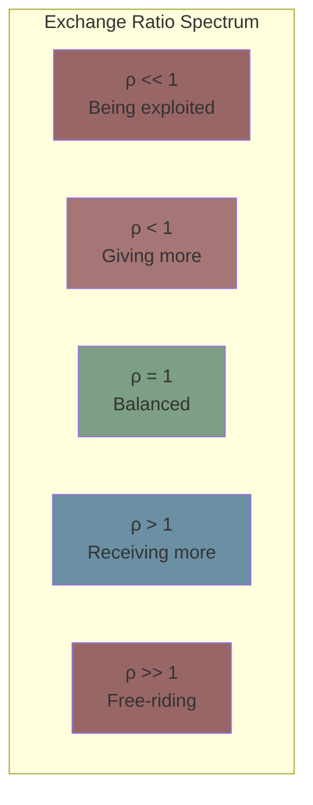
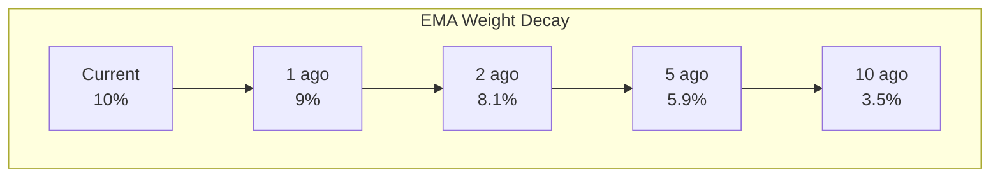
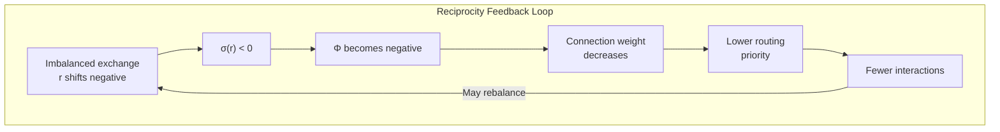
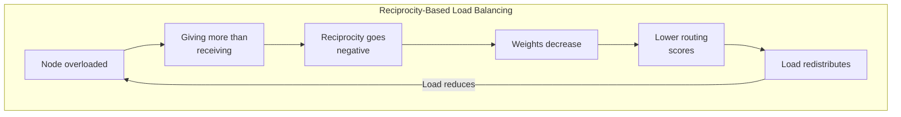

# Reciprocity System

**Document Version:** 1.0
**Last Updated:** December 2025
**Status:** Normative

---

## 1. Introduction

### 1.1 Purpose

This document specifies the reciprocity tracking system in Symbiont. Reciprocity ensures that relationships remain balanced and sustainable, preventing exploitation and free-riding.

### 1.2 Biological Inspiration

Reciprocity in Symbiont mirrors mycorrhizal network behavior:
- Trees exchange different resources through fungal networks
- Exchanges tend toward long-term balance
- Chronic imbalance leads to connection weakening

---

## 2. Reciprocity Fundamentals

### 2.1 Definition

**Reciprocity** measures the balance of value exchange between two nodes over time. A positive reciprocity means receiving more than giving; negative means giving more than receiving.

### 2.2 Core Equation

$$r_{new} = \lambda \cdot r_{old} + (1 - \lambda) \cdot \left(\log\left(\frac{in}{out + \epsilon}\right) + \theta \cdot (q - 0.5)\right)$$

### 2.3 Parameters

| Parameter | Symbol | Value | Description |
|-----------|--------|-------|-------------|
| Memory factor | λ | 0.9 | EMA smoothing |
| Quality weight | θ | 0.5 | Quality's effect on reciprocity |
| Safety constant | ε | 0.001 | Prevents division by zero |

---

## 3. Exchange Ratio

### 3.1 Computing the Ratio

The exchange ratio ρ measures immediate balance:

$$\rho = \frac{in}{out + \epsilon}$$

Where:
- **in** = Value received in this interaction
- **out** = Value given in this interaction

### 3.2 Ratio Interpretation

| ρ Value | log(ρ) | Meaning |
|---------|--------|---------|
| 0.1 | -2.30 | Gave 10x what received |
| 0.5 | -0.69 | Gave 2x what received |
| 1.0 | 0.00 | Balanced exchange |
| 2.0 | +0.69 | Received 2x what gave |
| 10 | +2.30 | Received 10x what gave |



### 3.3 Logarithmic Transform

Using log(ρ) rather than ρ directly provides:

1. **Symmetry:** log(0.5) = -log(2), so giving 2x is equal-opposite to receiving 2x
2. **Unbounded range:** Extreme imbalances are captured
3. **Diminishing sensitivity:** Very large ratios don't dominate

---

## 4. Quality Adjustment

### 4.1 Why Include Quality?

Pure exchange ratio doesn't capture value quality. A node might:
- Give little but of excellent quality
- Receive much but of poor quality

The quality adjustment accounts for this:

$$adjustment = \theta \cdot (q - 0.5)$$

### 4.2 Effect Analysis

| Quality | q - 0.5 | θ(q - 0.5) | Effect |
|---------|---------|------------|--------|
| Poor (q=0.1) | -0.4 | -0.2 | Reduces reciprocity |
| Neutral (q=0.5) | 0 | 0 | No effect |
| Good (q=0.9) | +0.4 | +0.2 | Increases reciprocity |

### 4.3 Combined Update

The full update combines exchange ratio and quality:

```
FUNCTION update_reciprocity(conn, interaction):

    // Exchange ratio
    ρ = interaction.exchange_in / (interaction.exchange_out + ε)
    log_ρ = log(ρ + ε)

    // Quality adjustment
    q_adj = θ × (interaction.quality - 0.5)

    // Combined signal
    signal = log_ρ + q_adj

    // EMA update
    conn.r = λ × conn.r + (1 - λ) × signal

    RETURN conn.r
```

---

## 5. Exponential Moving Average

### 5.1 EMA Properties

The EMA with λ = 0.9 provides:

$$r_{new} = 0.9 \cdot r_{old} + 0.1 \cdot signal$$

### 5.2 Memory Characteristics

| Interactions Ago | Weight |
|------------------|--------|
| Current | 10% |
| 1 ago | 9% |
| 2 ago | 8.1% |
| 5 ago | 5.9% |
| 10 ago | 3.5% |
| 20 ago | 1.2% |
| 50 ago | 0.05% |



### 5.3 Memory Duration

Effectively, the "memory" covers about 50 interactions:
- 50% of weight from last ~7 interactions
- 90% of weight from last ~23 interactions
- 99% of weight from last ~45 interactions

---

## 6. Reciprocity in Dynamics

### 6.1 Effect on Connection Weight

Reciprocity directly affects connection reinforcement via the sigmoid:

$$\sigma(r) = \frac{2}{1 + e^{-\beta r}} - 1$$

| r | σ(r) | Effect on Φ |
|---|------|-------------|
| -2 | -0.96 | Strong negative reinforcement |
| -1 | -0.76 | Moderate negative |
| 0 | 0.00 | Neutral |
| +1 | +0.76 | Moderate positive |
| +2 | +0.96 | Strong positive reinforcement |

### 6.2 Feedback Loop



---

## 7. Load Balancing Effect

### 7.1 Automatic Load Balancing

Reciprocity provides natural load balancing:

**When a node is overloaded:**
1. It gives more than it receives (many requests, little capacity to request back)
2. Exchange ratio ρ < 1 for incoming connections
3. Those connections see r decrease
4. Connection weights decrease
5. Routing scores to this node decrease
6. Traffic naturally routes elsewhere

### 7.2 No Explicit Load Balancer Needed



---

## 8. Free-Rider Detection

### 8.1 Pattern Recognition

Free-riders take value without contributing. This manifests as:
- Consistently high ρ (receiving >> giving)
- r accumulates positive from their partners' perspective
- But negative from the free-rider's connections' perspective

### 8.2 Detection Algorithm

```
FUNCTION detect_free_rider(node):

    // Check reciprocity from others' perspective
    FOR EACH conn IN node.connections:
        partner = get_node(conn.partner_id)
        partner_conn = partner.connections[node.id]

        // If partners consistently have negative reciprocity with this node
        IF partner_conn.r < -0.5:
            free_rider_signals += 1

    // Free rider if most partners show negative reciprocity
    IF free_rider_signals > len(node.connections) × 0.7:
        RETURN true

    RETURN false
```

---

## 9. Aggregated Reciprocity

### 9.1 For Trust Computation

Reciprocity is aggregated across all connections:

$$R_{agg}(n) = \frac{1}{|C|} \sum_{c \in C} r_c$$

### 9.2 Interpretation

| R_agg | Interpretation |
|-------|----------------|
| < -1 | Consistently giving more than receiving |
| -1 to -0.3 | Moderately giving |
| -0.3 to +0.3 | Balanced overall |
| +0.3 to +1 | Moderately receiving |
| > +1 | Consistently receiving more (possible free-rider) |

---

## 10. Value Measurement

### 10.1 What Counts as Value?

Value exchange can be measured as:

| Metric | Description |
|--------|-------------|
| Task complexity | Size/difficulty of requested work |
| Compute time | Resources consumed |
| Data volume | Amount of data processed |
| Custom tokens | Application-defined units |

### 10.2 Example: Task Volume

```
FUNCTION compute_exchange_value(interaction):

    IF I am the task executor:
        // I gave value (did work)
        exchange_out = task_complexity(interaction.task)
        exchange_in = 0  // or payment received
    ELSE:
        // I received value (got work done)
        exchange_in = task_complexity(interaction.task)
        exchange_out = 0  // or payment made

    RETURN (exchange_in, exchange_out)
```

---

## 11. Implementation Reference

### 11.1 Complete Update Function

```
FUNCTION handle_interaction_reciprocity(self, partner, interaction):

    // Get or create connection
    IF partner.id NOT IN self.connections:
        self.connections[partner.id] = new_connection(partner.id)
    conn = self.connections[partner.id]

    // Compute exchange ratio
    in_val = interaction.exchange_in
    out_val = interaction.exchange_out
    ρ = in_val / (out_val + ε)

    // Logarithmic transform
    log_ρ = log(ρ + ε)

    // Quality adjustment
    q_adj = θ × (interaction.quality - 0.5)

    // Combined signal
    signal = log_ρ + q_adj

    // EMA update
    conn.r = λ × conn.r + (1 - λ) × signal

    RETURN conn.r
```

### 11.2 Rust Implementation Pattern

```rust
pub fn update_reciprocity(
    connection: &mut Connection,
    exchange_in: f64,
    exchange_out: f64,
    quality: f64,
) -> f64 {
    const LAMBDA: f64 = 0.9;
    const THETA: f64 = 0.5;
    const EPSILON: f64 = 0.001;

    // Exchange ratio (logarithmic)
    let rho = exchange_in / (exchange_out + EPSILON);
    let log_rho = (rho + EPSILON).ln();

    // Quality adjustment
    let q_adj = THETA * (quality - 0.5);

    // Combined signal
    let signal = log_rho + q_adj;

    // EMA update
    connection.reciprocity = LAMBDA * connection.reciprocity
        + (1.0 - LAMBDA) * signal;

    connection.reciprocity
}
```

---

## 12. Summary

The reciprocity system ensures:

| Property | Mechanism |
|----------|-----------|
| **Balanced exchange** | Imbalanced ratios affect r |
| **Quality matters** | Quality adjustment rewards value |
| **Smooth tracking** | EMA prevents oscillation |
| **Load balancing** | Overloaded nodes naturally shed traffic |
| **Free-rider detection** | Chronic imbalance is detectable |

$$r_{new} = 0.9 \cdot r_{old} + 0.1 \cdot \left(\log\frac{in}{out} + 0.5 \cdot (q - 0.5)\right)$$

Reciprocity is not punishment for imbalance—it's a natural feedback mechanism that guides the network toward sustainable, mutually beneficial relationships.

---

*Previous: [Trust Computation](./trust-computation.md) | Next: [Defense Signaling](./defense-signaling.md)*
