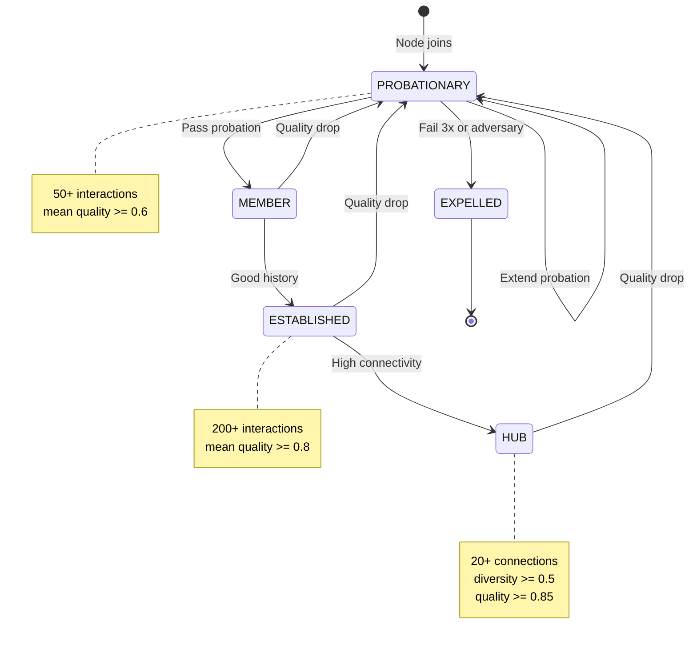
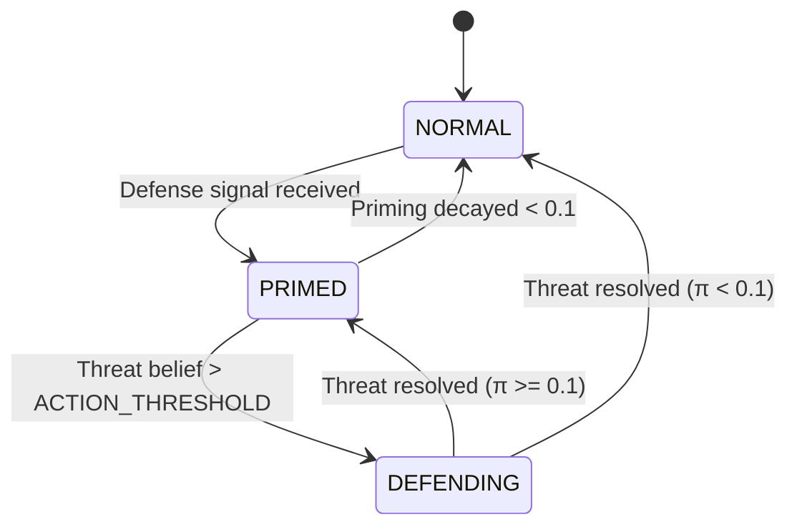
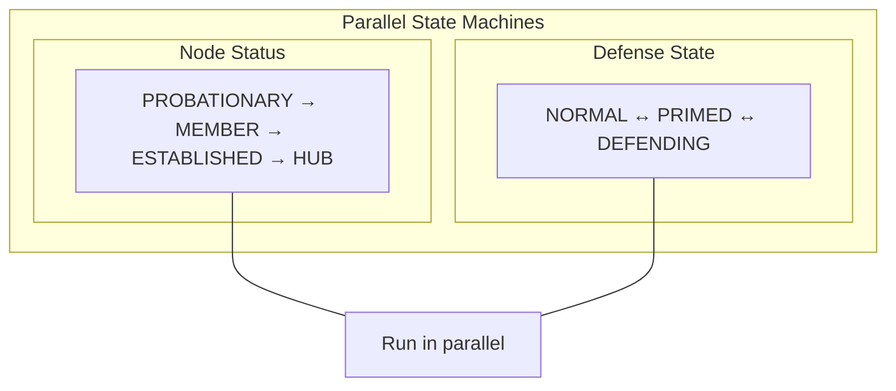
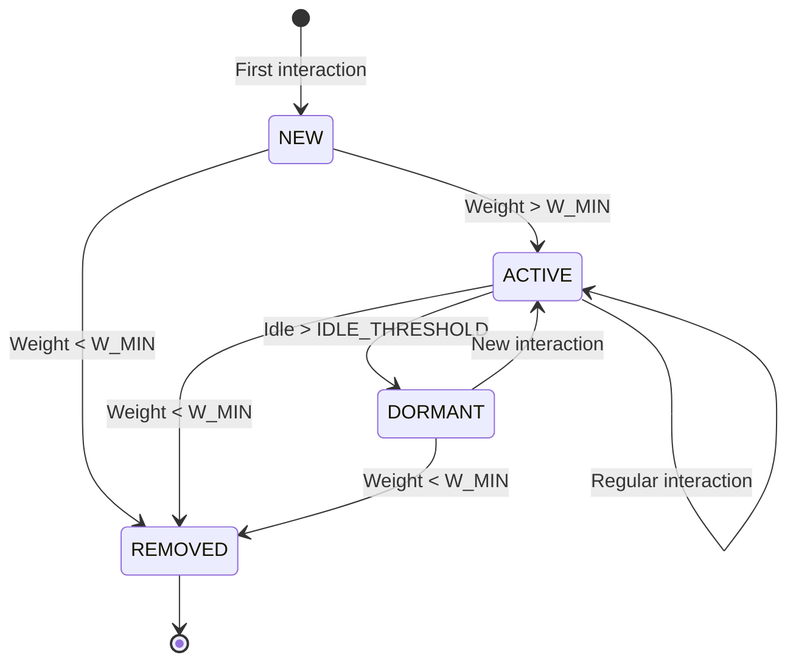
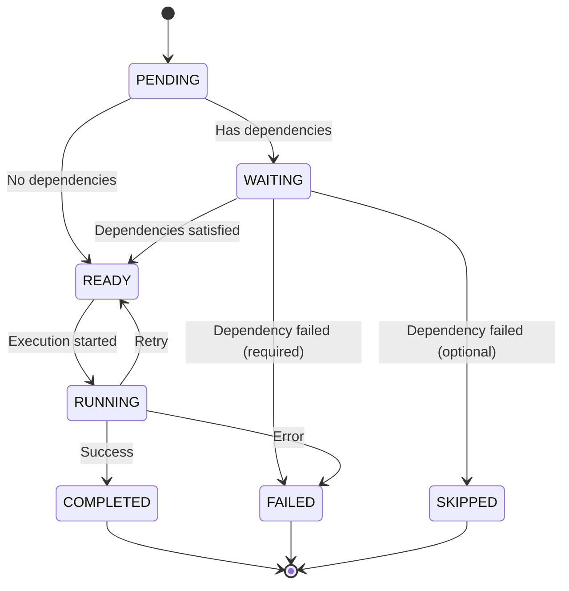
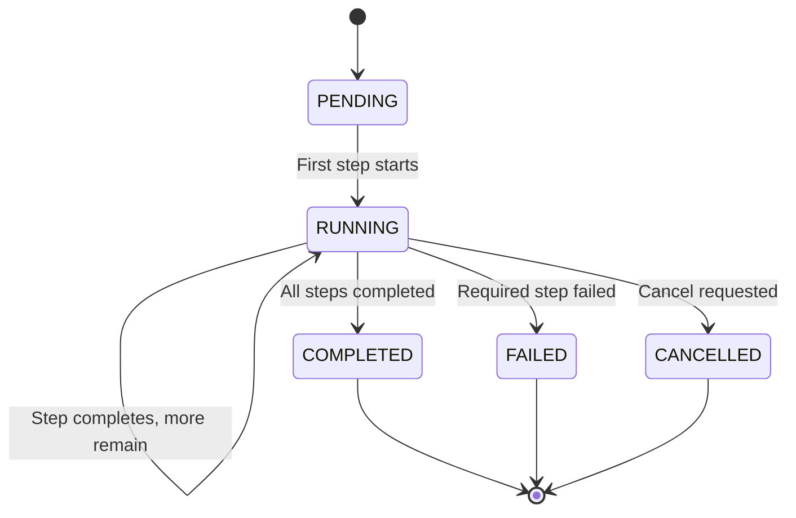
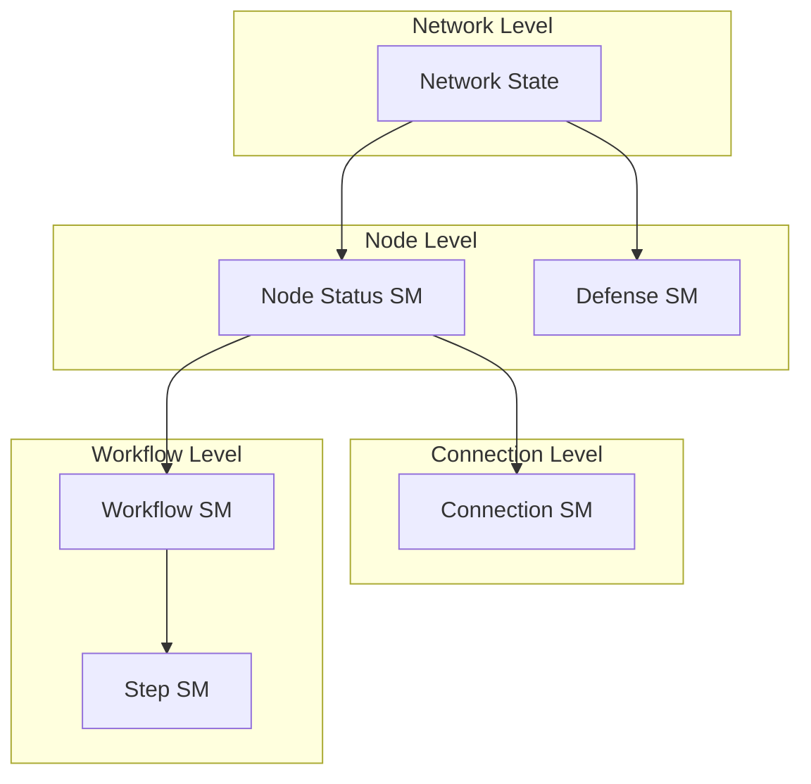

# State Machines

**Document Version:** 1.0
**Last Updated:** December 2025
**Status:** Normative

---

## 1. Introduction

### 1.1 Purpose

This document specifies the state machines that govern node behavior in Symbiont. State machines provide predictable, verifiable transitions between operational states.

### 1.2 Scope

This document covers:

- Node status state machine
- Defense state machine
- Connection state machine
- Workflow step state machine

---

## 2. Node Status State Machine

### 2.1 Overview

The node status state machine tracks a node's lifecycle in the network, from initial probation through established membership.

### 2.2 States

| State | Description | Trust Range |
|-------|-------------|-------------|
| PROBATIONARY | New node, building history | [0, 0.6] |
| MEMBER | Passed probation | [0.4, 0.8] |
| ESTABLISHED | Long history of reliability | [0.6, 1.0] |
| HUB | Highly connected, trusted | [0.8, 1.0] |
| EXPELLED | Removed from network | N/A |

### 2.3 State Diagram



### 2.4 Transition Table

| From | To | Condition | Action |
|------|-----|-----------|--------|
| PROBATIONARY | MEMBER | count >= 50 AND quality >= 0.6 | trust *= 1.5 (capped at 0.8) |
| PROBATIONARY | PROBATIONARY | count >= 50 AND quality < 0.6 | failures++; required_count += 25 |
| PROBATIONARY | EXPELLED | failures >= 3 OR detected_adversary | notify_vouchers(); blacklist() |
| MEMBER | ESTABLISHED | count >= 200 AND quality >= 0.8 | (none) |
| ESTABLISHED | HUB | connections >= 20 AND diversity >= 0.5 AND quality >= 0.85 | (none) |
| {MEMBER,ESTABLISHED,HUB} | PROBATIONARY | quality_drop > 0.4 OR trust < 0.3 | trust *= 0.5; reset_count() |
| ANY | EXPELLED | threat_belief >= 0.9 (multiple sources) | notify_network(); blacklist() |

### 2.5 Implementation

```
FUNCTION check_status_transition(node):

    SWITCH node.status:

        CASE PROBATIONARY:
            IF node.interaction_count >= required_count:
                mean_q = compute_mean_quality(node)
                IF mean_q >= PROBATION_THRESHOLD:  // 0.6
                    node.status = MEMBER
                    node.trust = min(node.trust * 1.5, 0.8)
                ELSE:
                    node.probation_failures += 1
                    node.required_count += 25
                    IF node.probation_failures >= 3:
                        expel(node)

        CASE MEMBER:
            mean_q = compute_mean_quality(node)
            IF node.interaction_count >= 200 AND mean_q >= 0.8:
                node.status = ESTABLISHED
            ELSE IF quality_dropped(node) OR node.trust < 0.3:
                demote_to_probation(node)

        CASE ESTABLISHED:
            IF len(node.connections) >= 20 AND
               node.diversity >= 0.5 AND
               compute_mean_quality(node) >= 0.85:
                node.status = HUB
            ELSE IF quality_dropped(node) OR node.trust < 0.3:
                demote_to_probation(node)

        CASE HUB:
            IF quality_dropped(node) OR node.trust < 0.3:
                demote_to_probation(node)


FUNCTION demote_to_probation(node):
    node.status = PROBATIONARY
    node.trust = node.trust * 0.5
    node.interaction_count = 0
    node.probation_failures = 0
    node.required_count = PROBATION_COUNT
```

---

## 3. Defense State Machine

### 3.1 Overview

The defense state machine tracks a node's defensive posture, from normal operation through active defense.

### 3.2 States

| State | Description | Priming Level |
|-------|-------------|---------------|
| NORMAL | No active threats | π < 0.1 |
| PRIMED | Received signals, alert | 0.1 ≤ π < 0.7 |
| DEFENDING | Actively responding | π ≥ 0.7 or action taken |

### 3.3 State Diagram



### 3.4 Transition Table

| From | To | Condition | Action |
|------|-----|-----------|--------|
| NORMAL | PRIMED | received_defense_signal | π += conf × SENSITIVITY |
| PRIMED | DEFENDING | threat_belief > 0.7 | take_defensive_action() |
| PRIMED | NORMAL | π < 0.1 (decayed) | (none) |
| DEFENDING | PRIMED | threat_resolved AND π >= 0.1 | π = 0.3 |
| DEFENDING | NORMAL | threat_resolved AND π < 0.1 | (none) |

### 3.5 Parallel Operation

The defense state machine runs **in parallel** with the node status machine. A node can be:

- MEMBER + NORMAL
- MEMBER + PRIMED
- HUB + DEFENDING
- etc.



### 3.6 Implementation

```
FUNCTION update_defense_state(node, event):

    SWITCH event.type:

        CASE DEFENSE_SIGNAL:
            // Always update priming
            node.priming += event.signal.confidence * PRIMING_SENSITIVITY

            // Transition to PRIMED if was NORMAL
            IF node.defense_state == NORMAL:
                node.defense_state = PRIMED

            // Check for DEFENDING transition
            threat_belief = node.threat_beliefs[event.signal.threat].level
            IF threat_belief > ACTION_THRESHOLD:
                node.defense_state = DEFENDING
                take_defensive_action(node, event.signal.threat)

        CASE THREAT_RESOLVED:
            IF node.priming < 0.1:
                node.defense_state = NORMAL
            ELSE:
                node.defense_state = PRIMED
                node.priming = max(0.3, node.priming)

        CASE TICK:
            // Decay priming
            node.priming = node.priming * PRIMING_DECAY

            // Check for NORMAL transition
            IF node.defense_state == PRIMED AND node.priming < 0.1:
                node.defense_state = NORMAL
```

---

## 4. Connection State Machine

### 4.1 Overview

The connection state machine tracks the lifecycle of individual connections between nodes.

### 4.2 States

| State | Description | Weight Range |
|-------|-------------|--------------|
| NEW | Just created | w = W_INIT (0.3) |
| ACTIVE | Regular interaction | W_MIN < w ≤ W_MAX |
| DORMANT | Long inactivity | W_MIN < w, long idle |
| REMOVED | Connection deleted | w = 0 |

### 4.3 State Diagram



### 4.4 Transition Table

| From | To | Condition | Action |
|------|-----|-----------|--------|
| NEW | ACTIVE | w > W_MIN | (none) |
| NEW | REMOVED | w < W_MIN | remove_connection() |
| ACTIVE | DORMANT | idle_time > IDLE_THRESHOLD | (none) |
| ACTIVE | REMOVED | w < W_MIN | remove_connection() |
| DORMANT | ACTIVE | new_interaction | update_last_active() |
| DORMANT | REMOVED | w < W_MIN | remove_connection() |

### 4.5 Implementation

```
FUNCTION update_connection_state(conn):

    // Check for removal
    IF conn.w < W_MIN:
        conn.state = REMOVED
        RETURN

    // Check activity
    idle_time = now() - conn.last_active

    IF conn.state == NEW:
        IF conn.w > W_MIN:
            conn.state = ACTIVE

    ELSE IF conn.state == ACTIVE:
        IF idle_time > IDLE_THRESHOLD:
            conn.state = DORMANT

    ELSE IF conn.state == DORMANT:
        // Will transition to ACTIVE on next interaction
        // (handled in interaction handler)
        PASS
```

---

## 5. Workflow Step State Machine

### 5.1 Overview

The workflow step state machine tracks the execution status of individual steps within a workflow.

### 5.2 States

| State | Description |
|-------|-------------|
| PENDING | Not yet started |
| WAITING | Dependencies not met |
| READY | Ready to execute |
| RUNNING | Currently executing |
| COMPLETED | Successfully finished |
| FAILED | Execution failed |
| SKIPPED | Bypassed (optional step) |

### 5.3 State Diagram



### 5.4 Transition Table

| From | To | Condition | Action |
|------|-----|-----------|--------|
| PENDING | WAITING | has_dependencies | (none) |
| PENDING | READY | no_dependencies | (none) |
| WAITING | READY | all_deps_completed | (none) |
| WAITING | FAILED | required_dep_failed | mark_failure() |
| WAITING | SKIPPED | optional_dep_failed | (none) |
| READY | RUNNING | execution_started | assign_node() |
| RUNNING | COMPLETED | success | record_result() |
| RUNNING | FAILED | error | record_error() |
| RUNNING | READY | retry_requested | increment_retry() |

### 5.5 Implementation

```
FUNCTION update_step_state(step, event):

    SWITCH step.state:

        CASE PENDING:
            IF has_unmet_dependencies(step):
                step.state = WAITING
            ELSE:
                step.state = READY

        CASE WAITING:
            deps_status = check_dependencies(step)
            IF deps_status == ALL_COMPLETED:
                step.state = READY
            ELSE IF deps_status == REQUIRED_FAILED:
                step.state = FAILED
                step.error = "Dependency failed"
            ELSE IF deps_status == OPTIONAL_FAILED:
                step.state = SKIPPED

        CASE READY:
            IF event.type == START_EXECUTION:
                step.state = RUNNING
                step.assigned_to = event.node_id
                step.started_at = now()

        CASE RUNNING:
            IF event.type == SUCCESS:
                step.state = COMPLETED
                step.result = event.result
                step.completed_at = now()
            ELSE IF event.type == ERROR:
                IF step.retry_count < MAX_RETRIES:
                    step.state = READY
                    step.retry_count += 1
                ELSE:
                    step.state = FAILED
                    step.error = event.error
            ELSE IF event.type == TIMEOUT:
                step.state = FAILED
                step.error = "Timeout"
```

---

## 6. Workflow State Machine

### 6.1 Overview

The workflow state machine tracks the overall status of a multi-step workflow.

### 6.2 States

| State | Description |
|-------|-------------|
| PENDING | Not yet started |
| RUNNING | Steps being executed |
| COMPLETED | All steps finished successfully |
| FAILED | One or more required steps failed |
| CANCELLED | Manually cancelled |

### 6.3 State Diagram



### 6.4 Implementation

```
FUNCTION update_workflow_state(workflow):

    // Count step states
    step_states = count_step_states(workflow.steps)

    IF workflow.state == PENDING:
        IF any_step_running(workflow):
            workflow.state = RUNNING

    ELSE IF workflow.state == RUNNING:
        IF workflow.cancel_requested:
            workflow.state = CANCELLED
            cancel_running_steps(workflow)

        ELSE IF any_required_step_failed(workflow):
            workflow.state = FAILED
            cancel_running_steps(workflow)

        ELSE IF all_steps_terminal(workflow):
            workflow.state = COMPLETED
            workflow.result = aggregate_results(workflow)
```

---

## 7. State Machine Composition

### 7.1 Hierarchical States

State machines can be composed hierarchically:



### 7.2 Event Propagation

Events can trigger transitions across multiple state machines:

```
FUNCTION handle_event(node, event):

    // May affect multiple state machines
    SWITCH event.type:

        CASE INTERACTION_COMPLETE:
            update_connection_state(node.connections[event.partner])
            check_status_transition(node)  // May promote status

        CASE DEFENSE_SIGNAL:
            update_defense_state(node, event)  // May enter DEFENDING
            update_connection_state(...)       // May weaken connection

        CASE WORKFLOW_STEP_COMPLETE:
            update_step_state(event.step, event)
            update_workflow_state(event.workflow)
            handle_interaction(...)  // Triggers connection update
```

---

## 8. State Persistence

### 8.1 What to Persist

| State | Persistence | Recovery |
|-------|-------------|----------|
| Node status | Durable | Load from storage |
| Defense state | Session | Reset to NORMAL |
| Connection state | Durable | Load from storage |
| Workflow state | Session | Lost on restart |
| Step state | Session | Lost on restart |

### 8.2 State Serialization

```
STRUCTURE PersistedNodeState {
    id              : NodeId
    status          : NodeStatus
    trust           : Score
    trust_cap       : Score
    interaction_count : uint64
    probation_failures : uint8
    connections     : Map<NodeId, PersistedConnection>
}

STRUCTURE PersistedConnection {
    partner_id  : NodeId
    state       : ConnectionState
    w           : Weight
    r           : float64
    q           : Score
    τ           : SignedScore
    last_active : Timestamp
    count       : uint32
}
```

---

## 9. Summary

Symbiont uses state machines to ensure predictable behavior:

| State Machine | Purpose | Key States |
|---------------|---------|------------|
| Node Status | Lifecycle management | PROBATIONARY → MEMBER → ESTABLISHED → HUB |
| Defense | Threat response | NORMAL ↔ PRIMED ↔ DEFENDING |
| Connection | Relationship lifecycle | NEW → ACTIVE ↔ DORMANT → REMOVED |
| Workflow | Multi-step coordination | PENDING → RUNNING → COMPLETED |
| Step | Individual task tracking | PENDING → READY → RUNNING → COMPLETED |

State machines provide:

- **Predictability:** Clear rules for transitions
- **Verifiability:** States can be audited
- **Composability:** Machines work together
- **Recoverability:** Persistent states survive restarts

---

*Previous: [Convergence Protocol](./convergence.md) | Next: [Getting Started](../tutorials/getting-started.md)*
