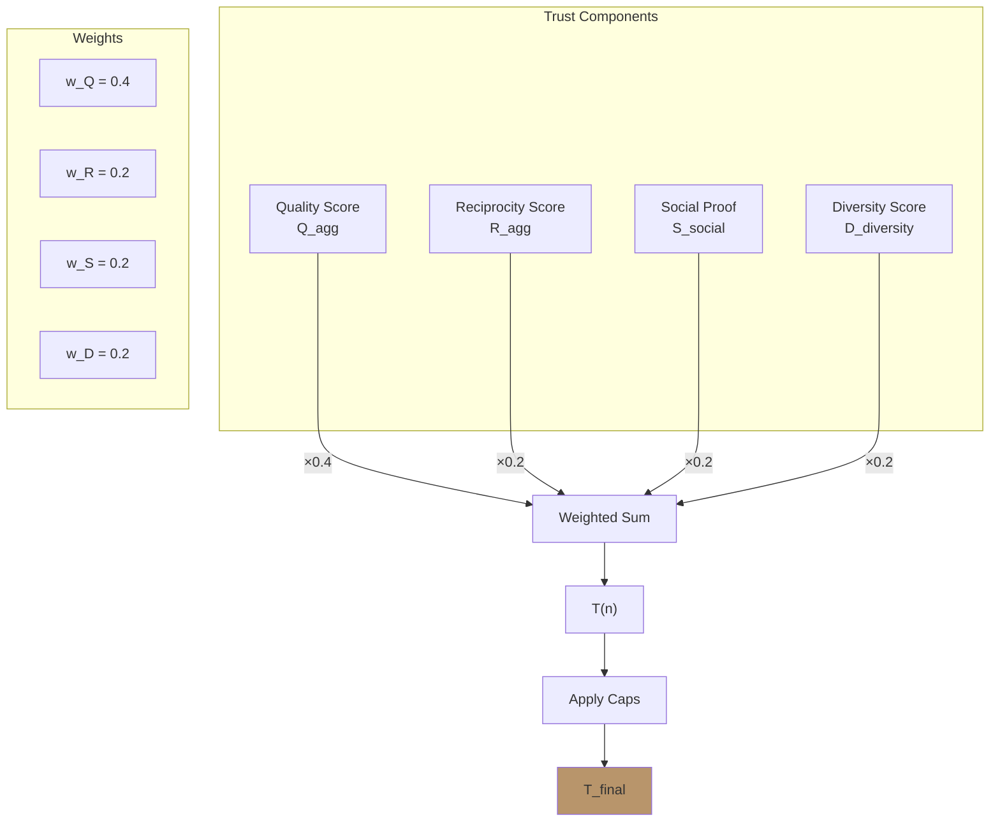
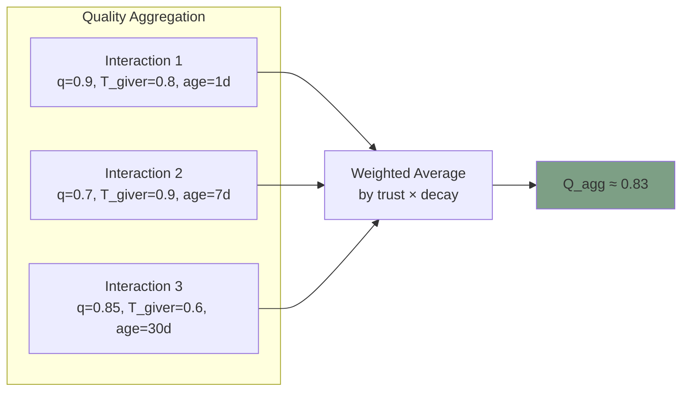
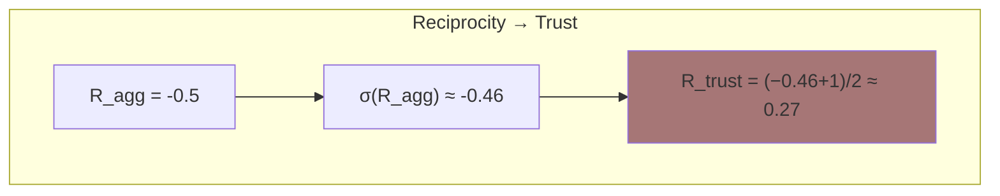
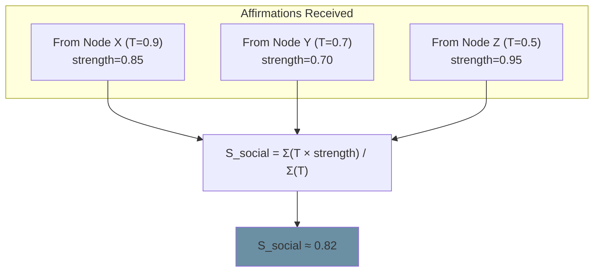
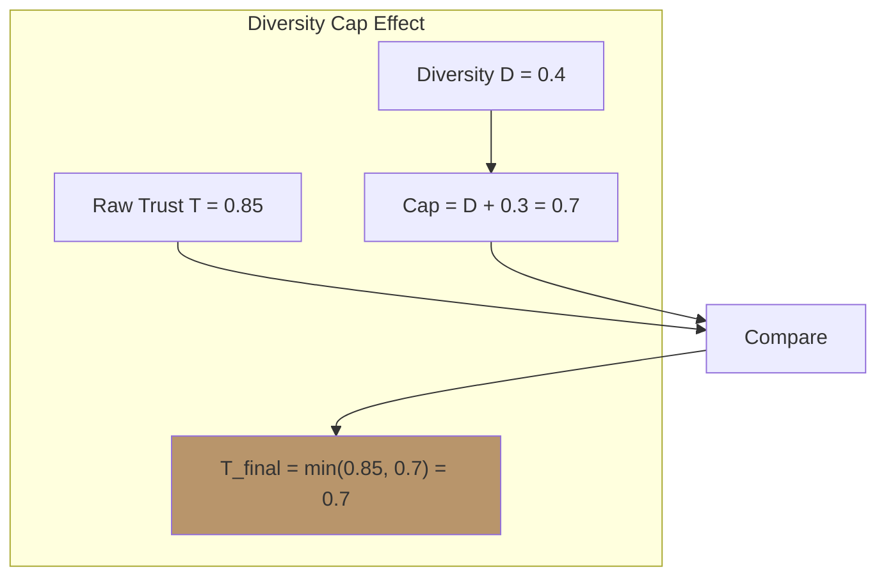
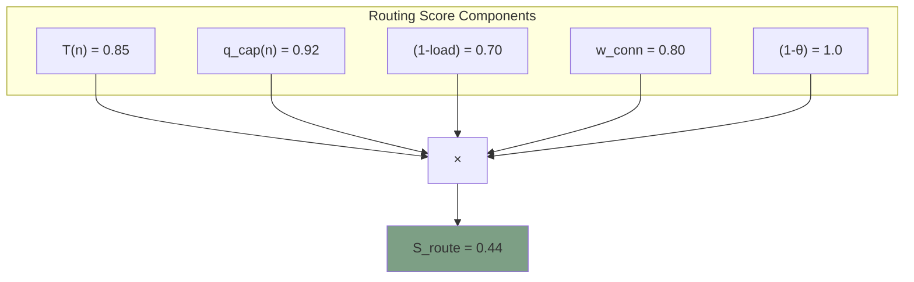

# Trust Computation

**Document Version:** 1.0
**Last Updated:** December 2025
**Status:** Normative

---

## 1. Introduction

### 1.1 Purpose

This document specifies how trust scores are computed in Symbiont. Trust is the fundamental metric that determines routing decisions, defense responses, and network behavior.

### 1.2 Key Principle

> **Trust emerges from interaction patterns—it is never directly assigned.**

Every trust score is derived from observable, measurable interaction history.

---

## 2. Trust Score Overview

### 2.1 Definition

The **trust score** T(n) of a node n is a value in [0, 1] representing the network's assessment of that node's trustworthiness:

- **T = 0** — Completely untrustworthy
- **T = 0.5** — Neutral/unknown
- **T = 1** — Highly trustworthy

### 2.2 Trust Computation Formula

$$T(n) = \frac{w_Q \cdot Q_{agg} + w_R \cdot \sigma(R_{agg}) + w_S \cdot S_{social} + w_D \cdot D_{diversity}}{\sum w}$$

With caps applied:
$$T_{final}(n) = \min\left(T(n), D_{diversity} + 0.3, trust\_cap\right)$$

### 2.3 Component Overview



---

## 3. Quality Score (Q_agg)

### 3.1 Definition

The aggregated quality score represents the average quality of a node's interactions, weighted by trust of those rating it and recency.

### 3.2 Per-Interaction Quality

Quality is measured from feedback on each interaction:

$$Q_{raw} = \frac{\omega_{help} \cdot helpfulness + \omega_{acc} \cdot accuracy + \omega_{rel} \cdot relevance + \omega_{time} \cdot timeliness}{4}$$

| Weight | Value | Dimension |
|--------|-------|-----------|
| ω_help | 0.4 | Helpfulness |
| ω_acc | 0.3 | Accuracy |
| ω_rel | 0.2 | Relevance |
| ω_time | 0.1 | Timeliness |

Each dimension is rated 1-5, then normalized:

```
FUNCTION compute_quality(feedback):
    Q_raw = (0.4 × feedback.helpfulness +
             0.3 × feedback.accuracy +
             0.2 × feedback.relevance +
             0.1 × feedback.timeliness) / 4

    // Reuse modifier
    IF feedback.would_reuse:
        Q_raw = Q_raw × 1.2    // REUSE_BOOST
    ELSE:
        Q_raw = Q_raw × 0.8    // REUSE_PENALTY

    // Normalize to [0, 1]
    Q = (Q_raw - 1) / 4

    RETURN clamp(Q, 0, 1)
```

### 3.3 Aggregated Quality

Quality scores are aggregated across all interactions:

$$Q_{agg}(n) = \frac{\sum_i Q_i \cdot T_{giver,i} \cdot decay(age_i)}{\sum_i T_{giver,i} \cdot decay(age_i)}$$

Where:
- **Q_i** — Quality score from interaction i
- **T_giver,i** — Trust of the node that gave the rating
- **decay(age)** — Time decay function



### 3.4 Per-Capability Quality

Quality is also tracked per capability:

$$q_{cap}(n, c) = \text{EMA of quality for capability } c$$

This enables nuanced routing: a node might be excellent at analysis (q_analysis = 0.95) but mediocre at generation (q_generation = 0.65).

---

## 4. Reciprocity Score (R_agg)

### 4.1 Definition

The reciprocity score measures whether a node maintains balanced exchanges over time.

### 4.2 Per-Connection Reciprocity

Each connection maintains a reciprocity score r updated via EMA:

$$r_{new} = \lambda \cdot r_{old} + (1-\lambda) \cdot \left(\log\left(\frac{in}{out + \epsilon}\right) + \theta \cdot (q - 0.5)\right)$$

Where:
- **λ** = 0.9 (memory factor)
- **θ** = 0.5 (quality weight)
- **in** = value received in interaction
- **out** = value given in interaction
- **ε** = 0.001 (division safety)

### 4.3 Aggregated Reciprocity

Reciprocity is aggregated across all connections:

$$R_{agg}(n) = \frac{1}{|C|} \sum_{c \in C} r_c$$

Where C is the set of connections.

### 4.4 Reciprocity to Trust Contribution

The reciprocity sigmoid converts R_agg to [0, 1]:

$$\sigma(R_{agg}) = \frac{2}{1 + e^{-\beta R_{agg}}} - 1$$

Then shifted to [0, 1] for trust computation:

$$R_{trust} = \frac{\sigma(R_{agg}) + 1}{2}$$



**Interpretation:**
- R_agg > 0 (receives more than gives) → R_trust > 0.5
- R_agg = 0 (balanced) → R_trust = 0.5
- R_agg < 0 (gives more than receives) → R_trust < 0.5

---

## 5. Social Proof (S_social)

### 5.1 Definition

Social proof measures how well-regarded a node is by other trusted nodes, based on received affirmations.

### 5.2 Affirmation Structure

```
STRUCTURE Affirmation {
    from      : NodeId
    to        : NodeId
    type      : { QUALITY, RELIABILITY, COLLABORATION, GROWTH }
    strength  : Score ∈ [0, 1]
    timestamp : Timestamp
}
```

### 5.3 Social Proof Computation

$$S_{social}(n) = \frac{\sum_a T(a.from) \cdot a.strength \cdot decay(a.age)}{\sum_a T(a.from) \cdot decay(a.age)}$$

Where the sum is over affirmations received by node n.



### 5.4 Self-Confidence (Related Concept)

Nodes also maintain self-confidence, updated when receiving affirmations:

$$S_{conf,new} = \alpha_{conf} \cdot S_{conf,old} + (1 - \alpha_{conf}) \cdot A_{mean}$$

Where:
- **α_conf** = 0.95 (confidence memory)
- **A_mean** = weighted mean of received affirmation strengths

---

## 6. Diversity Score (D_diversity)

### 6.1 Definition

The diversity score measures how varied a node's interaction partners are. This prevents trust inflation through narrow, potentially colluding relationships.

### 6.2 Computation

$$D_{diversity}(n) = \frac{unique\_partners_{last\_100}}{100}$$

Where unique_partners_last_100 is the count of distinct nodes interacted with in the last 100 interactions.

### 6.3 Diversity Examples

| Scenario | Unique Partners | D_diversity |
|----------|-----------------|-------------|
| Always same partner | 1 | 0.01 |
| 10 regular partners | 10 | 0.10 |
| 50 varied partners | 50 | 0.50 |
| Highly diverse | 80+ | 0.80+ |

### 6.4 Diversity Cap

**Critical:** Diversity acts as a cap on trust:

$$T_{capped} = \min(T, D_{diversity} + 0.3)$$

This ensures:
- A node with D = 0.1 can never exceed T = 0.4
- A node with D = 0.5 can never exceed T = 0.8
- Only highly diverse nodes can reach T = 1.0



---

## 7. Trust Computation Algorithm

### 7.1 Complete Algorithm

```
FUNCTION compute_trust(node):

    // Step 1: Aggregate quality
    Q_agg = 0
    Q_weight_sum = 0
    FOR EACH interaction IN node.interaction_history:
        weight = T(interaction.partner) × decay(interaction.age)
        Q_agg += interaction.quality × weight
        Q_weight_sum += weight
    Q_agg = Q_agg / (Q_weight_sum + ε)

    // Step 2: Aggregate reciprocity
    R_agg = 0
    FOR EACH conn IN node.connections:
        R_agg += conn.r
    R_agg = R_agg / (len(node.connections) + ε)

    // Convert to [0, 1]
    R_trust = (reciprocity_sigmoid(R_agg) + 1) / 2

    // Step 3: Compute social proof
    S_social = 0
    S_weight_sum = 0
    FOR EACH aff IN node.affirmations_received:
        weight = T(aff.from) × decay(aff.age)
        S_social += aff.strength × weight
        S_weight_sum += weight
    S_social = S_social / (S_weight_sum + ε)

    // Step 4: Compute diversity
    unique = count_unique(node.last_100_interactions)
    D = unique / 100

    // Step 5: Weighted combination
    T = (0.4 × Q_agg + 0.2 × R_trust + 0.2 × S_social + 0.2 × D)

    // Step 6: Apply caps
    T = min(T, D + 0.3)              // Diversity cap
    T = min(T, node.trust_cap)       // Trust cap (from flags)

    RETURN T
```

### 7.2 Weight Configuration

| Component | Symbol | Default Weight | Rationale |
|-----------|--------|----------------|-----------|
| Quality | w_Q | 0.4 | Primary indicator of value |
| Reciprocity | w_R | 0.2 | Ensures sustainable relationships |
| Social Proof | w_S | 0.2 | Leverages network knowledge |
| Diversity | w_D | 0.2 | Prevents gaming through collusion |

---

## 8. Trust Caps and Modifiers

### 8.1 Diversity Cap

As described above:
$$T \leq D_{diversity} + 0.3$$

### 8.2 Trust Cap (Flags)

Certain flags reduce the trust cap:

| Flag | Trust Cap Effect |
|------|------------------|
| LOW_DIVERSITY | trust_cap = 0.7 |
| UNDER_INVESTIGATION | trust_cap = 0.5 |
| PROBATION_WARNING | trust_cap = 0.6 |

### 8.3 Status-Based Limits

Node status affects achievable trust:

| Status | Typical Trust Range |
|--------|---------------------|
| PROBATIONARY | [0, 0.6] |
| MEMBER | [0.4, 0.8] |
| ESTABLISHED | [0.6, 1.0] |
| HUB | [0.8, 1.0] |

---

## 9. Trust in Routing

### 9.1 Routing Score Formula

Trust is a key component of routing decisions:

$$S_{route}(n) = T(n) \cdot q_{cap}(n) \cdot (1 - load) \cdot w_{conn} \cdot (1 - \theta_{threat})$$

### 9.2 Impact Visualization



---

## 10. Trust Dynamics

### 10.1 Trust Formation (Cold Start)

New nodes receive **swift trust** to enable participation:

$$T_{init} = 0.3 \cdot T_{swift} + 0.2 \cdot T_{category} + 0.3 \cdot T_{vouch} + 0.2 \cdot T_{social}$$

Where:
- **T_swift** = 0.4 (base swift trust)
- **T_category** = role-based trust adjustment
- **T_vouch** = trust from vouchers
- **T_social** = initial social connections

### 10.2 Trust Evolution

Trust changes over time through:

1. **Positive interactions** → Connection weights increase → Q_agg increases → T increases
2. **Balanced exchange** → Reciprocity stays neutral → R_trust ≈ 0.5
3. **Affirmations received** → S_social increases → T increases
4. **Diverse interactions** → D_diversity increases → Cap raises

### 10.3 Trust Decay

Trust can decay through:

1. **Poor quality** → Connection weights decrease → Q_agg decreases
2. **Imbalanced exchange** → Reciprocity goes negative → R_trust decreases
3. **Lack of affirmations** → S_social decays
4. **Narrow interactions** → D_diversity decreases → Cap tightens

---

## 11. Implementation Reference

### 11.1 Rust Implementation Pattern

```rust
pub fn compute_trust(node: &Node, network: &Network) -> f64 {
    // Quality aggregation
    let q_agg = aggregate_quality(&node.interaction_history, network);

    // Reciprocity aggregation
    let r_agg = node.connections.values()
        .map(|c| c.reciprocity)
        .sum::<f64>() / node.connections.len().max(1) as f64;
    let r_trust = (reciprocity_sigmoid(r_agg) + 1.0) / 2.0;

    // Social proof
    let s_social = aggregate_social_proof(&node.affirmations, network);

    // Diversity
    let unique = count_unique_partners(&node.last_100_interactions);
    let d = unique as f64 / 100.0;

    // Weighted sum
    let t = 0.4 * q_agg + 0.2 * r_trust + 0.2 * s_social + 0.2 * d;

    // Apply caps
    let t = t.min(d + 0.3);
    let t = t.min(node.trust_cap);

    t.clamp(0.0, 1.0)
}
```

---

## 12. Summary

Trust in Symbiont is:

| Property | Description |
|----------|-------------|
| **Emergent** | Computed from interaction history, never assigned |
| **Multi-dimensional** | Combines quality, reciprocity, social, diversity |
| **Capped** | Diversity prevents gaming through narrow relationships |
| **Dynamic** | Changes continuously based on behavior |
| **Local** | Each node computes its own view |

$$T(n) = \min\left(\frac{0.4 \cdot Q + 0.2 \cdot R + 0.2 \cdot S + 0.2 \cdot D}{1.0}, D + 0.3, trust\_cap\right)$$

---

*Previous: [The Physarum Equation](./physarum-equation.md) | Next: [Reciprocity System](./reciprocity.md)*
