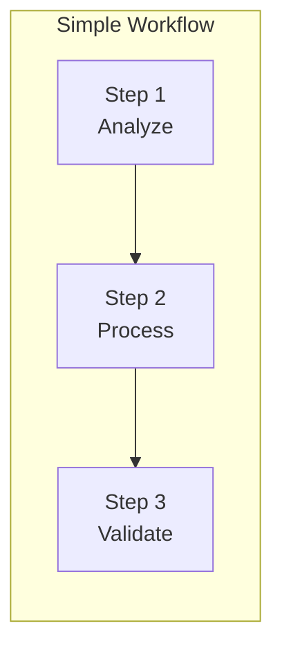
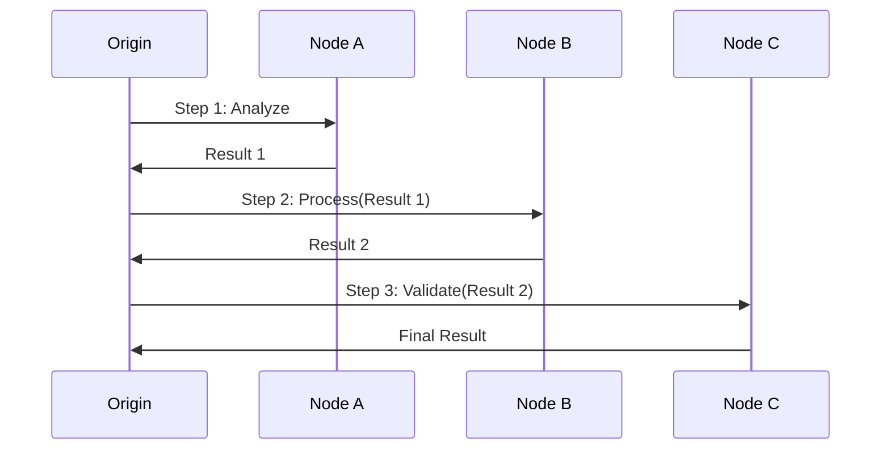
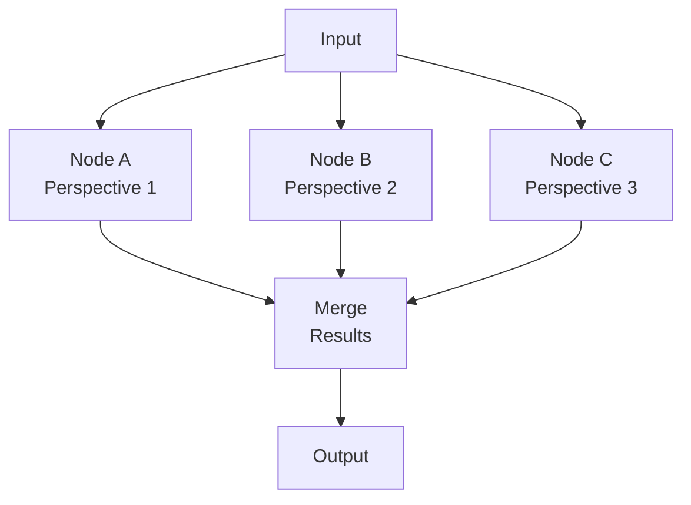
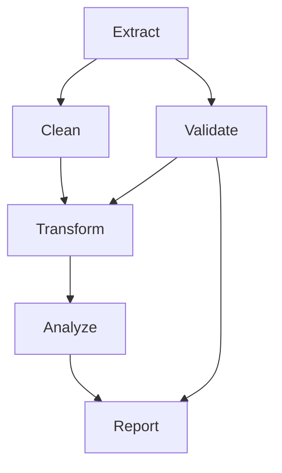
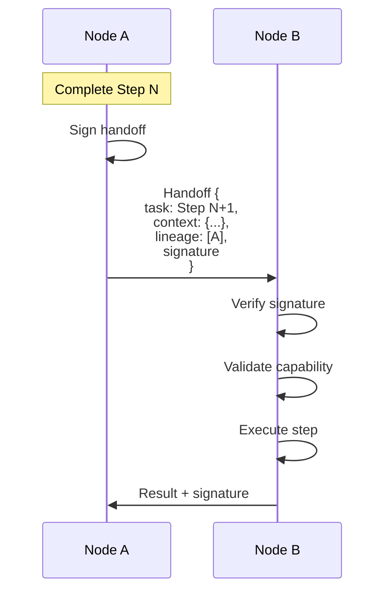
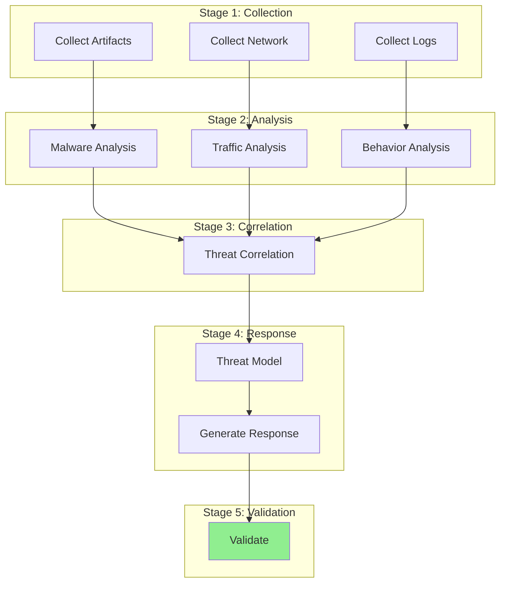

# Building Workflows

**Document Version:** 1.0
**Last Updated:** December 2025
**Difficulty:** Advanced

---

## 1. Introduction

This tutorial teaches you to build multi-step workflows in Symbiont. You will learn to:

- Design sequential, parallel, and DAG workflows
- Implement routing strategies
- Handle failures and retries
- Monitor workflow execution

---

## 2. Workflow Concepts

### 2.1 What is a Workflow?

A **workflow** is a structured sequence of tasks executed across the network:



### 2.2 Workflow Types

| Type | Description | Example |
|------|-------------|---------|
| SINGLE | One task, one node | Simple query |
| SEQUENTIAL | Chain of tasks | Pipeline processing |
| PARALLEL | Concurrent tasks | Ensemble voting |
| DAG | Dependency graph | Complex analysis |

---

## 3. Sequential Workflows

### 3.1 Definition

Sequential workflows execute steps one after another, with each step's output feeding into the next.



### 3.2 Creating a Sequential Workflow

```rust
use symbiont_core::workflow::*;

fn create_analysis_pipeline() -> Workflow {
    Workflow::sequential("data-analysis")
        .add_step(Step::new("extract")
            .capability(Capability::DataExtraction)
            .timeout(Duration::from_secs(30)))
        .add_step(Step::new("transform")
            .capability(Capability::DataTransformation)
            .timeout(Duration::from_secs(60)))
        .add_step(Step::new("analyze")
            .capability(Capability::Analysis)
            .min_trust(0.7))
        .add_step(Step::new("validate")
            .capability(Capability::Validation)
            .min_quality(0.8))
        .build()
}
```

### 3.3 Running a Sequential Workflow

```rust
async fn run_pipeline(node: &Node, input: DataInput) -> Result<AnalysisResult> {
    let workflow = create_analysis_pipeline();

    let context = WorkflowContext::new()
        .with_input(input)
        .with_priority(Priority::Normal);

    let result = node.execute_workflow(workflow, context).await?;

    match result.status {
        WorkflowStatus::Completed => Ok(result.output.into()),
        WorkflowStatus::Failed => Err(result.error.unwrap()),
    }
}
```

---

## 4. Parallel Workflows

### 4.1 Definition

Parallel workflows execute multiple tasks concurrently, then merge results.



### 4.2 Creating a Parallel Workflow

```rust
fn create_ensemble_workflow() -> Workflow {
    Workflow::parallel("ensemble-analysis")
        // Parallel analysis steps
        .add_parallel_steps(vec![
            Step::new("analyze-1")
                .capability(Capability::Analysis)
                .exclude_nodes(&[]), // Different nodes will be selected

            Step::new("analyze-2")
                .capability(Capability::Analysis),

            Step::new("analyze-3")
                .capability(Capability::Analysis),
        ])
        // Merge step
        .add_merge_step(Step::new("aggregate")
            .capability(Capability::Aggregation)
            .aggregation_strategy(AggregationStrategy::TrustWeightedVote))
        .build()
}
```

### 4.3 Aggregation Strategies

| Strategy | Description | Use Case |
|----------|-------------|----------|
| TrustWeightedVote | Weight votes by trust | Classification |
| Majority | Simple majority | Binary decisions |
| Unanimous | Require all agreement | Critical decisions |
| Average | Numeric average | Estimation |
| Median | Robust to outliers | Noisy data |

```rust
pub enum AggregationStrategy {
    TrustWeightedVote,
    Majority,
    Unanimous,
    Average,
    Median,
    Custom(Box<dyn Fn(Vec<StepResult>) -> Result<AggregatedResult>>),
}
```

---

## 5. DAG Workflows

### 5.1 Definition

DAG (Directed Acyclic Graph) workflows allow complex dependency structures.



### 5.2 Creating a DAG Workflow

```rust
fn create_dag_workflow() -> Workflow {
    Workflow::dag("complex-pipeline")
        .add_step(Step::new("extract")
            .id("s1")
            .capability(Capability::DataExtraction))

        .add_step(Step::new("clean")
            .id("s2")
            .capability(Capability::DataCleaning)
            .depends_on(&["s1"]))

        .add_step(Step::new("validate")
            .id("s3")
            .capability(Capability::Validation)
            .depends_on(&["s1"]))

        .add_step(Step::new("transform")
            .id("s4")
            .capability(Capability::DataTransformation)
            .depends_on(&["s2", "s3"]))  // Waits for both

        .add_step(Step::new("analyze")
            .id("s5")
            .capability(Capability::Analysis)
            .depends_on(&["s4"]))

        .add_step(Step::new("report")
            .id("s6")
            .capability(Capability::ReportGeneration)
            .depends_on(&["s3", "s5"]))

        .build()
}
```

### 5.3 Dependency Resolution

The workflow engine automatically:

1. Identifies steps with no dependencies (start nodes)
2. Executes them in parallel
3. Waits for dependencies before starting dependent steps
4. Detects cycles (error) and missing dependencies (error)

---

## 6. Routing Strategies

### 6.1 Default Routing

By default, each step routes to the best available node:

$$S_{route} = T(n) \times q_{cap}(n) \times (1 - load) \times w_{conn} \times (1 - \theta_{threat})$$

### 6.2 Constrained Routing

```rust
Step::new("critical-analysis")
    .capability(Capability::Analysis)
    .min_trust(0.8)           // Only high-trust nodes
    .min_quality(0.85)        // Only high-quality nodes
    .preferred_nodes(&[hub_id])  // Prefer specific nodes
    .excluded_nodes(&[suspect_id])  // Exclude specific nodes
```

### 6.3 Diversity Requirements

For ensemble workflows, ensure diverse executors:

```rust
Workflow::parallel("diverse-ensemble")
    .add_parallel_steps(steps)
    .require_executor_diversity(0.5)  // At least 50% unique
    .build()
```

---

## 7. Context and Handoffs

### 7.1 Context Accumulation

Each step can access and modify the workflow context:

```rust
#[derive(Serialize, Deserialize)]
struct AnalysisContext {
    input_data: DataInput,
    intermediate_results: Vec<IntermediateResult>,
    metadata: HashMap<String, Value>,
}

impl StepExecutor for AnalysisStep {
    async fn execute(&self, ctx: &mut WorkflowContext) -> Result<StepResult> {
        // Read from context
        let input = ctx.get::<DataInput>("input")?;

        // Execute
        let result = self.analyze(input).await?;

        // Write to context
        ctx.set("analysis_result", result.clone());

        Ok(StepResult::success(result))
    }
}
```

### 7.2 Handoff Protocol

When work transfers between nodes:



---

## 8. Error Handling

### 8.1 Retry Configuration

```rust
Step::new("flaky-operation")
    .capability(Capability::ExternalApi)
    .retry_policy(RetryPolicy::new()
        .max_attempts(3)
        .initial_delay(Duration::from_secs(1))
        .backoff_multiplier(2.0)
        .max_delay(Duration::from_secs(30)))
```

### 8.2 Failure Modes

| Failure | Handling |
|---------|----------|
| Step timeout | Retry or fail workflow |
| Node unavailable | Route to alternative |
| Quality too low | Retry with different node |
| All retries exhausted | Fail step, maybe workflow |

### 8.3 Partial Failure Handling

```rust
Workflow::dag("resilient-pipeline")
    .add_step(Step::new("optional-enrichment")
        .optional(true)  // Continue even if fails
        .capability(Capability::Enrichment))

    .on_step_failure(|step, error| {
        if step.is_optional() {
            FailureAction::Continue
        } else {
            FailureAction::AbortWorkflow
        }
    })
    .build()
```

---

## 9. Monitoring Workflows

### 9.1 Status Tracking

```rust
async fn monitor_workflow(workflow_id: WorkflowId, node: &Node) {
    loop {
        let status = node.get_workflow_status(workflow_id).await?;

        println!("Workflow: {:?}", status.state);
        for step in &status.steps {
            println!("  {}: {:?}", step.name, step.state);
        }

        if status.is_terminal() {
            break;
        }

        sleep(Duration::from_secs(1)).await;
    }
}
```

### 9.2 Progress Callbacks

```rust
let workflow = create_pipeline()
    .on_step_start(|step| {
        println!("Starting: {}", step.name);
    })
    .on_step_complete(|step, result| {
        println!("Completed: {} ({:?})", step.name, result.status);
    })
    .on_workflow_complete(|workflow, result| {
        println!("Workflow done: {:?}", result.status);
    })
    .build();
```

### 9.3 Metrics Collection

```rust
#[derive(Debug)]
struct WorkflowMetrics {
    total_duration: Duration,
    step_durations: HashMap<String, Duration>,
    nodes_used: HashSet<NodeId>,
    retry_count: u32,
    trust_changes: Vec<TrustChange>,
}

impl WorkflowExecutor {
    async fn execute_with_metrics(&self, workflow: Workflow)
        -> (WorkflowResult, WorkflowMetrics)
    {
        let start = Instant::now();
        let mut metrics = WorkflowMetrics::default();

        let result = self.execute_internal(workflow, &mut metrics).await;

        metrics.total_duration = start.elapsed();
        (result, metrics)
    }
}
```

---

## 10. Complete Example

### 10.1 Threat Analysis Workflow

```rust
/// A complete threat analysis workflow
fn create_threat_analysis_workflow() -> Workflow {
    Workflow::dag("threat-analysis")
        // Stage 1: Collection (parallel)
        .add_step(Step::new("collect-logs")
            .id("logs")
            .capability(Capability::LogCollection))

        .add_step(Step::new("collect-network")
            .id("network")
            .capability(Capability::NetworkCapture))

        .add_step(Step::new("collect-artifacts")
            .id("artifacts")
            .capability(Capability::ArtifactCollection))

        // Stage 2: Initial Analysis (parallel, depends on collection)
        .add_step(Step::new("analyze-malware")
            .id("malware")
            .capability(Capability::MalwareAnalysis)
            .depends_on(&["artifacts"])
            .min_trust(0.8))

        .add_step(Step::new("analyze-traffic")
            .id("traffic")
            .capability(Capability::TrafficAnalysis)
            .depends_on(&["network"]))

        .add_step(Step::new("analyze-behavior")
            .id("behavior")
            .capability(Capability::BehaviorAnalysis)
            .depends_on(&["logs"]))

        // Stage 3: Correlation (waits for all analysis)
        .add_step(Step::new("correlate-threats")
            .id("correlate")
            .capability(Capability::ThreatCorrelation)
            .depends_on(&["malware", "traffic", "behavior"])
            .min_quality(0.85))

        // Stage 4: Modeling and Response
        .add_step(Step::new("threat-model")
            .id("model")
            .capability(Capability::ThreatModeling)
            .depends_on(&["correlate"]))

        .add_step(Step::new("generate-response")
            .id("response")
            .capability(Capability::ResponseGeneration)
            .depends_on(&["model"]))

        // Stage 5: Validation
        .add_step(Step::new("validate-response")
            .id("validate")
            .capability(Capability::SecurityValidation)
            .depends_on(&["response"])
            .min_trust(0.9))

        .build()
}
```

### 10.2 Execution Flow



---

## 11. Best Practices

### 11.1 Design Guidelines

| Guideline | Rationale |
|-----------|-----------|
| Minimize step count | Reduce latency and failure points |
| Use appropriate granularity | Not too fine, not too coarse |
| Set realistic timeouts | Prevent hangs |
| Include validation steps | Catch errors early |
| Handle partial failures | Improve resilience |

### 11.2 Performance Tips

| Tip | Impact |
|-----|--------|
| Parallelize independent steps | Reduces total time |
| Cache intermediate results | Avoids recomputation |
| Use appropriate routing constraints | Better node selection |
| Monitor and tune | Identify bottlenecks |

---

## 12. Summary

You've learned to build workflows in Symbiont:

| Skill | Description |
|-------|-------------|
| Sequential | Step-by-step processing |
| Parallel | Concurrent execution |
| DAG | Complex dependencies |
| Routing | Constrain node selection |
| Handoffs | Pass context between nodes |
| Error handling | Retries and failure modes |
| Monitoring | Track progress and metrics |

Workflows enable sophisticated multi-agent coordination while maintaining the trust-based routing that makes Symbiont unique.

---

*Previous: [Understanding Trust](./understanding-trust.md) | Next: [Core Types](../api/types.md)*
