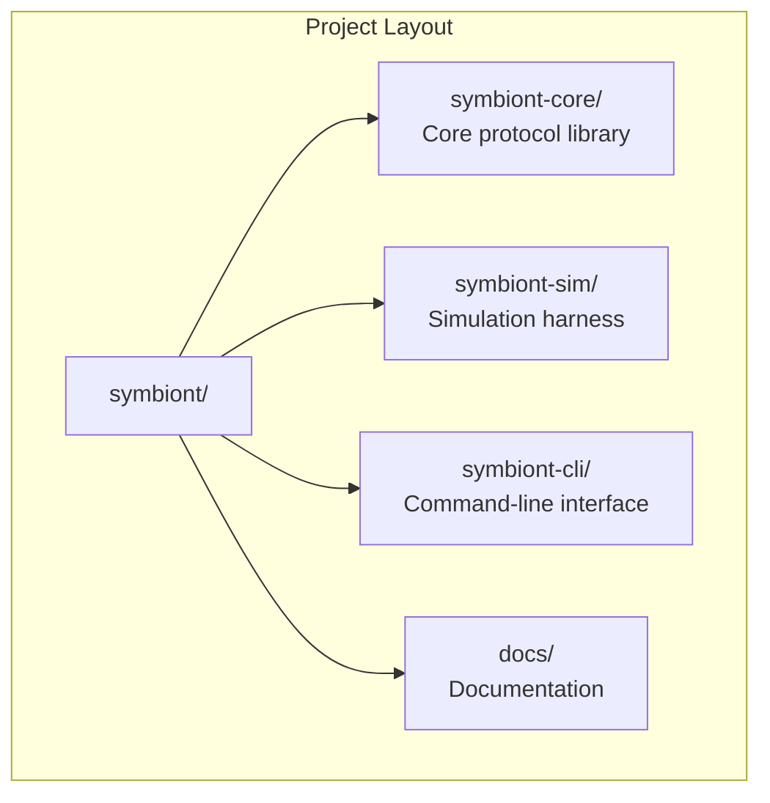
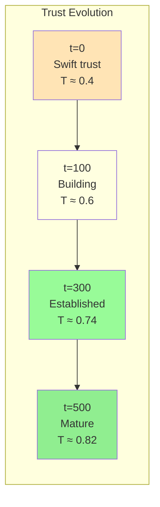

# Getting Started

**Document Version:** 1.0
**Last Updated:** December 2025
**Difficulty:** Beginner

---

## 1. Introduction

This tutorial guides you through setting up and running your first Symbiont simulation. By the end, you will:

- Install the Symbiont toolchain
- Understand the project structure
- Run a basic trust emergence simulation
- Interpret the results

---

## 2. Prerequisites

### 2.1 Required Software

| Software | Version | Purpose |
|----------|---------|---------|
| Rust | 1.70+ | Programming language |
| Cargo | (included with Rust) | Package manager |
| Git | 2.x+ | Version control |

### 2.2 Installing Rust

If you don't have Rust installed:

```bash
# Install rustup (Rust toolchain manager)
curl --proto '=https' --tlsv1.2 -sSf https://sh.rustup.rs | sh

# Follow the prompts, then reload your shell
source ~/.cargo/env

# Verify installation
rustc --version
cargo --version
```

---

## 3. Installation

### 3.1 Clone the Repository

```bash
git clone https://github.com/your-org/symbiont.git
cd symbiont
```

### 3.2 Build the Project

```bash
# Build all crates in release mode
cargo build --release

# This may take a few minutes on first build
```

### 3.3 Run Tests

Verify everything works:

```bash
cargo test
```

You should see output like:

```
running 42 tests
test types::tests::test_node_id ... ok
test connection::tests::test_weight_update ... ok
...
test result: ok. 42 passed; 0 failed
```

---

## 4. Project Structure



### 4.1 Key Directories

| Directory | Purpose |
|-----------|---------|
| `symbiont-core/src/` | Core protocol implementation |
| `symbiont-sim/src/` | Simulation framework |
| `symbiont-cli/src/` | CLI entry point |
| `docs/` | This documentation |

### 4.2 Core Source Files

| File | Description |
|------|-------------|
| `types.rs` | Core types (NodeId, Score, Weight) |
| `node.rs` | Node structure and behavior |
| `connection.rs` | Connection dynamics (Physarum equation) |
| `trust.rs` | Trust computation |
| `defense.rs` | Defense signaling |
| `routing.rs` | Task routing |
| `workflow.rs` | Workflow orchestration |

---

## 5. Your First Simulation

### 5.1 Running the Trust Emergence Scenario

The simplest simulation shows how trust emerges in a network of honest nodes:

```bash
cargo run -p symbiont-cli --release -- run \
    -s trust-emergence \
    -n 20 \
    -t 500 \
    -v
```

**Parameters:**

| Flag | Meaning |
|------|---------|
| `-s trust-emergence` | Scenario name |
| `-n 20` | Number of nodes |
| `-t 500` | Number of ticks (time steps) |
| `-v` | Verbose output |

### 5.2 Expected Output

```
[INFO] Starting simulation: trust-emergence
[INFO] Nodes: 20, Ticks: 500

Tick 0:   Mean Trust: 0.400  Mean Weight: 0.300
Tick 50:  Mean Trust: 0.512  Mean Weight: 0.421
Tick 100: Mean Trust: 0.598  Mean Weight: 0.534
Tick 200: Mean Trust: 0.687  Mean Weight: 0.612
Tick 300: Mean Trust: 0.742  Mean Weight: 0.678
Tick 400: Mean Trust: 0.789  Mean Weight: 0.723
Tick 500: Mean Trust: 0.821  Mean Weight: 0.756

[INFO] Simulation complete
[INFO] Final statistics:
  - Mean trust: 0.821
  - Trust std dev: 0.089
  - Mean connection weight: 0.756
  - Network density: 0.67
  - Hub nodes: 3 (15%)
```

### 5.3 Understanding the Results



**What happened:**

1. **t=0:** Nodes start with swift trust (~0.4)
2. **t=1-100:** Positive interactions strengthen connections
3. **t=100-300:** Trust scores rise as history accumulates
4. **t=300-500:** Network stabilizes; hub nodes emerge

---

## 6. Exploring Scenarios

### 6.1 Available Scenarios

| Scenario | Description |
|----------|-------------|
| `trust-emergence` | Honest network trust formation |
| `strategic` | Strategic adversary injection |
| `free-rider` | Free-rider detection |
| `sybil` | Sybil attack resistance |
| `workflow-chain` | Sequential workflow routing |
| `workflow-fan-out` | Parallel workflow execution |

### 6.2 Running the Strategic Adversary Scenario

```bash
cargo run -p symbiont-cli --release -- run \
    -s strategic \
    -n 20 \
    -t 500 \
    --inject-at 100 \
    -v
```

This simulates an adversary that:

1. Behaves well for 100 ticks (building trust)
2. Starts misbehaving at tick 100
3. Should be detected and isolated by the network

**Expected output:**

```
[INFO] Starting simulation: strategic
[INFO] Adversary injection at tick 100

Tick 100: Adversary trust: 0.72 (HIGH)
Tick 150: Quality drop detected, signal emitted
Tick 175: Adversary trust: 0.48 (MEDIUM)
Tick 200: Adversary trust: 0.31 (LOW)
Tick 250: Adversary effectively isolated

[INFO] Detection time: 75 ticks after defection
[INFO] Adversary final trust: 0.18
```

---

## 7. Understanding the CLI

### 7.1 Command Structure

```bash
symbiont-cli <COMMAND> [OPTIONS]

Commands:
  run       Run a simulation
  analyze   Analyze simulation results
  export    Export data to CSV/JSON
  help      Show help information
```

### 7.2 Run Command Options

```bash
symbiont-cli run [OPTIONS]

Options:
  -s, --scenario <NAME>     Scenario to run
  -n, --nodes <COUNT>       Number of nodes (default: 20)
  -t, --ticks <COUNT>       Number of ticks (default: 500)
  --inject-at <TICK>        When to inject adversary
  --adversary-count <N>     Number of adversaries
  -v, --verbose             Verbose output
  -o, --output <FILE>       Output file for results
  --seed <SEED>             Random seed for reproducibility
```

### 7.3 Examples

```bash
# Large network simulation
cargo run -p symbiont-cli -- run -s trust-emergence -n 100 -t 1000

# Reproducible run with seed
cargo run -p symbiont-cli -- run -s strategic -n 20 --seed 12345

# Export results to JSON
cargo run -p symbiont-cli -- run -s trust-emergence -o results.json
```

---

## 8. Next Steps

Now that you can run simulations, explore further:

| Tutorial | Description |
|----------|-------------|
| [Running Simulations](./running-simulations.md) | Advanced simulation techniques |
| [Understanding Trust](./understanding-trust.md) | Deep dive into trust dynamics |
| [Building Workflows](./building-workflows.md) | Creating multi-step workflows |

### 8.1 Experiment Ideas

1. **Vary network size:** How does trust emergence change with 10 vs 100 nodes?
2. **Adjust constants:** Modify γ or α in constants.rs and observe effects
3. **Multiple adversaries:** What happens with 2, 5, or 10 adversaries?
4. **Early vs late injection:** Does it matter when adversaries appear?

---

## 9. Troubleshooting

### 9.1 Common Issues

| Issue | Solution |
|-------|----------|
| Build fails | Ensure Rust 1.70+; run `rustup update` |
| Tests fail | Check for local modifications |
| Simulation hangs | Reduce node count or tick count |
| Memory issues | Use release mode (`--release`) |

### 9.2 Getting Help

- Check the [FAQ](../concepts/glossary.md) for terminology
- Review [Architecture](../architecture/overview.md) for system understanding
- Open an issue on GitHub for bugs

---

## 10. Summary

You've learned to:

- Install and build Symbiont
- Run basic simulations
- Interpret trust emergence results
- Explore different scenarios

The Symbiont protocol demonstrates how trust can emerge from local interactions without central authority—just like biological networks optimize themselves through simple rules.

---

*Next: [Running Simulations](./running-simulations.md)*
