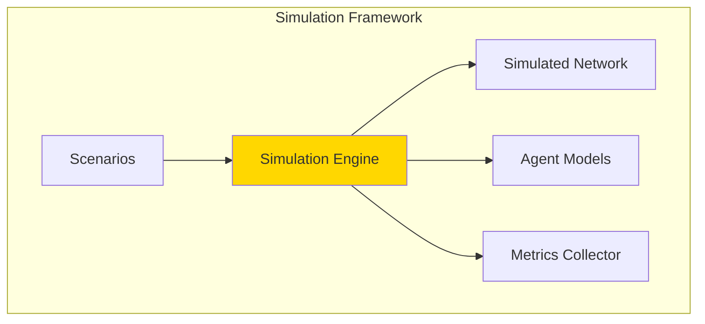
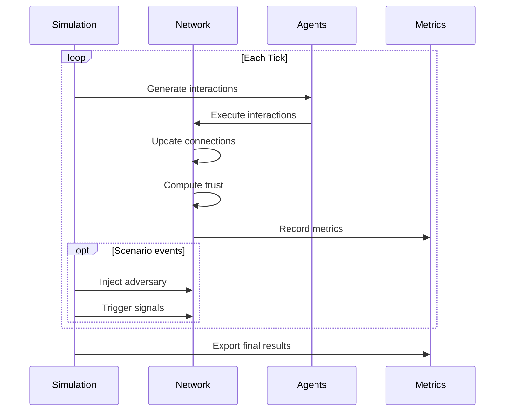

# Running Simulations

**Document Version:** 1.0
**Last Updated:** December 2025
**Difficulty:** Intermediate

---

## 1. Introduction

This tutorial covers advanced simulation techniques in Symbiont. You will learn to:

- Configure custom simulation parameters
- Create new scenarios
- Collect and analyze metrics
- Visualize results

---

## 2. Simulation Architecture

### 2.1 Components



### 2.2 Simulation Loop



---

## 3. Configuration

### 3.1 Simulation Parameters

Create a configuration file `sim_config.toml`:

```toml
[simulation]
name = "custom-experiment"
ticks = 1000
seed = 42

[network]
node_count = 50
initial_connections = 3  # Connections per node at start

[agents]
honest_ratio = 0.9
strategic_ratio = 0.05
free_rider_ratio = 0.05

[dynamics]
interaction_rate = 0.1    # Probability of interaction per tick
quality_mean = 0.75       # Mean quality for honest agents
quality_stddev = 0.1

[constants]
# Override default constants
gamma = 0.1
alpha = 0.01
beta = 2.0
lambda = 0.9

[metrics]
sample_interval = 10      # Record every N ticks
export_format = "json"
```

### 3.2 Running with Configuration

```bash
cargo run -p symbiont-cli -- run --config sim_config.toml -v
```

---

## 4. Agent Models

### 4.1 Available Agent Types

| Agent Type | Behavior |
|------------|----------|
| Honest | High quality, balanced exchange |
| Free-Rider | Receives but doesn't contribute |
| Strategic | Builds trust, then defects |
| Sybil | Multiple colluding identities |
| Random | Unpredictable quality |

### 4.2 Agent Implementation

```rust
pub trait AgentBehavior {
    /// Generate quality for this interaction
    fn generate_quality(&self, tick: u64) -> f64;

    /// Determine exchange values
    fn compute_exchange(&self, task: &Task) -> (f64, f64);

    /// Should this agent respond honestly?
    fn is_cooperative(&self, tick: u64) -> bool;
}

pub struct StrategicAdversary {
    defection_tick: u64,
    pre_defection_quality: f64,
    post_defection_quality: f64,
}

impl AgentBehavior for StrategicAdversary {
    fn generate_quality(&self, tick: u64) -> f64 {
        if tick < self.defection_tick {
            self.pre_defection_quality
        } else {
            self.post_defection_quality
        }
    }

    fn is_cooperative(&self, tick: u64) -> bool {
        tick < self.defection_tick
    }
}
```

### 4.3 Custom Agent Example

```rust
pub struct GradualDegrader {
    start_quality: f64,
    degradation_rate: f64,
}

impl AgentBehavior for GradualDegrader {
    fn generate_quality(&self, tick: u64) -> f64 {
        let quality = self.start_quality - (tick as f64 * self.degradation_rate);
        quality.max(0.1)
    }

    fn is_cooperative(&self, _tick: u64) -> bool {
        true  // Always cooperative, just declining quality
    }
}
```

---

## 5. Creating Scenarios

### 5.1 Scenario Structure

```rust
pub trait Scenario {
    /// Initialize the network
    fn setup(&self, network: &mut Network);

    /// Called each tick
    fn on_tick(&mut self, tick: u64, network: &mut Network);

    /// Check if scenario is complete
    fn is_complete(&self, tick: u64, network: &Network) -> bool;

    /// Return scenario results
    fn get_results(&self) -> ScenarioResults;
}
```

### 5.2 Example: Gradual Attack Scenario

```rust
pub struct GradualAttackScenario {
    adversary_count: usize,
    injection_start: u64,
    injection_interval: u64,
    injected: usize,
}

impl Scenario for GradualAttackScenario {
    fn setup(&self, network: &mut Network) {
        // Initialize with honest nodes only
        for i in 0..self.node_count {
            network.add_node(HonestAgent::new());
        }
    }

    fn on_tick(&mut self, tick: u64, network: &mut Network) {
        // Gradually inject adversaries
        if tick >= self.injection_start &&
           self.injected < self.adversary_count {
            if (tick - self.injection_start) % self.injection_interval == 0 {
                network.add_node(StrategicAdversary::new(tick + 50));
                self.injected += 1;
            }
        }
    }

    fn is_complete(&self, tick: u64, network: &Network) -> bool {
        tick >= 1000 || self.all_adversaries_isolated(network)
    }
}
```

### 5.3 Scenario Configuration

```toml
[scenario]
name = "gradual-attack"

[scenario.params]
adversary_count = 5
injection_start = 100
injection_interval = 50
```

---

## 6. Metrics Collection

### 6.1 Available Metrics

| Metric | Description |
|--------|-------------|
| `mean_trust` | Average trust across all nodes |
| `trust_stddev` | Standard deviation of trust |
| `mean_weight` | Average connection weight |
| `network_density` | Proportion of possible connections |
| `hub_count` | Number of hub nodes |
| `adversary_trust` | Trust of adversarial nodes |
| `detection_time` | Ticks to detect adversary |
| `isolation_time` | Ticks to isolate adversary |

### 6.2 Metrics Collector

```rust
pub struct MetricsCollector {
    samples: Vec<MetricsSample>,
    sample_interval: u64,
}

impl MetricsCollector {
    pub fn sample(&mut self, tick: u64, network: &Network) {
        if tick % self.sample_interval != 0 {
            return;
        }

        let sample = MetricsSample {
            tick,
            mean_trust: network.mean_trust(),
            trust_stddev: network.trust_stddev(),
            mean_weight: network.mean_connection_weight(),
            density: network.density(),
            hub_count: network.count_hubs(),
            adversary_trust: network.adversary_trust(),
        };

        self.samples.push(sample);
    }

    pub fn export_json(&self, path: &str) -> Result<()> {
        let json = serde_json::to_string_pretty(&self.samples)?;
        std::fs::write(path, json)?;
        Ok(())
    }

    pub fn export_csv(&self, path: &str) -> Result<()> {
        let mut writer = csv::Writer::from_path(path)?;
        for sample in &self.samples {
            writer.serialize(sample)?;
        }
        Ok(())
    }
}
```

### 6.3 Custom Metrics

```rust
impl MetricsCollector {
    pub fn add_custom_metric<F>(&mut self, name: &str, compute: F)
    where
        F: Fn(&Network) -> f64 + 'static
    {
        self.custom_metrics.push(CustomMetric {
            name: name.to_string(),
            compute: Box::new(compute),
        });
    }
}

// Usage
collector.add_custom_metric("reciprocity_variance", |net| {
    let reciprocities: Vec<f64> = net.all_connections()
        .map(|c| c.reciprocity)
        .collect();
    variance(&reciprocities)
});
```

---

## 7. Batch Experiments

### 7.1 Parameter Sweeps

```bash
# Create a sweep configuration
cat > sweep.toml << EOF
[sweep]
parameter = "network.node_count"
values = [10, 20, 50, 100, 200]
runs_per_value = 5

[base_config]
ticks = 500
scenario = "trust-emergence"
EOF

# Run the sweep
cargo run -p symbiont-cli -- sweep --config sweep.toml -o results/
```

### 7.2 Multi-Parameter Experiments

```rust
fn run_experiment_grid() {
    let gammas = [0.05, 0.1, 0.15, 0.2];
    let alphas = [0.005, 0.01, 0.02];

    for gamma in &gammas {
        for alpha in &alphas {
            let config = SimConfig {
                gamma: *gamma,
                alpha: *alpha,
                ..Default::default()
            };

            let results = run_simulation(config);
            save_results(&format!("g{}_a{}.json", gamma, alpha), &results);
        }
    }
}
```

### 7.3 Statistical Analysis

```rust
fn analyze_results(results: &[SimulationResult]) {
    // Mean and confidence interval
    let trusts: Vec<f64> = results.iter()
        .map(|r| r.final_mean_trust)
        .collect();

    let mean = trusts.iter().sum::<f64>() / trusts.len() as f64;
    let stddev = standard_deviation(&trusts);
    let ci_95 = 1.96 * stddev / (trusts.len() as f64).sqrt();

    println!("Mean trust: {:.3} ± {:.3} (95% CI)", mean, ci_95);
}
```

---

## 8. Visualization

### 8.1 Export for Plotting

```bash
# Export to CSV for external plotting
cargo run -p symbiont-cli -- run \
    -s trust-emergence \
    -n 50 \
    -t 1000 \
    -o results.csv \
    --format csv
```

### 8.2 Python Visualization Example

```python
import pandas as pd
import matplotlib.pyplot as plt

# Load results
df = pd.read_csv('results.csv')

# Plot trust evolution
plt.figure(figsize=(10, 6))
plt.plot(df['tick'], df['mean_trust'], label='Mean Trust')
plt.fill_between(
    df['tick'],
    df['mean_trust'] - df['trust_stddev'],
    df['mean_trust'] + df['trust_stddev'],
    alpha=0.3
)
plt.xlabel('Tick')
plt.ylabel('Trust')
plt.title('Trust Evolution in Symbiont Network')
plt.legend()
plt.savefig('trust_evolution.png')
```

### 8.3 Network Visualization

```python
import networkx as nx

def visualize_network(connections_file):
    G = nx.Graph()

    # Load connections
    df = pd.read_csv(connections_file)
    for _, row in df.iterrows():
        G.add_edge(row['from'], row['to'], weight=row['weight'])

    # Draw with weight-based edge widths
    pos = nx.spring_layout(G)
    weights = [G[u][v]['weight'] * 3 for u, v in G.edges()]

    plt.figure(figsize=(12, 12))
    nx.draw(G, pos, width=weights, node_color='lightblue',
            node_size=500, with_labels=True)
    plt.savefig('network_graph.png')
```

---

## 9. Reproducibility

### 9.1 Setting Seeds

```bash
# Reproducible run
cargo run -p symbiont-cli -- run \
    -s strategic \
    --seed 12345 \
    -o run1.json

# Same results
cargo run -p symbiont-cli -- run \
    -s strategic \
    --seed 12345 \
    -o run2.json

# Verify
diff run1.json run2.json  # Should be empty
```

### 9.2 Logging Configuration

```bash
# Detailed logging for debugging
RUST_LOG=symbiont=debug cargo run -p symbiont-cli -- run -s trust-emergence

# Log levels: error, warn, info, debug, trace
```

---

## 10. Summary

You've learned to:

| Skill | Description |
|-------|-------------|
| Configure simulations | Custom parameters and scenarios |
| Create agents | Implement new agent behaviors |
| Build scenarios | Design experimental conditions |
| Collect metrics | Track and export measurements |
| Run experiments | Batch runs and parameter sweeps |
| Visualize results | Export and plot data |

---

*Previous: [Getting Started](./getting-started.md) | Next: [Understanding Trust](./understanding-trust.md)*
