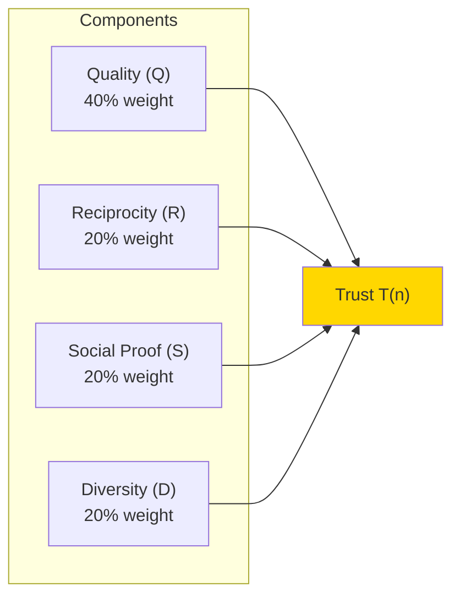
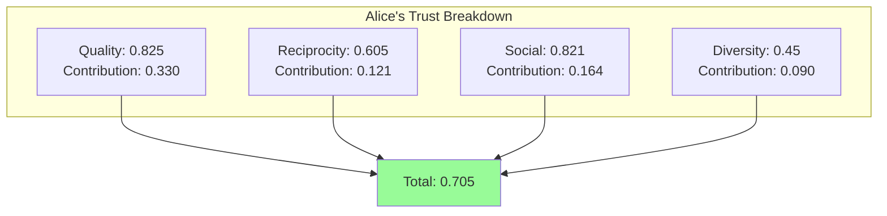
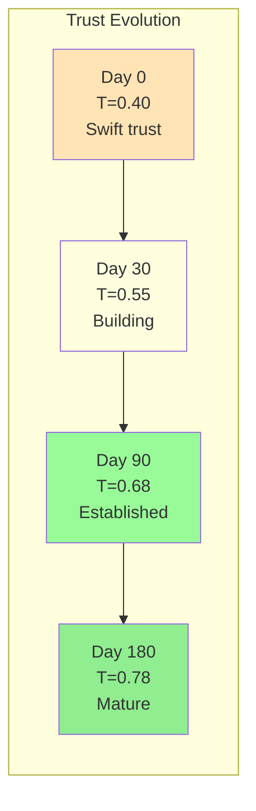
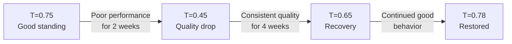
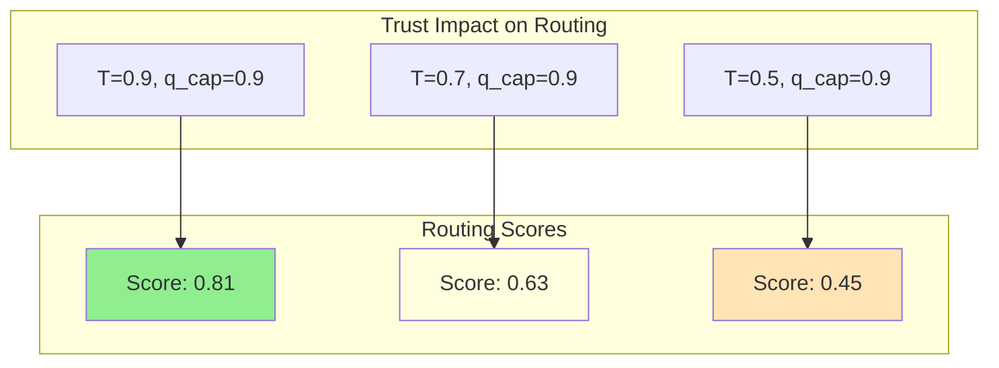

# Understanding Trust

**Document Version:** 1.0
**Last Updated:** December 2025
**Difficulty:** Intermediate

---

## 1. Introduction

This tutorial provides an interactive exploration of how trust works in Symbiont. You will:

- Trace trust computation step-by-step
- Understand each component's contribution
- See how different behaviors affect trust
- Learn to interpret trust scores

---

## 2. Trust Components Recap

Trust is computed from four components:



$$T(n) = 0.4 \cdot Q_{agg} + 0.2 \cdot R_{trust} + 0.2 \cdot S_{social} + 0.2 \cdot D_{diversity}$$

---

## 3. Step-by-Step Example

Let's trace trust computation for a specific node.

### 3.1 Scenario Setup

**Node Alice** has:

- 75 interactions completed
- 12 active connections
- 45 unique partners in last 100 interactions
- 8 affirmations received

### 3.2 Step 1: Quality Score (Q_agg)

Alice's recent interactions:

| Partner | Quality | Partner Trust | Age (days) |
|---------|---------|---------------|------------|
| Bob | 0.85 | 0.72 | 1 |
| Carol | 0.78 | 0.68 | 3 |
| Dave | 0.92 | 0.81 | 7 |
| Eve | 0.65 | 0.55 | 14 |

**Computation:**

```
decay(age) = 0.95^age  // Example decay function

Weighted sum:
  Bob:   0.85 × 0.72 × 0.95^1  = 0.58
  Carol: 0.78 × 0.68 × 0.95^3  = 0.45
  Dave:  0.92 × 0.81 × 0.95^7  = 0.53
  Eve:   0.65 × 0.55 × 0.95^14 = 0.18

Weight sum:
  Bob:   0.72 × 0.95^1  = 0.68
  Carol: 0.68 × 0.95^3  = 0.58
  Dave:  0.81 × 0.95^7  = 0.58
  Eve:   0.55 × 0.95^14 = 0.27

Q_agg = (0.58 + 0.45 + 0.53 + 0.18) / (0.68 + 0.58 + 0.58 + 0.27)
Q_agg = 1.74 / 2.11 = 0.825
```

**Result: Q_agg = 0.825** (Good quality)

### 3.3 Step 2: Reciprocity Score (R_trust)

Alice's connection reciprocities:

| Connection | r value |
|------------|---------|
| Bob | +0.3 |
| Carol | -0.1 |
| Dave | +0.5 |
| Eve | -0.2 |
| ... (8 more) | ~0.1 average |

**Computation:**

```
R_agg = mean of all r values
R_agg = (0.3 - 0.1 + 0.5 - 0.2 + 0.8) / 12 = 0.108

// Convert to [0,1] via sigmoid
σ(R_agg) = (2 / (1 + e^(-2 × 0.108))) - 1 = 0.21

// Shift to [0,1]
R_trust = (0.21 + 1) / 2 = 0.605
```

**Result: R_trust = 0.605** (Slightly positive reciprocity)

### 3.4 Step 3: Social Proof (S_social)

Alice's affirmations:

| From | Affirmer Trust | Strength | Age (days) |
|------|----------------|----------|------------|
| Hub1 | 0.92 | 0.85 | 2 |
| Bob | 0.72 | 0.70 | 5 |
| Carol | 0.68 | 0.90 | 10 |

**Computation:**

```
Weighted sum:
  Hub1:  0.92 × 0.85 × 0.95^2  = 0.71
  Bob:   0.72 × 0.70 × 0.95^5  = 0.39
  Carol: 0.68 × 0.90 × 0.95^10 = 0.37

Weight sum:
  Hub1:  0.92 × 0.95^2  = 0.83
  Bob:   0.72 × 0.95^5  = 0.55
  Carol: 0.68 × 0.95^10 = 0.41

S_social = (0.71 + 0.39 + 0.37) / (0.83 + 0.55 + 0.41)
S_social = 1.47 / 1.79 = 0.821
```

**Result: S_social = 0.821** (Well-regarded)

### 3.5 Step 4: Diversity Score (D)

Alice has 45 unique partners in last 100 interactions:

```
D = 45 / 100 = 0.45
```

**Result: D = 0.45** (Moderate diversity)

### 3.6 Step 5: Combine Components

```
T_raw = 0.4 × Q_agg + 0.2 × R_trust + 0.2 × S_social + 0.2 × D

T_raw = 0.4 × 0.825 + 0.2 × 0.605 + 0.2 × 0.821 + 0.2 × 0.45
T_raw = 0.330 + 0.121 + 0.164 + 0.090
T_raw = 0.705
```

### 3.7 Step 6: Apply Caps

```
Diversity cap: T ≤ D + 0.3 = 0.45 + 0.3 = 0.75

T_raw (0.705) < cap (0.75), so no reduction

Trust cap: Assume trust_cap = 1.0 (no flags)

Final: T = 0.705
```

**Final Result: Alice's trust = 0.705**



---

## 4. What-If Analysis

### 4.1 What if Alice Had Better Diversity?

If Alice had 70 unique partners:

```
D = 0.70
T_raw = 0.4 × 0.825 + 0.2 × 0.605 + 0.2 × 0.821 + 0.2 × 0.70
T_raw = 0.330 + 0.121 + 0.164 + 0.140 = 0.755
```

**Improvement: +0.05** (7% increase)

### 4.2 What if Alice Had Poor Quality?

If Q_agg dropped to 0.5:

```
T_raw = 0.4 × 0.5 + 0.2 × 0.605 + 0.2 × 0.821 + 0.2 × 0.45
T_raw = 0.200 + 0.121 + 0.164 + 0.090 = 0.575
```

**Decrease: -0.13** (18% drop)

### 4.3 What if Alice Were a Free-Rider?

If R_agg = -0.8 (chronic imbalance):

```
σ(-0.8) = (2 / (1 + e^1.6)) - 1 = -0.55
R_trust = (-0.55 + 1) / 2 = 0.225

T_raw = 0.4 × 0.825 + 0.2 × 0.225 + 0.2 × 0.821 + 0.2 × 0.45
T_raw = 0.330 + 0.045 + 0.164 + 0.090 = 0.629
```

**Decrease: -0.076** (11% drop from reciprocity alone)

---

## 5. Trust Over Time

### 5.1 New Node Journey



### 5.2 Trust Building Strategies

| Strategy | Effect | Timeline |
|----------|--------|----------|
| Consistent quality | Q_agg rises steadily | Weeks |
| Balanced exchange | R stays positive | Ongoing |
| Diverse interactions | D increases | Weeks |
| Help others | Affirmations received | Days |

### 5.3 Trust Damage and Recovery



---

## 6. Interpreting Trust Scores

### 6.1 Trust Score Ranges

| Range | Interpretation | Typical Status |
|-------|----------------|----------------|
| 0.0 - 0.3 | Low trust / New | PROBATIONARY |
| 0.3 - 0.5 | Building trust | PROBATIONARY → MEMBER |
| 0.5 - 0.7 | Moderate trust | MEMBER |
| 0.7 - 0.85 | Good trust | ESTABLISHED |
| 0.85 - 1.0 | Excellent trust | HUB |

### 6.2 Trust vs Routing Priority



High trust = higher routing priority = more opportunities = more interactions = higher trust (virtuous cycle)

---

## 7. Practical Exercises

### 7.1 Exercise 1: Manual Calculation

Given:

- Quality scores: [0.7, 0.8, 0.9] from partners with trust [0.6, 0.8, 0.9]
- Reciprocity r values: [0.2, -0.1, 0.4] across 3 connections
- 2 affirmations with strength [0.7, 0.9] from trust [0.75, 0.85]
- 30 unique partners in last 100 interactions

**Calculate the final trust score.**

<details>
<summary>Solution</summary>

```
Q_agg = (0.7×0.6 + 0.8×0.8 + 0.9×0.9) / (0.6 + 0.8 + 0.9)
      = (0.42 + 0.64 + 0.81) / 2.3 = 0.813

R_agg = (0.2 - 0.1 + 0.4) / 3 = 0.167
σ(R_agg) = (2 / (1 + e^-0.334)) - 1 = 0.32
R_trust = (0.32 + 1) / 2 = 0.66

S_social = (0.7×0.75 + 0.9×0.85) / (0.75 + 0.85)
         = (0.525 + 0.765) / 1.6 = 0.806

D = 30 / 100 = 0.30

T_raw = 0.4×0.813 + 0.2×0.66 + 0.2×0.806 + 0.2×0.30
      = 0.325 + 0.132 + 0.161 + 0.060 = 0.678

Diversity cap: 0.30 + 0.3 = 0.60

T_final = min(0.678, 0.60) = 0.60

Note: Diversity is limiting! Need more unique partners.
```

</details>

### 7.2 Exercise 2: Identify the Problem

A node has trust = 0.45 despite:

- Q_agg = 0.85
- S_social = 0.80

What might be limiting their trust?

<details>
<summary>Solution</summary>

Possible issues:

1. **Low diversity** (D < 0.15) → cap at 0.45
2. **Negative reciprocity** (R << 0) → low R_trust contribution
3. **Trust cap reduced** (flags active)

Check D first since 0.45 = D + 0.3 suggests D ≈ 0.15.

</details>

---

## 8. Common Patterns

### 8.1 Trust Ceiling

```
Problem: Trust plateaus despite good behavior
Cause: Diversity cap limiting growth
Solution: Interact with more unique partners
```

### 8.2 Trust Oscillation

```
Problem: Trust fluctuates up and down
Cause: Inconsistent quality or reciprocity
Solution: Maintain consistent positive interactions
```

### 8.3 Slow Trust Growth

```
Problem: Trust grows very slowly
Cause: Low interaction rate or low-trust partners
Solution: Increase activity, seek hub connections
```

---

## 9. Summary

Understanding trust in Symbiont:

| Concept | Key Point |
|---------|-----------|
| Components | Quality (40%) + Reciprocity + Social + Diversity (20% each) |
| Weights | Quality matters most, but others can limit |
| Caps | Diversity can cap trust even with high quality |
| Time | Trust builds gradually through consistent behavior |
| Recovery | Damage takes longer to recover than to cause |

Trust is **earned through behavior**, not granted by authority. Every interaction contributes to your trust profile.

---

*Previous: [Running Simulations](./running-simulations.md) | Next: [Building Workflows](./building-workflows.md)*
